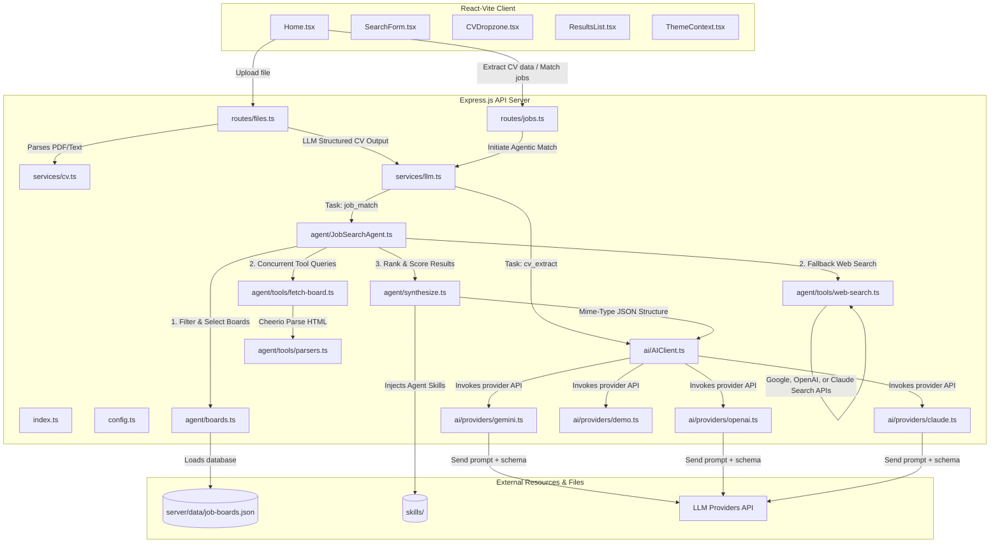

# JobMatch Platform — AI-Powered Job Matching Engine

Welcome to the **JobMatch** platform repository — an intelligent job matching assistant based on AI agents, designed to demonstrate SRE, DevOps, GitOps, and AI safety practices (Prompt Security & Evals).

---

## What is JobMatch?

**JobMatch** is an AI-powered job search application designed as a teaching reference and sandbox for **DevOps/SRE workflows**, containerization (Docker/Docker Compose), and **Kubernetes** deployments. 

## What the Code Does (Summary)

This repository is an **AI-powered Job Search and Matching application** called **JobMatch**. It serves as a learning sandbox for DevOps and Kubernetes environments.

- **CV Upload & Extraction**: Accepts PDF/text resumes on the frontend. The backend extracts text (using `pdf-parse` for PDFs) and uses structured LLM output to parse experience, education, skills, and summary.
- **Agentic Job Search**: The user inputs queries and regional settings. The backend searches targeted job boards (e.g., `DOU.ua`, `Work.ua`, `Djinni.co`, `Remote OK`, etc.) from [job-boards.json](./app/server/data/job-boards.json) using native scrapers (`cheerio`) or triggers search APIs (Gemini/OpenAI/Claude web searches) as fallbacks.
- **Scoring & Synthesis**: Integrates custom markdown-based instruction sets ("Agent Skills" under [skills/](./app/skills/)) into the LLM system prompt. The LLM ranks results based on a weighted matching model:
  - Core Skill Overlap: **35%**
  - Experience Fit: **20%**
  - Domain Relevance: **20%**
  - Gap Severity: **15%**
  - Growth Potential: **10%**
- **DevOps/SRE Sandbox**: Contains a Docker configuration (`Dockerfile`, `Dockerfile.api`, `docker-compose.yml`) structured to demonstrate deployment, reverse proxying, configuration maps, and Kubernetes deployment workflows.

The application matches job seekers with target opportunities by parsing their uploaded resumes (CVs), performing web scraping and LLM-native search queries across selected regional and global job boards, and ranking the results using customized "Agent Skills" context-injected into the LLM prompt.

---

## 🏗️ Architecture Overview & Code Flow



### Layered View

* **Presentation Layer (`app/src/`):** React UI components, CSS styles, internationalization, and HTTP API clients.
* **API Layer (`app/server/routes/`):** Express endpoints handles uploads (`/api/files`), CV parsing, and job matching loops.
* **Service Layer (`app/server/services/`):** Orchestrator logic connecting uploads parsing with `JobSearchAgent`.
* **Agent Layer (`app/server/agent/`):** Decides targets, scrapes HTML contents via Cheerio, and synthesizes candidate scoring weights.
* **AI Provider Layer (`app/server/ai/`):** Abstraction singleton supporting dynamic prompt skills injection.
* **Platform Layer (`platform/`):** Helm charts, Envoy configurations, and FluxCD deployments.

---

## 📂 Monorepo Structure

The repository is built as a monorepo with clear separation of concerns:

```
├── app/                      # Application zone
│   ├── src/                  # React/Vite SPA frontend
│   ├── server/               # Node.js Express API & Worker (JobSearchAgent)
│   ├── skills/               # Versioned agent skills (flat markdown)
│   └── prompts/              # System prompts and templates of LLM roles
├── platform/                 # Infrastructure zone (GitOps)
│   ├── flux/                 # FluxCD configuration
│   │   └── clusters/         # Separated cluster configurations per environment
│   │       ├── dev/          # Dev environment settings (Namespace jobmatch-dev, branch dev)
│   │       └── prod/         # Prod environment settings (Namespace jobmatch-prod, branch main)
│   └── helm/                 # Local Umbrella Helm Chart (Redis, Qdrant)
├── evals/                    # Evaluation zone (Quality Gate)
│   ├── dataset.json          # Golden dataset (including security test cases)
│   └── run-evals.mjs         # LLM-as-a-Judge evaluation execution script
├── doc/                      # Project documentation
│   ├── ADR.md                # Architectural Decision Records
│   ├── HLD.md                # High-Level Solution Design
│   ├── cicd.md               # Detailed description of CI/CD & GitOps
│   ├── eval.md               # Evals Quality Gate documentation
│   ├── finops-llm.md         # Detailed description of FinOps routing
│   ├── Tests.md              # Testing guide
│   └── ProjectCodeMindMap.md # Code relationships map and exploration
```

---

## 🚀 Quick Start Locally

### 1. Prerequisites
You will need **Node.js v20+** and **Docker / Docker Compose** installed.

### 2. Install Dependencies
```bash
# Install dependencies for frontend and backend
npm install
npm install --prefix app/server
```

### 3. Environment Variables Configuration
Create a `.env` file in the `app/` directory based on `.env.example`:
```bash
cp app/.env.example app/.env
```
Open `app/.env` and add at least one LLM provider API key (e.g., `GEMINI_API_KEY`, `OPENAI_API_KEY`, or `ANTHROPIC_API_KEY`).

### 4. Build the Backend
To compile the TypeScript backend:
```bash
cd app/server
npm run build
```

### 5. Run in Development Mode
```bash
# From the repository root
npm run dev
```
* **Frontend UI:** http://localhost:5173
* **Backend API Health:** http://localhost:3001/api/health

---

## 🛠️ Docker Deployment
To run the full stack in Docker containers locally:
```bash
cd app
docker compose up --build
```
The web interface will be available at http://localhost:8080.

---

## 🧪 Running Evals (Quality Gate)
The Evals zone evaluates the job matching quality and cover letter generation using the LLM-as-a-Judge pattern.

```bash
# Navigate to the evals folder and run
cd evals
npm install
npm test
```
The script will evaluate the test cases from `dataset.json` against these metrics:
* **Relevance**
* **Tone** (of the cover letter)
* **Hallucination-free**
* **Safety-guardrails** (checks for prompt leakage and discrimination patterns)

*Note: In the CI/CD pipeline, the evaluation runs conditionally — on pushes and pull requests to both `dev` and `main` branches when skills/prompts files are modified. If the average score falls below `4.2/5.0` or a security gate fails, the pipeline fails.*

---

## 🛡️ Security Controls
* **PII Masking:** Candidate personal information (emails, phone numbers, GitHub/LinkedIn links) is automatically masked or removed locally before being sent to the cloud. This can run either backend-side or at the `agentgateway` level using Guardrails.
* **Prompt Injection Shield:** XML tags separate system instructions from user inputs. Regression tests ensure resilience against prompt injection.
* **Secrets Management:** All LLM API keys are excluded from git and injected into Kubernetes using K8s Secrets / External Secrets Operator. At the `agentgateway` level, key proxying is configured (`secretRef`).
* **CI/CD Security Gates:** The pipeline includes a **Gitleaks** scan step to block commits with hardcoded secrets and checks prompt changes against the Evals test suite.

---

## 📖 Detailed Architecture Documents

* 📑 **[Architectural Decision Records (ADR)](doc/ADR.md)** — Architectural choices justification, FinOps analysis, model selection, and unit cost calculations.
* 📐 **[High-Level Solution Design (HLD)](doc/HLD.md)** — System architecture, Agent life cycle, and deployment diagrams in Kubernetes.
* 🔄 **[CI/CD & GitOps Guide](doc/archive/cicd.md)** — Detailed description of FluxCD, tag updates, and automatic rollouts.
* 🧪 **[Evaluation Engine Guide](doc/archive/eval.md)** — Evaluation framework setup, test cases, and LLM-as-a-Judge scoring details.
* 💸 **[FinOps LLM Routing Guide](doc/archive/finops-llm.md)** — Detailed description of dynamic routing based on task names (x-gateway-task-name) and model suggestions.
* 🧪 **[Testing Guide](doc/archive/Tests.md)** — Guide for local unit and integration testing (Vitest, mocking, and coverage).
* 🗺️ **[Project Code Mind Map](doc/archive/ProjectCodeMindMap.md)** — Map and overview of code relationships and structure.