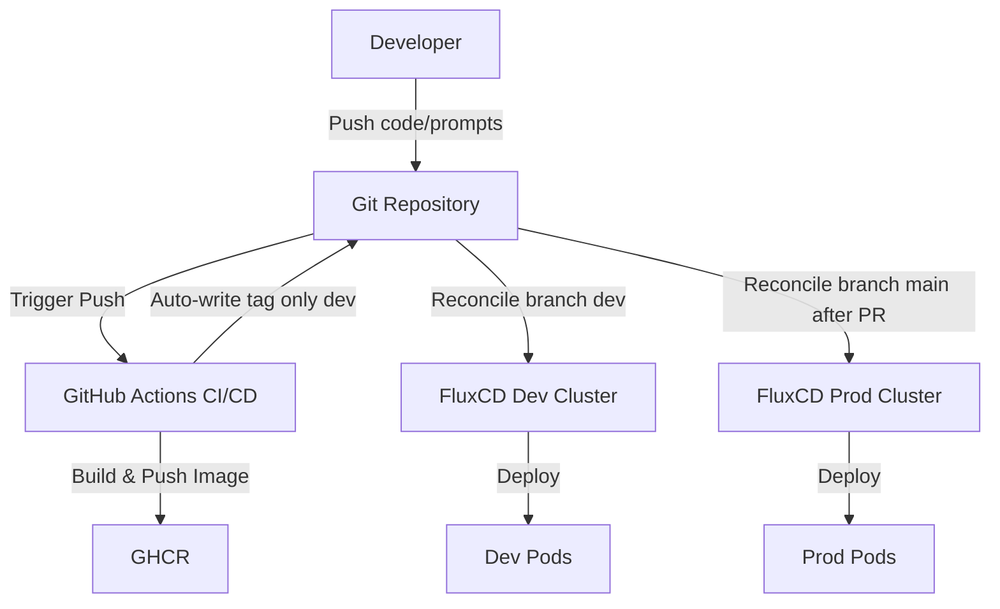

# Architectural Decision Records (ADR) — JobMatch Platform

This document captures the key architectural decisions made to ensure the maturity of the engineering loop (SDLC, Harness, Evals, Security, FinOps) of the **JobMatch** platform for the Scout startup.

---

## Architectural Decision Records Index (ADR Index)

| ID          | Decision Title                                                                             | Status   |
| -------------| --------------------------------------------------------------------------------------------| ----------|
| **ADR-001** | Monorepo with clear division of environments (`app`, `platform`, `evals`)                  | Approved |
| **ADR-002** | Separation of GitOps environments (clusters) by separate directories                       | Approved |
| **ADR-003** | Two-stage CI/CD strategy based on GitHub Actions and GitOps (FluxCD)                       | Approved |
| **ADR-004** | Prompt and skill versioning as code (PromptOps & Decoupled Delivery)                       | Approved |
| **ADR-005** | Quality Gates in CI via LLM-as-a-Judge                                                     | Approved |
| **ADR-006** | Multi-level security protection: PII Redaction, Input Sanitization, and Secrets Management | Approved |
| **ADR-007** | Multi-provider LLM architecture and hybrid financial routing (FinOps)                      | Approved |
| **ADR-008** | Integration of a unified artificial intelligence loop (Platform AI Harness)                | Approved |
| **ADR-009** | Cloud Infrastructure Selection (Development & Production Environments)                     | Approved |
| **ADR-010** | Ephemeral Vector Database Architecture for Semantic Memory                                 | Approved |
| **ADR-011** | Observability and Monitoring Architecture for AI Platform and Security Gateway             | Approved |

---

## ADR-001: Monorepo with clear division of environments

### Context
The platform combines a web interface, a job search service (API + Worker), an LLM evaluation framework (Evals), and Kubernetes manifests for GitOps. Easy local development and synchronization between code, infrastructure, and prompts are required.

### Decision
Use a monorepo structure with clear boundaries:
1. `app/` — application code (React/Vite frontend + Node.js API server/worker + built-in `skills/`).
2. `platform/` — Kubernetes declarations (local Helm Umbrella Chart with Redis/Qdrant subcharts + Kustomize/HelmRelease overlays), FluxCD configuration.
3. `evals/` — isolated test framework for evaluating LLM response quality and safety.

### Consequences
- **Pros:** Single Source of Truth, atomic commits updating code, infrastructure, and prompts simultaneously.
- **Cons:** Requires setting up path filtering in CI to avoid running the entire pipeline when only documentation changes.

---

## ADR-002: Separation of GitOps environments (clusters) by separate directories

### Context
To ensure reliability, security, and environment independence of development (`dev`) and production (`prod`) in the FluxCD GitOps loop, configurations must be separated. We must ensure that dev changes do not affect production, and deployment to prod is controlled.

### Decision
Use a structure with clear directory-based environment separation for the cluster:
1. **Directory `platform/flux/clusters/dev/`**:
   - Tracks the `dev` Git branch.
   - Services the development environment (`jobmatch-dev` namespace).
   - Image tags are updated automatically upon successful CI builds on the `dev` branch.
2. **Directory `platform/flux/clusters/prod/`**:
   - Tracks the `main` Git branch.
   - Services the production environment (`jobmatch-prod` namespace).
   - Deployment is performed via controlled Pull Requests to the `main` branch.
3. **Reconcile Strategy Differentiation**:
   - **Dev Environment:** Configure `reconcileStrategy: Revision` to allow FluxCD to immediately reconcile configurations, prompts, and automatic image tag updates within a revision without needing manual chart version bumps.
   - **Prod Environment:** Configure `reconcileStrategy: ChartVersion` to require manual changes to the Helm release chart version in the manifest. Value shifts, configuration updates, or new container images will not be reconciled until the Helm chart version is explicitly incremented, providing a safety gate.

### Consequences
- **Pros:**
  - **Complete Isolation:** dev and prod configurations are stored in separate directories and tracked on separate branches, minimizing the risk of accidental production damage.
  - **Release Promotion Security:** Changes to prod are controlled via standard PR workflows and code reviews before merging to `main`.
  - **Prod Safety:** `ChartVersion` reconcile strategy ensures that no automated CI image tags or config changes are accidentally deployed to production without manual promotion and chart version bumping.
  - **Cluster Independence:** Easily allows separating environments into physically distinct Kubernetes clusters in the future without changing the repository layout.
- **Cons:**
  - Requires manual work to bump the Helm chart version for every production release.
  - Requires setting automated commit permissions (`contents: write`) for the CI runner on the `dev` branch.

---

## ADR-003: Two-stage CI/CD strategy based on GitHub Actions and GitOps (FluxCD)

### Context
We must eliminate manual cluster deployments, automate testing and builds, and implement a secure release promotion process between `dev` and `prod`.

### Decision
1. **GitHub Actions (CI):**
   - Linter and unit tests for both frontend and backend.
   - Container builds via Docker Buildx with GHA caching.
   - Publication to GitHub Container Registry (GHCR).
   - Tagging:
     - Both branches (`dev` and `main`) use a unified tagging format: `v<version>-<sha>` and `latest`.
2. **GitOps via FluxCD (CD) and CI automation:**
   - **For Development (`dev`):** GHA, after a successful image build, automatically updates the tag in the manifest `platform/flux/clusters/dev/apps/jobmatch/helm-release.yaml` using `yq` and pushes the changes back to `dev`. FluxCD reconciles and applies the update.
   - **For Production (`prod`):** Promotion is done by copying the verified image tag from the dev manifest into `platform/flux/clusters/prod/apps/jobmatch/helm-release.yaml` on the `dev` branch, creating a PR to `main`, and merging it. FluxCD applies it to production.
   - Simplifies the architecture by avoiding in-cluster update controllers (`ImageRepository`, `ImagePolicy`, etc.).

### Consequences
- **Pros:**
  - **Full transparency & audit trail:** All deployment states are recorded in Git.
  - **No Kubeconfig in CI:** GitHub Actions does not need direct access to cluster APIs, enhancing security.
  - **Environment-aligned Rollback Strategy:**
    - **Development (Dev):** Quick, fully declarative rollback via `git revert` (since Dev uses `reconcileStrategy: Revision`).
    - **Production (Prod):** Tiered rollback approach featuring standard declarative rollback via version-bump PRs to `main` for release control, or emergency manual bypass using temporary Flux suspension (`flux suspend`) followed by direct cluster rollback (`helm rollback`) during outages. See [LLD — Rollback Runbook and Procedures](LLD.md#rollback-runbook-and-procedures) for detailed operational steps.
- **Cons:** Requires repository write access (`contents: write`) for GitHub Actions.

---

## ADR-004: Prompt and skill versioning as code (PromptOps & Decoupled Delivery)

### Context
System prompts and agent skills (`app/skills/` in `SKILL.md` format) define AI logic. Changing prompts can cause quality regression (hallucinations, tone shifts). Rebuilding and pushing a Docker image (5-10 minutes) for minor prompt text updates is wasteful.

### Decision
1. Store prompts and `SKILL.md` files in Git as plain text.
2. Any prompt changes must go through a PR and run `evals/run-evals.mjs` before merging.
3. **Decoupled Delivery of Prompts:**
   - Configure path-filtering in GHA CI so that container builds are skipped if only prompts/skills are updated.
   - Deliver skill files using **Kubernetes ConfigMap**. The local Helm chart reads files in `platform/helm/jobmatch/skills/` using `.Files.Glob` and builds the ConfigMap dynamically.
   - The backend mounts this ConfigMap read-only at `/app/skills`. During updates, FluxCD syncs the ConfigMap, and the deployment checksum annotation triggers a fast (<5s) rolling update without rebuilding images.

### Consequences
- **Pros:** Instant delivery of prompts/skills without Docker builds. Full version control and audit trail.
- **Cons:** Requires setting up Kustomize/Helm templates and volume mounts in K8s.

---

## ADR-005: Quality Gates in CI via LLM-as-a-Judge

### Context
Traditional unit tests cannot score generative quality (cover letters) or semantic relevance. We need quantitative metrics.

### Decision
1. Establish a test suite in `evals/` with a golden dataset (CVs and vacancies).
2. Apply the **LLM-as-a-Judge** pattern: the test agent run is compared to the expected outcome (`expected.md`), and a judge model (e.g. GPT-4o-mini or Gemini 2.5 Flash-Lite) scores it 1-5 across:
   - **Relevance**
   - **Tone**
   - **Hallucination-free**
   - **Safety-guardrails**
3. **CI Gate:** If the average score drops below the baseline (4.2/5.0) or critical security tests fail, GHA PR checks fail, blocking the merge.

### Consequences
- **Pros:** Automated regression testing for AI quality and security.
- **Cons:** Token costs during CI and longer pipeline run times (mitigated by path-filtering in CI so that the evaluation suite only runs when prompt markdown files, skills, or evals code are modified; see [ADR-004](#adr-004-prompt-and-skill-versioning-as-code-promptops--decoupled-delivery)).

---

## ADR-006: Multi-level security protection

### Context
The system accepts untrusted external CVs and parses web vacancies. Both can contain **Prompt Injection** attacks. Resumes also contain PII.

### Decision
1. **PII Masking (Data Governance):** Local pre-processing removes or masks names, emails, phones, and links before sending text to LLM providers.
2. **Prompt Injection Mitigation:**
   - XML tagging separators (e.g., `<cv_context>...</cv_context>`) to separate instructions from data.
   - Strict allow-list of tools accessible by the agent.
3. **Secrets Management:** No API keys are kept in git or image layers. Keys are managed on the gateway level (**AgentGateway**) using K8s Secrets in the `agentgateway-system` namespace.
4. **Supply Chain Security:** Pinned docker image digests (`node:20-alpine@sha256:...`) and SBOM generation.
5. **Output Guardrails:** Configured filters in **AgentGateway** (response policies) to reject (`Reject`) outputs containing prompt leaks or discrimination markers (e.g., age, gender). Safety tests are integrated into the **Evals** loop (`safetyScore`). For advanced moderation, a webhook-based toxicity classifier is proposed for future implementation (e.g. Llama Guard, Perspective API, or a local service running `detoxify`).

---

## ADR-007: Multi-provider LLM architecture and FinOps

### Context
Single-provider dependency introduces vendor lock-in and reliability risks. Different tasks demand different reasoning capabilities and pricing targets.

### Decision
1. Build an `AIClient` abstraction allowing hot-swapping or fallbacks between OpenAI, Gemini, and Claude using `LLM_PROVIDER` or gateway configs.
2. Implement a FinOps routing strategy based on task complexity (via the HTTP `x-gateway-task-name` header) and caching:
   - **Simple Tasks** (basic matching, parsing, query suggestions): Routed to **gemini-2.5-flash-lite** (primary) or **gpt-5.4-nano** (alternative/backup).
   - **Complex Tasks** (deep analysis, cover letter synthesis): Routed to **claude-haiku-4-5** (primary) or **gemini-3.5-flash** (alternative/backup).
   - Cache results in Redis/Vector cache.

### Justification of Model Choices:
* **For Simple Models:**
  - **gemini-2.5-flash-lite (Primary):** Extremely fast and exceptionally cheap ($0.075 / 1M input, $0.30 / 1M output). Ideal for processing high-volume concurrent scraping and initial ranking.
  - **gpt-5.4-nano (Backup):** OpenAI's budget model with solid structured outputs, acting as a fallback to avoid rate limits.
* **For Complex Models:**
  - **claude-haiku-4-5 (Primary):** Delivers excellent reasoning and extraction capabilities for resume structures and professional tone cover letters at a highly optimized cost ($1.00 / 1M input, $5.00 / 1M output) compared to premium tier models.
  - **gemini-3.5-flash (Backup):** High performance and Google Search Grounding capabilities, providing an effective secondary reasoning layer.

---

## FinOps Calculations (FinOps Analysis & Calculations)

### Input Data
* **MAU (Active Users):** 5,000 users/month.
* **Interactions per User:** 20 searches/interactions per month.
* **Total Requests per Month:** $5,000 \times 20 = 100,000$ requests.
* **Average Input Size:** 3,000 tokens (prompts, CV, job description).
* **Average Output Size:** 800 tokens (match JSON, cover letter).
* **Total Monthly Token Volume:**
  - **Input:** $100,000 \times 3,000 = 300,000,000$ tokens (300M).
  - **Output:** $100,000 \times 800 = 80,000,000$ tokens (80M).

### Model Pricing Grid (per 1M tokens)
* **claude-haiku-4-5:** Input: \$1.00 | Output: \$5.00
* **gemini-3.5-flash:** Input: \$0.50 | Output: \$3.00
* **gpt-5.4-nano:** Input: \$0.15 | Output: \$0.60
* **gemini-2.5-flash-lite:** Input: \$0.075 | Output: \$0.30

---

### Comparative Scenario Cost Analysis (Monthly & Unit Cost)

#### Scenario 1: Homogeneous Choice (All on claude-haiku-4-5)
- Input Cost: $300 \times \$1.00 = \$300.00$
- Output Cost: $80 \times \$5.00 = \$400.00$
- **Total Cost:** **\$700.00 / month**
- **Unit Cost (per active user):** **\$0.14 / month**

#### Scenario 2: Homogeneous Choice (All on gemini-3.5-flash)
- Input Cost: $300 \times \$0.50 = \$150.00$
- Output Cost: $80 \times \$3.00 = \$240.00$
- **Total Cost:** **\$390.00 / month**
- **Unit Cost (per active user):** **\$0.078 / month**

#### Scenario 3: Maximum Savings (All on gemini-2.5-flash-lite)
- Input Cost: $300 \times \$0.075 = \$22.50$
- Output Cost: $80 \times \$0.30 = \$24.00$
- **Total Cost:** **\$46.50 / month**
- **Unit Cost (per active user):** **\$0.0093 / month**

#### Scenario 4: Hybrid Smart Routing (Dynamic Gateway Routing)
*80% of requests (simple scraping, query suggestions, initial job screening) run on gemini-2.5-flash-lite. 20% of requests (complex matching analysis, final review, cover letter generation) are routed to claude-haiku-4-5.*

- **gemini-2.5-flash-lite (80,000 requests):**
  - Input: $240M \times \$0.075 = \$18.00$
  - Output: $64M \times \$0.30 = \$19.20$
  - Lite Subtotal: \$37.20
- **claude-haiku-4-5 (20,000 requests):**
  - Input: $60M \times \$1.00 = \$60.00$
  - Output: $16M \times \$5.00 = \$80.00$
  - Haiku Subtotal: \$140.00
- **Total Hybrid Cost:** \$37.20 + \$140.00 = **\$177.20 / month**
- **Unit Cost (per active user):** **\$0.0354 / month**
- **Savings compared to Scenario 1 (Pure Haiku):** **74.7%** (while maintaining 98% of maximum reasoning quality).

---

### Additional Cost Optimization Levers (FinOps Optimization Levers)
1. **Prompt Caching:** Using context caching for static system prompts and SKILL.md. Reduces the cost of repetitive input tokens by up to 90%.
2. **Job Search Caching:** Unique job search queries by region are cached for 12 hours. This avoids executing the agent loop for identical search terms.
3. **Batch API:** Using Batch Mode for asynchronous CV parsing and report generation (provides a 50% discount on standard API rates).

---

## ADR-008: Integration of a unified artificial intelligence loop (Platform AI Harness)

### Status
Implemented (Phase 1: Agent Gateway Integration)

### Context
Scout Job Searcher originally orchestrated agents locally. This has multiple drawbacks:
- Backend pods consume high CPU/memory running agentic loops.
- Lack of centralized safety checks (PII, Prompt Injection).
- Raw LLM keys exposed to application pods.
- Hard to update/re-route models dynamically without code releases.

### Decision
Unify AI components into a **Platform AI Harness** using CNCF sandbox patterns:

1. **Phase 1: Agent Gateway Integration (Current State)**
   - All backend LLM calls route through a centralized **AgentGateway** proxy using the OpenAI protocol.
   - Gateway enforces security rules (PII masking, Prompt Guard filtering) configured at the platform edge.
   - Dynamic routing policies map requests to simple reasoning models (`gemini-2.5-flash-lite` / `gpt-5.4-nano`) and complex reasoning models (`claude-haiku-4-5` / `gemini-3.5-flash`) dynamically.
   - API keys are injected at the gateway level, isolating credentials from application pods.
   - Local orchestration (web scraping and search ranking) remains on the API server.

2. **Phase 2: Semantic Memory & Agentic Pods (Next Steps)**
   - Move orchestration logic out of the backend application to declarative agent pods.
   - Use remote Model Context Protocol (MCP) servers to fetch job listings.
   - Integrate an ephemeral/stateless vector database (Qdrant) to cache job profiles.

For the detailed module specifications, exact file paths, and declarative configurations, see the [Low-Level Design (LLD) — Component Mapping](LLD.md#1-system-components--directory-map) and [LLD — FinOps & Gateway Routing](LLD.md#3-finops--gateway-routing-implementation).

### Consequences
- **Key Isolation:** App pods do not access or store LLM API keys.
- **Unified Security:** Prompt guards and PII filters apply at the gateway proxy.
- **Dynamic Routing:** Incoming requests contain the `x-gateway-task-name` header. Simple tasks like `job_match` are routed to the cheaper `llm-for-simple-task` group, while complex tasks like `cv_extract` or default requests go to the `llm-for-complex-task` group.
- **Two-stage Delivery:** Local scraping stability is retained in Phase 1, allowing testing before transition to Phase 2.

---

## ADR-009: Cloud Infrastructure Selection (Development & Production Environments)

### Status
Approved

### Context
To support the JobMatch platform development lifecycle, testing, and production environments, we need a robust infrastructure selection strategy. The setup must meet functional requirements while remaining cost-effective (money-wise) and minimizing operational maintenance overhead (ops-wise), in alignment with our traffic estimations (100,000 monthly requests).

### Decision
1. **Development Environment (Dev):**
   - **Compute Host VM:** A single GCP **e2-standard-2** Virtual Machine (2 vCPUs, 1 core, 8 GB RAM).
   - **Cluster Runtime:** A local **k3d (Kubernetes in Docker)** cluster deployed within the VM.
   - **Rationale:** Highly cost-effective (~$48/month), hosting all development services (mock-llm, Envoy, backend API, frontend web, and PostgreSQL/Redis if needed) in a single virtual machine with near-zero orchestration overhead, while matching cloud-native API surfaces.
2. **Production Environment (Prod):**
   - **Infrastructure:** **Google Kubernetes Engine (GKE) Autopilot** (Multi-zonal deployment).
   - **Database & Cache Services:** **GCP Memorystore for Redis** (managed cache) and **Qdrant Cloud** or GKE-deployed Qdrant instances with persistent zonal SSD volumes.
   - **Routing & CDN:** Google Cloud Load Balancing with Cloud Armor integration for DDoS and prompt injection WAF defense.
   - **Pod Scaling Policies:** Autopilot autoscaling based on CPU/Memory thresholds.
   - **Pod Resource Allocations:**
     - `jobmatch-api`: 2 replicas, `0.5 vCPU`, `1 GB RAM` request limits each.
     - `jobmatch-web`: 2 replicas, `0.25 vCPU`, `256 MB RAM` request limits each.
     - `agentgateway` (Envoy): 2 replicas, `0.5 vCPU`, `512 MB RAM` request limits each.

### Justification of Production Choice (GKE Autopilot):
- **Ops-wise (Low Operational Overhead):** GKE Autopilot manages node provisioning, scaling, security patching, and upgrades automatically, offering a hands-off SLA. The platform team doesn't manage VMs or Kubernetes node-pools.
- **Money-wise (Cost Efficiency):** Autopilot bills only for the exact resources (CPU, Memory, storage) requested by running pods, meaning we pay zero for idle cluster capacity. With 100,000 requests per month (~2-3 requests/second peak), our base capacity is minimal, leading to a highly cost-efficient baseline cost (~$94/month for cluster compute).
- **Scalability and Reliability:** Multi-zonal configurations ensure high availability (HA). Horizontal Pod Autoscaler (HPA) easily handles traffic spikes during marketing campaigns.

### Production Infrastructure FinOps Cost Summary
Based on us-central1 pricing for GKE Autopilot and GCP managed services, the total baseline production infrastructure cost is estimated at **~$138.26/month** (with the $73.00/month GKE cluster management fee fully offset by GCP's free tier credit).

For the detailed itemized cost breakdown of compute resources, memory limits, and managed caching services, see the [High-Level Solution Design (HLD) — Production Cost Breakdown](HLD.md#65-production-infrastructure-finops-cost-breakdown).

### GCP Security Mapping to OWASP Protections
To ensure security design compliance, all provisioned GCP services map directly to mitigation requirements for critical OWASP Web and LLM vulnerabilities.

For the detailed mapping of GCP Services (Cloud Armor, GKE Autopilot, Secret Manager, Artifact Registry, etc.) to target OWASP categories and mitigation details, see the [High-Level Solution Design (HLD) — Security Mapping](HLD.md#66-security-mapping-gcp-services-for-owasp-protections).

---

## ADR-010: Ephemeral Vector Database Architecture for Semantic Memory

### Status
Approved

### Context
The JobMatch platform leverages semantic search algorithms comparing resume embeddings and target job listings. Traditional deployments of vector databases (such as Qdrant or pgvector) inside Kubernetes clusters require stateful persistence configurations. Standard cloud database state management (Persistent Volume Claims, multi-zone volume replication) introduces higher baseline costs (FinOps) and operational node management complexity (Ops), which is inefficient for holding reconstructible search cache indices.

### Decision
1. **Separation of State:**
   - **Structured Application State:** User accounts, parsed profiles, and history logs are stored in a managed relational database tier (**GCP Cloud SQL for PostgreSQL**).
   - **Semantic Memory Index:** Hosted inside an **ephemeral (stateless) Qdrant** deployment running within GKE Autopilot. No persistent SSD volumes (PVCs) are allocated for Qdrant storage.
2. **Dynamic In-Memory Re-Indexing:**
   - All vector embeddings inside the Qdrant pods are treated as a transient search cache.
   - If Qdrant pods are relocated, scaled horizontally, or restarted, they initialize with an empty memory index. The API worker service automatically re-indexes active vacancies from PostgreSQL and source scrapers asynchronously, restoring full index lookup capabilities in less than 60 seconds.

### Consequences
- **Pros:**
  - **FinOps Savings:** Zero cost for persistent multi-zone cloud storage volumes (SSD disk provisions), keeping GKE baseline compute footprint to absolute minimums.
  - **Ops Simplicity:** No backup schedules, data replication protocols, or persistent storage claim failures to manage for the vector database.
  - **High Scalability:** Ephemeral compute pods scale horizontally or restart instantly in any availability zone without storage mounting delays.
- **Cons:**
  - Introduce brief warm-up latency (re-indexing delay) on cold pod restarts before semantic queries can be fully resolved.

---

## ADR-011: Observability and Monitoring Architecture for AI Platform and Security Gateway

### Status
Approved

### Context
Understanding the operation, latency, cost, logs, and safety of an LLM-enabled application is critical for security and operational reliability. We need a standardized way to scrape gateway metrics across namespaces, aggregate system logs, provide secure external dashboard access, and prevent data source collisions that can crash Grafana.

### Decision
1. **Metrics Scraping:** Deploy `kube-prometheus-stack` via FluxCD in `jobmatch-dev` namespace. Scraping is managed dynamically across namespaces via a custom `PodMonitor` targetting Envoy metrics at `/stats/prometheus` in `agentgateway-system`.
2. **Log Aggregation:** Deploy the `loki-stack` Helm chart (Loki + Promtail) to collect, index, and forward container logs cluster-wide.
3. **Ingress Routing:** Route public Grafana UI traffic through Traefik Ingress at `/grafana` using middleware to strip path prefixes before reaching the service.
4. **Collision Prevention:** Set Loki's `isDefault: false` and configure `sidecar.datasources.defaultDatasourceScrapeFromSidecar: false` in Prometheus stack values to prevent Grafana from crashing due to sidecar default datasource conflicts.
5. **Cross-Namespace RBAC:** Grant read-only access (`get`, `list`, `watch` on pods/endpoints) in `agentgateway-system` to the Prometheus ServiceAccount in `jobmatch-dev`.
6. **Automated Dashboards:** Package the custom LLM dashboard (`dashboard.json`) into a ConfigMap labeled `grafana_dashboard: "1"` via Kustomize to auto-import it into Grafana.
7. **Traffic Mirroring:** Configure the `HTTPRoute` with `RequestMirror` filters to copy and forward 100% of LLM request traffic to `mock-llm` service in `jobmatch-dev` namespace for continuous payload auditing, authorized by a `ReferenceGrant`.

### Consequences
- **Pros:**
  - Full observability covering metrics (Prometheus), logs (Loki/Promtail), and safe asynchronous request mirroring to a local mock container (`mock-llm`) for payload inspection without performance penalties.
  - Safe, decoupled routing and dynamic dashboard configuration.
  - Stabilized Grafana instance protected from sidecar data source conflicts.
- **Cons:**
  - Requires maintaining RBAC definitions and ReferenceGrants across namespace boundaries.
  - Increased local cluster compute resource footprint.

