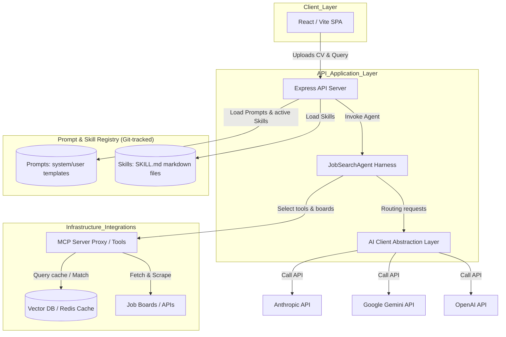
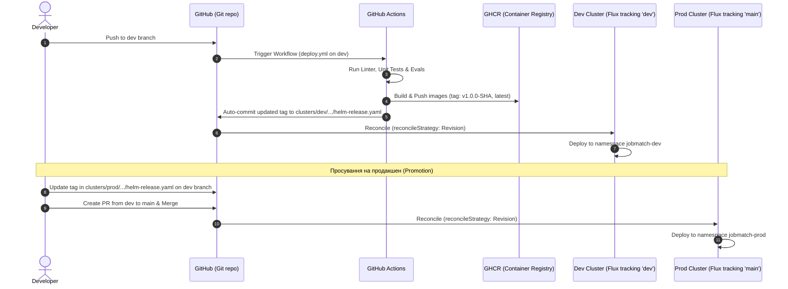
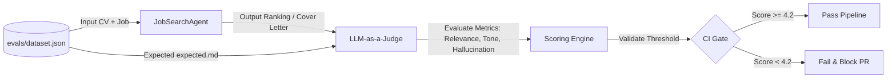
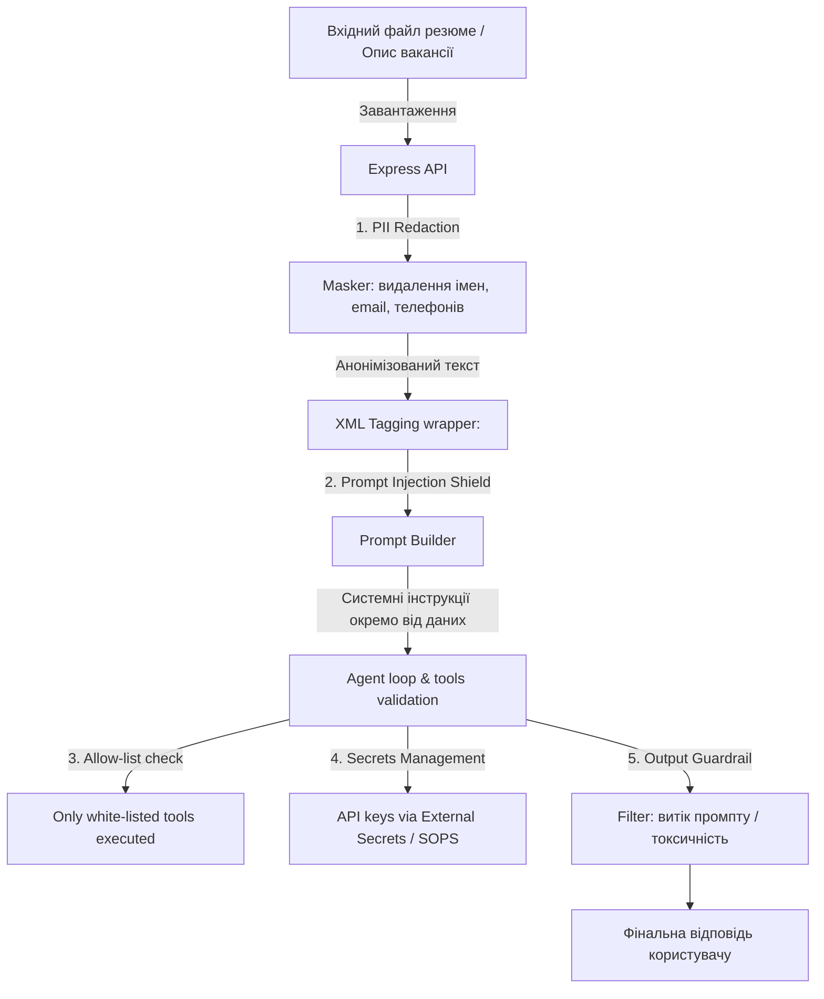

# High-Level Solution Design (HLD) — JobMatch Platform

Цей документ визначає високорівневу архітектуру платформи **JobMatch**, включаючи дизайн компонентів, життєвий цикл запитів, процес CI/CD автоматизації та контур тестування якості (Evals) для стартапу Scout.

---

## 1. Архітектурна діаграма системи (System Architecture)

Нижче наведено огляд основних компонентів платформи та їхніх зв'язків.

### Основні компоненти:
1. **React/Vite Frontend (Web):** Клієнтська частина для завантаження резюме (PDF/TXT) та введення пошукових запитів.
2. **Express API Server (app/server):** Точка входу для запитів, яка виконує пре-процесинг (маскування PII), завантажує необхідні системні промпти та `SKILL.md` файли, та ініціює роботу Агента.
3. **JobSearchAgent Harness (Harness):** Керує циклом мислення агента (Agent Loop), здійснює виклики інструментів (tools), отримує вакансії та передає їх на фінальний скоринг/синтез.
4. **AIClient (Providers):** Агностичний шар інтеграції з LLM (OpenAI, Gemini, Anthropic), який обробляє повторні спроби (retry), тайм-аути та роутинг.
5. **Git-tracked Prompts & Skills:** Системні промпти для різних ролей та скіли, які зберігаються у репозиторії та оновлюються через Pull Requests.
6. **Vector DB / Redis Cache:** Забезпечує семантичний пошук по профілях кандидатів та кешування результатів збору вакансій для економії токенів (FinOps).

---

## 2. CI/CD Пайплайн та GitOps Реліз-Процес

Розгортання платформи здійснюється повністю декларативно за допомогою GitOps-контролера FluxCD, розділеного на рівні окремих каталогів кластерів та відповідних гілок.

### Стратегія просування (Promotion Strategy):
* **Dev-кластер (Гілка `dev`):** Синхронізується з каталогом `platform/flux/clusters/dev`. При кожному пуші в `dev` GitHub Actions автоматично збирає контейнери з тегом `v1.0.0-<git-sha>` та за допомогою кроку автоматичного запису оновлює цей тег у `dev/apps/jobmatch/helm-release.yaml`.
* **Prod-кластер (Гілка `main`):** Синхронізується з каталогом `platform/flux/clusters/prod`. Для доставки оновлень розробник оновлює тег у `prod/apps/jobmatch/helm-release.yaml` на перевірений у dev, створює Pull Request у `main` та зливає його після перевірки.

### Безпека стратегії `reconcileStrategy: Revision`
Обидва середовища використовують параметр `reconcileStrategy: Revision` у своїх `HelmRelease` ресурсах:
1. **Швидкість доставки:** Це дозволяє Flux миттєво реагувати на будь-які комміти зі зміною тегів образів або налаштувань промптів без потреби підняття версії чарту в `Chart.yaml` при кожному релізі.
2. **Безпека на продакшені:** Оскільки Prod-кластер відстежує виключно гілку `main`, будь-які зміни ревізій проходять жорсткий контроль через Pull Request та рев'ю коду перед застосуванням.
3. **Автоматичний Rollback:** У разі невдалого старту подів (наприклад, збій конфігурації чи помилка образу), Flux автоматично виконає відкат (`rollback`) до попередньої стабільної ревізії.

---

## 3. Контур оцінки якості LLM-as-a-Judge (Evaluation Engine)

Для вимірювання якості роботи агента при зміні коду або промптів використовується LLM-суддя.

### Метрики оцінювання (Metrics Framework):
1. **Relevance (Релевантність):** Чи дійсно підібрані вакансії відповідають навичкам та досвіду кандидата з резюме? (Шкала 1-5).
2. **Tone (Тональність):** Чи відповідає згенерований супровідний лист (cover letter) професійному корпоративному стилю без зайвого "хайпу" (Шкала 1-5).
3. **Hallucination-free (Відсутність галюцинацій):** Чи не придумує модель вакансії або досвід, якого не було в резюме (Шкала 1-5).

---

## 4. Схема безпеки (Security Architecture)

Багаторівневий захист забезпечує ізоляцію конфіденційних даних та захист від зовнішніх атак.

### Ключові механізми безпеки:
* **PII Redaction:** Усі резюме анонімізуються на рівні Express-сервера перед надсиланням до хмарних LLM.
* **Структурне тегування:** Вхідні дані користувача відокремлюються від системних інструкцій за допомогою суворих XML-тегів, що мінімізує успішність атак "ignore previous instructions".
* **allow-list інструментів:** Агент має обмежений набір дій (наприклад, дозволено робити HTTP GET тільки на валідовані домени дощок вакансій).
* **secrets поза git:** Усі API-ключі LLM-провайдерів розгортаються через External Secrets Operator (ESO) з інтеграцією GCP Secret Manager та монтуються в контейнер як змінні оточення під час старту поду в K8s.
