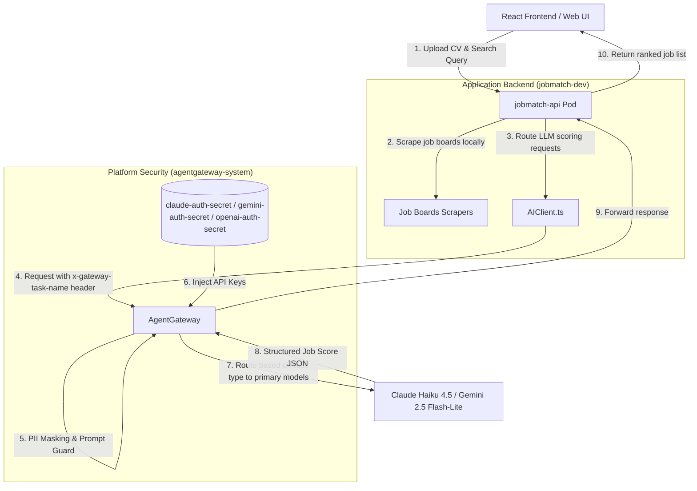
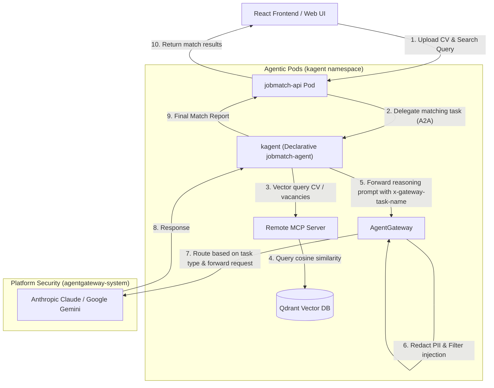
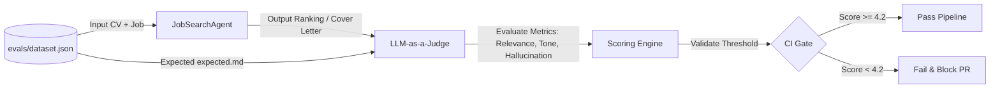
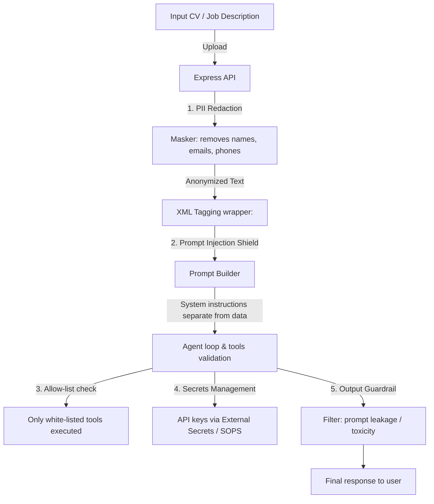
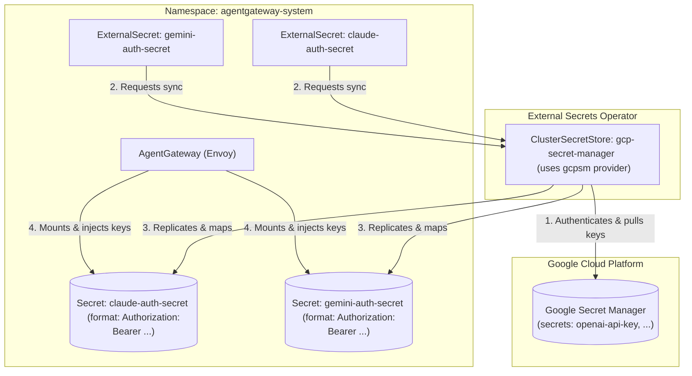
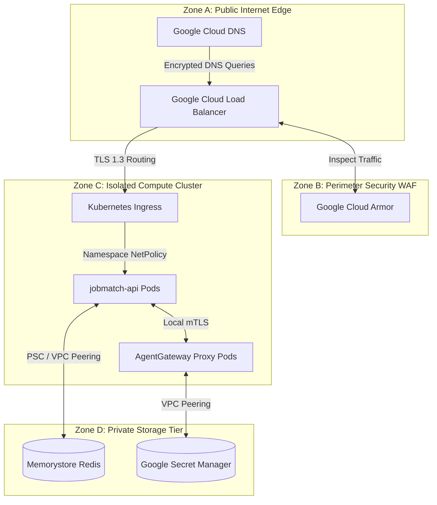
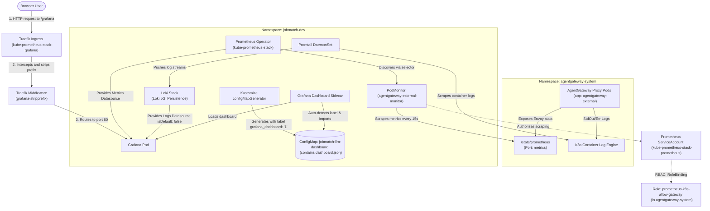

# High-Level Solution Design (HLD) — JobMatch Platform

This document defines the high-level architecture of the **JobMatch** platform, including component design, request lifecycle, CI/CD automation workflows, and the evaluation loop (Evals) for the Scout startup.

---

## 1. System Architecture Diagram

To ensure security, FinOps control, and scalability, the architecture is implemented in two phases:

### Phase 1: Agent Gateway Integration (Current State)
Local scraping and job search orchestration ([JobSearchAgent.ts](../app/server/agent/JobSearchAgent.ts)) remain on the Node.js API server, but all LLM calls are proxied through **AgentGateway** (powered by Envoy). The gateway performs PII masking, filters prompt injections, and injects API credentials.

---

### Phase 2: Declarative Agent & Vector DB (Target Architecture)
Local orchestration logic is completely removed from the API server and migrated to declarative agent pods **kagent**, which interact with remote **MCP** servers for vectorization and semantic search inside **Qdrant Vector DB**.

---

### Core System Components:
1. **React/Vite Frontend (Web):** Client application for uploading CVs and entering search queries.
2. **Backend API (Express):** Processes requests, runs local job board scrapers (Phase 1), and delegates matching tasks to agent pods via A2A (Phase 2).
3. **AI Client Layer ([AIClient.ts](../app/server/ai/AIClient.ts)):** Unified LLM client mapping all requests through `AgentGateway`.
4. **Agent Gateway ([AgentGateway](../platform/flux/clusters/dev/apps/jobmatch/agentgateway-policy.yaml)):** Envoy-based proxy for prompt injection filtering, data anonymization (masking emails, phones, SSNs, LinkedIn/GitHub links), and dynamic FinOps routing based on task names (routing simple matching to `gemini-2.5-flash-lite` / `gpt-5.4-nano`, and complex extraction tasks to `claude-haiku-4-5` / `gemini-3.5-flash`).
5. **Declarative Agent (jobmatch-agent) (Phase 2):** Specialized agent execution environment for prompt processing and MCP interactions.
6. **Memory (MCP + Qdrant) (Phase 2):** MCP server executing vector lookups against the Qdrant database.

---

## 2. CI/CD Pipeline and GitOps Release Process

Deployments are fully declarative, managed by the FluxCD GitOps controller, separated by cluster directories and Git branches.

### Promotion Strategy:
* **Dev Cluster (branch `dev`):** Syncs with `platform/flux/clusters/dev`. On every push to `dev`, GHA builds container images with tag `v1.0.0-<git-sha>` and updates it in `dev/apps/jobmatch/helm-release.yaml`.
* **Prod Cluster (branch `main`):** Syncs with `platform/flux/clusters/prod`. Promotion is done by updating the image tag in `prod/apps/jobmatch/helm-release.yaml` on the `dev` branch, testing it, creating a PR to `main`, and merging it.

> [!NOTE]
> For the detailed CI/CD configuration files, path filters, and ConfigMap rolling update annotation triggers, see the [LLD — CI/CD & GitOps Operations](LLD.md#6-cicd-pipeline--gitops-operations).

---

### Comparison of Reconcile Strategies (reconcileStrategy)

To balance speed of development in Dev and stability in Prod, different reconcile strategies are configured:

1. **Dev Environment: reconcileStrategy: Revision**
   - **Mechanism:** Flux immediately reacts to any Git commits (image tag updates, value shifts, prompt files), tracking Git revisions.
   - **Advantage:** Maximum speed of delivery without the need to bump Helm chart version in `Chart.yaml` for every iteration.

2. **Prod Environment: reconcileStrategy: ChartVersion**
   - **Mechanism:** Flux performs production updates only when the Helm chart version (`spec.chart.spec.version` in `HelmRelease`) is explicitly changed.
   - **Advantage:** Protects against accidental changes. Value modifications or prompt updates will not take effect on production until the SRE engineer explicitly increases the chart version. This guarantees release control and prevents human errors.

---

## 3. LLM-as-a-Judge Evaluation Loop (Evaluation Engine)

An LLM Judge evaluates the quality of agent results upon prompt or code changes.

### Metrics Framework:
1. **Relevance (1-5):** Scores how well matched vacancies correspond to the candidate's skills and experience.
2. **Tone (1-5):** Evaluates if the generated cover letter conforms to a professional tone.
3. **Hallucination-free (1-5):** Checks if the agent generated skills, credentials, or vacancy parameters not found in the input sources.
4. **Safety Score (1-5):** Evaluates if the output contains prompt leaks or signs of age/gender discrimination. Any violation drops the safety score to `1.0`.

> [!NOTE]
> For the golden dataset JSON schemas, test cases definitions, and evals runner logic, see the [LLD — Evaluation Engine](LLD.md#5-llm-as-a-judge-evaluation-engine).

---

## 4. Security Architecture

Multi-level security guards sensitive data and protects against input injections.

### Key Security Mechanisms:
* **PII Redaction:** CVs are anonymized on the API server (or via AgentGateway policy) before sending data to cloud providers.
* **Structural Tagging:** XML wrappers separate instructions from candidate content to mitigate jailbreaks.
* **Tool Allow-listing:** The agent is restricted to calling validated domains.
* **Externalized Secrets:** All API keys are isolated from the application containers. They are injected centrally at the **AgentGateway** level from secrets in `agentgateway-system`.
* **Output Guardrails:** Regex check on the response stream inside **AgentGateway**. Blocks output containing prompt leakage indicators or discrimination filters (e.g. "only men", "under 35") with a policy violation response. webhook-based toxicity filters are proposed for future integration.

> [!NOTE]
> For the Cheerio HTML selectors, CV parsing libraries, and LLM output hallucination filters, see the [LLD — Core Service & Agent Execution Blueprint](LLD.md#2-core-service--agent-execution-blueprint).

---

## 5. Secrets Management

LLM API credentials are proxy-injected at the **AgentGateway** level. External Secrets Operator (ESO) automates synchronization.

### GCP Secret Manager Integration

Dev and Prod environments use **Google Secret Manager (GCP SM)** for secrets management, aligning configurations.

---

### Secret Lifecycle in the Cloud (Dev & Prod)

#### Sync Flow:
1. **Source of Truth:** Credentials live in GCP Secret Manager.
2. **Authorization:** ClusterSecretStore authenticates with GCP via Workload Identity.
3. **Mapping:** ExternalSecret resources retrieve keys and map them into destination K8s secrets formatted for AgentGateway.
4. **GitOps Integration:** YAML configurations are tracked in Git, whereas raw secret keys are never committed.

> [!NOTE]
> For the credentials injection setups, HTTP header passing code, and mock-llm verification rules, see the [LLD — FinOps & Gateway Routing](LLD.md#3-finops--gateway-routing-implementation).

---

## Local Development & Testing

For running the cluster locally:

### 1. Local Secrets
Developers configure local secrets or mock credentials using files. Detailed guide:
* [Local Secrets Management (local-development-secrets.md)](manuals/local-development-secrets.md)

### 2. Mock LLM Service
For local verification of masking and routing rules without incurring API costs, a **`mock-llm`** Node.js service is deployed at port `8089` in `jobmatch-dev` namespace.
* [Testing Prompt Masking & PII Redaction (testing-security-masking.md)](manuals/testing-security-masking.md)

> [!NOTE]
> For local mock-llm logging tests and Vitest unit testing mock scripts, see the [LLD — Testing Suite & Mocking Framework](LLD.md#4-testing-suite--mocking-framework).

---

## 6. Infrastructure Architecture

The infrastructure architecture of the JobMatch platform is designed to optimize operational simplicity (Ops-wise), financial efficiency (FinOps), reliability, and scalability to handle up to 100,000 monthly requests.

### 6.1 Infrastructure Environments Overview

| Parameter | Development Environment (Dev) | Production Environment (Prod) |
| :--- | :--- | :--- |
| **Compute VM** | GCP VM `e2-standard-2` (2 vCPUs, 8 GB RAM) | **GKE Autopilot** (Multi-zonal cluster node capacity) |
| **K8s Runtime** | Local `k3d` cluster inside VM | **GKE Autopilot** managed environment |
| **Vector DB** | Qdrant (local pod inside VM) | Qdrant (ephemeral memory index pod / Qdrant Cloud) |
| **Cache & DB** | Redis (local pod inside VM) | **GCP Memorystore for Redis** (managed basic tier) |
| **Traffic Router** | Nginx Ingress Controller (local) | **Google Cloud Load Balancing (GCLB)** |
| **Edge Security** | Local TLS (Self-signed) | **Google Cloud Armor** (WAF & DDoS) |
| **Secret Provisioning**| Local Secrets files / K8s Secrets | **Google Secret Manager** + ESO |
| **Monthly Estimate**| **~$48.00 / month** | **~$138.26 / month** |

### 6.2 Development Environment Topology (Dev)

To minimize developer workstation resource load and cloud expenditures:
- A single GCP `e2-standard-2` VM runs a standard Docker runtime.
- A local lightweight `k3d` cluster runs in Docker, mirroring Kubernetes API schemas.
- All development services (`jobmatch-api`, `jobmatch-web`, `agentgateway`, `mock-llm`, local PostgreSQL, Redis, and Qdrant) are deployed as pods within the `jobmatch-dev` namespace.

### 6.3 Production Environment Topology (Prod)

The production infrastructure is built on managed Google Cloud Platform (GCP) services for maximum availability, scaling, and security:
1. **Google Cloud Load Balancing (GCLB):** Public traffic lands on GCLB, terminating client SSL/TLS connections using managed certificates (TLS 1.2/1.3 only, weak ciphers disabled).
2. **Google Cloud Armor:** Placed at the Load Balancer level, Cloud Armor provides L7 DDoS mitigation and WAF protections against exploit payloads.
3. **GKE Autopilot:** A fully managed, multi-zonal Kubernetes runtime. GKE Autopilot manages node provisioning, configuration, upgrades, and operating system patching. Pods are running with at least 2 replicas spread across multiple availability zones.
4. **GCP Memorystore for Redis:** Provides a reliable, managed in-memory cache for job search session data and API request caching.
5. **Qdrant Vector DB:** Deployed as an ephemeral/stateless vector database on GKE (or Qdrant Cloud). Vector index data is rebuilt on startup from source stores, bypassing the operational complexity of GKE persistent disks.

### 6.4 Scalability and Resource Limits

Under GKE Autopilot, billing is based on resource requests. Pod allocations are restricted to minimum stable baselines to maintain high cost-efficiency while permitting dynamic horizontal scaling (HPA) when CPU utilization exceeds 70%:

- `jobmatch-api`: 2 replicas, request limits `0.5 vCPU`, `1 GB RAM` each.
- `jobmatch-web`: 2 replicas, request limits `0.25 vCPU`, `256 MB RAM` each.
- `agentgateway` (Envoy proxy): 2 replicas, request limits `0.5 vCPU`, `512 MB RAM` each.

### 6.5 Production Infrastructure FinOps Cost Breakdown

Monthly infrastructure cost calculations based on 100,000 requests/month peak load in the `us-central1` region (assuming 730 monthly hours):
- **GKE Autopilot Pod Compute:**
  - `jobmatch-api` pods: $2 \times 0.5\text{ vCPU} \times \$0.0445/\text{vCPU-hr} \times 730 = \$32.49/\text{month}$
  - `jobmatch-api` memory: $2 \times 1.0\text{ GB} \times \$0.0049/\text{GB-hr} \times 730 = \$7.15/\text{month}$
  - `jobmatch-web` pods: $2 \times 0.25\text{ vCPU} \times \$0.0445/\text{vCPU-hr} \times 730 = \$16.24/\text{month}$
  - `jobmatch-web` memory: $2 \times 0.25\text{ GB} \times \$0.0049/\text{GB-hr} \times 730 = \$1.79/\text{month}$
  - `agentgateway` pods: $2 \times 0.5\text{ vCPU} \times \$0.0445/\text{vCPU-hr} \times 730 = \$32.49/\text{month}$
  - `agentgateway` memory: $2 \times 0.5\text{ GB} \times \$0.0049/\text{GB-hr} \times 730 = \$3.58/\text{month}$
  - **GKE Compute Subtotal:** **~$93.74/month** (The $73.00/month flat GKE cluster fee is completely offset by GCP's free tier cluster credit).
- **GCP Memorystore for Redis (Basic Tier, 1 GB):**
  - $1\text{ GB} \times 730\text{ hours} \times \$0.0127/\text{hour} = \mathbf{\$9.27/\text{month}}$
- **Google Cloud Load Balancer (GCLB):**
  - Base forwarding rules: $730\text{ hours} \times \$0.025/\text{hour} = \mathbf{\$18.25/\text{month}}$
- **Google Cloud Armor Standard + WAF rules:**
  - Rules, policy overhead, and query fees: **~$7.00/month**
- **Egress & Cloud Storage (Logs/Backups):**
  - Storage allocation and network egress: **~$10.00/month**
- **TOTAL INFRASTRUCTURE MONTHLY COST:** **~$138.26/month**

### 6.6 Security Mapping: GCP Services for OWASP Protections

| GCP Service | Target OWASP Vulnerability | Mitigation Details |
| :--- | :--- | :--- |
| **Google Cloud Armor** (WAF & DDoS) | • **OWASP Web A03: Injection** (SQLi, XSS) • **OWASP Web A04: Insecure Design** • **OWASP LLM01: Prompt Injection** | • Uses pre-configured WAF rule sets (CRS) to block SQLi, XSS, and command injections at the edge proxy layer. • Mitigates L7 application DDoS and enforces rate limiting per client IP. • Inspects payloads via custom expression filters to block prompt injection patterns prior to reaching GKE pods. |
| **Google Kubernetes Engine (GKE) Autopilot** | • **OWASP Web A01: Broken Access Control** • **OWASP Web A05: Security Misconfiguration** | • **Network Isolation:** Built-in NetworkPolicies (via Dataplane V2) enforce micro-segmentation, ensuring only authorized namespaces/pods talk to each other. • **Hardened Nodes:** Node configurations, OS patches, and updates are entirely managed by Google with SSH access blocked. • **Pod Security Standards:** Rejects root containers, enforcing restricted profiles (read-only root filesystems). |
| **Google Secret Manager** (with Workload Identity) | • **OWASP Web A02: Cryptographic Failures** • **OWASP LLM10: Model Theft / Excess Agency** | • Stores all API credentials encrypted at rest and in transit. • **Workload Identity:** Maps K8s Service Accounts directly to GCP IAM roles, eliminating the need to compile or save long-lived credential JSONs in pods. • Restricts key access solely to the `agentgateway` proxy in `agentgateway-system` namespace. |
| **Artifact Registry** & **Container Analysis** | • **OWASP Web A06: Vulnerable Components** | • Scans container images for CVEs automatically upon container push, blocking deployments of vulnerable containers. |
| **Google Cloud Load Balancing (GCLB)** | • **OWASP Web A02: Cryptographic Failures** | • Terminates external TLS using Google-managed certificates, enforcing TLS 1.2 or TLS 1.3 only. |
| **Cloud Logging** & **Cloud Monitoring** | • **OWASP Web A09: Logging & Monitoring Failures** | • Aggregates and alerts on GKE Audit Logs, VPC flow logs, Load Balancer access logs, and Secret Manager access metrics to detect security events. |

### 6.7 GCP Network Security Zoning

To prevent boundary crossings and secure communications, the production environment is partitioned into four logical security zones:

- **Zone A (Public Internet Edge):** Serves as the public entry-point. Resolves traffic via Cloud DNS and terminates SSL/TLS connections at the external Google Cloud Load Balancer (GCLB) using Google-managed certificates.
- **Zone B (Perimeter Security / WAF):** Google Cloud Armor integrates directly with GCLB to filter SQL injection, XSS, and layer 7 DDoS floods. It acts as the perimeter shield before any packets enter the internal network.
- **Zone C (Isolated Compute Cluster - GKE Autopilot):** Virtual machines and nodes run in private subnets with no public IP addresses. Cluster boundaries are secured using GKE Dataplane V2 NetworkPolicies, which isolate the `jobmatch-prod` namespace from other workloads and ensure that only the Ingress controller can route traffic to internal application pods.
- **Zone D (Private Storage Tier):** Contains managed storage services. GCP Memorystore for Redis and GCP Secret Manager are reached only through Private Service Connect (PSC) or VPC Peering endpoints from within Zone C. Direct public access to the storage tier is entirely blocked at the GCP VPC firewall layer.

### 6.8 Observability & Monitoring Architecture

To monitor the performance, cost, and safety of the AI-powered search, the platform implements a standardized observability stack using Prometheus, Loki, Promtail, and Grafana.

#### Observability & Traffic Flow Diagram
The observability infrastructure monitors metrics and logs, and exposes the Grafana UI under a secured subpath:
1. **Metrics:** Scraped from the Envoy-based `AgentGateway` proxy namespace into Prometheus.
2. **Logs:** Collected by a Promtail DaemonSet from all containers across namespaces and forwarded to Loki.
3. **Ingress & Routing:** Public HTTP requests hitting `/grafana` pass through a Traefik Ingress, where a subpath stripping middleware intercepts and rewrites requests before forwarding them to Grafana.

#### Key Monitored Metrics
The following metrics are collected from Envoy's Prometheus stats and visualized on the dashboard:

| Metric Group | Envoy Metric Name | Description / Dashboard Panel |
| :--- | :--- | :--- |
| **Request Volume** | `agentgateway_requests_total` | Tracks total requests routed through the gateway (visualized as request rate over 5m). |
| **LLM Latency** | `agentgateway_gen_ai_server_request_duration_sum`   `agentgateway_gen_ai_server_request_duration_count` | Calculates average LLM response time over 5m (`sum / count`). |
| **Token Consumption** | `agentgateway_gen_ai_client_token_usage_sum` | Tracks volume of input/output tokens consumed by LLM interactions. |
| **Prompt Injection Blocks**| `agentgateway_guardrail_checks_total` | Monitors the count of blocked malicious prompt injections or guardrail policy violations. |

