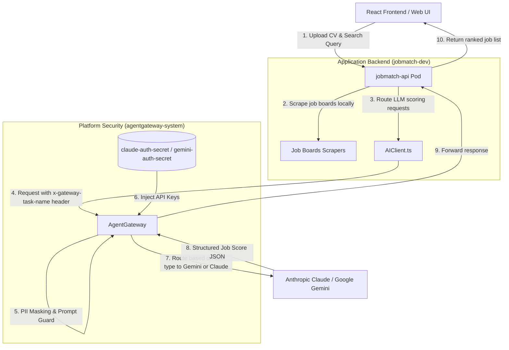
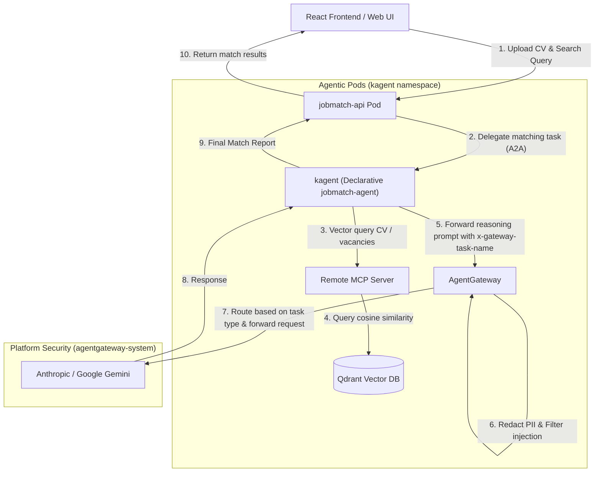
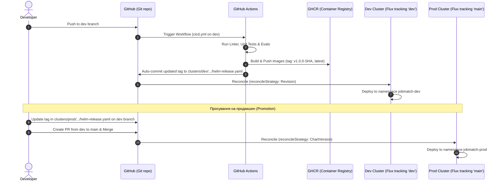
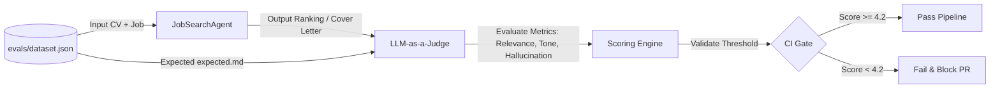
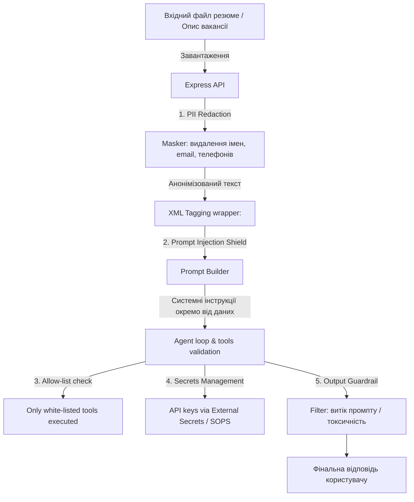
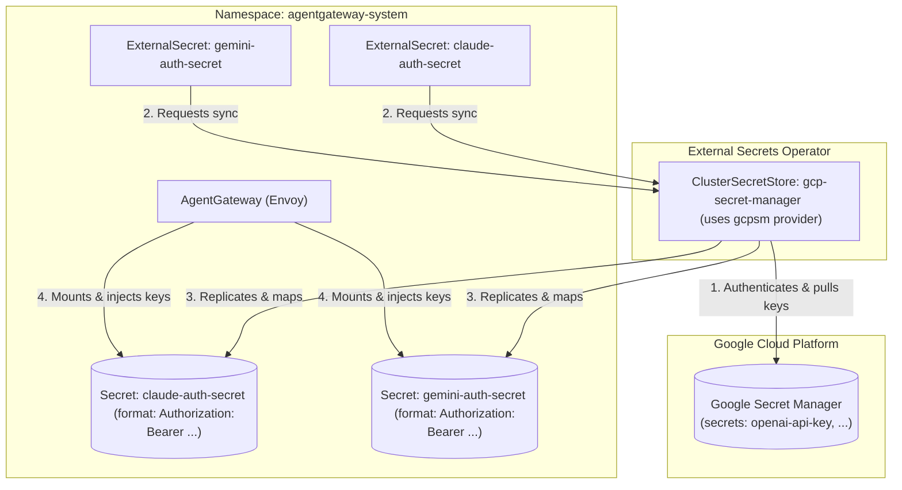

# High-Level Solution Design (HLD) — JobMatch Platform

Цей документ визначає високорівневу архітектуру платформи **JobMatch**, включаючи дизайн компонентів, життєвий цикл запитів, процес CI/CD автоматизації та контур тестування якості (Evals) для стартапу Scout.

---

## 1. Архітектурна діаграма системи (System Architecture)

Для забезпечення безпеки, FinOps контролю та масштабованості архітектура впроваджується у два етапи:

### Фаза 1: Інтеграція Agent Gateway (Поточний стан)
Локальний збір та оркестрація пошуку вакансій ([JobSearchAgent.ts](../app/server/agent/JobSearchAgent.ts)) залишаються на Node.js API сервері, але всі запити до LLM проксіюються через **AgentGateway** (на базі Envoy). Шлюз виконує анонімізацію даних (PII), фільтрує ін'єкції промптів та інжектує API-ключі.

---

### Фаза 2: Декларативний Агент та Векторна БД (Цільова архітектура)
Локальна логіка оркестрації повністю вилучається з API-сервера та переноситься у декларативні под-агенти **kagent**, які взаємодіють з віддаленими серверами **MCP** для векторизації та семантичного пошуку у **Qdrant Vector DB**.

---

### Основні компоненти системи:
1. **React/Vite Frontend (Web):** Клієнтська частина для завантаження резюме та введення пошукових запитів.
2. **Backend API (Express):** Обробляє запити, запускає локальні парсери/скрапери вакансій (Фаза 1) та перенаправляє завдання агентам kagent через A2A (Фаза 2).
3. **AI Client Layer ([AIClient.ts](../app/server/ai/AIClient.ts)):** Уніфікований клієнт, що перенаправляє всі LLM запити на `AgentGateway`.
4. **Agent Gateway ([AgentGateway](../platform/flux/clusters/dev/apps/jobmatch/agentgateway-policy.yaml)):** Envoy-посередник для фільтрації Prompt Injection, маскування персональних даних (PII, як-от Email, телефони, SSN, посилання на LinkedIn/GitHub) та динамічного FinOps роутингу на основі типу задачі (через HTTP-заголовок `x-gateway-task-name`, який спрямовує `job_match` на дешеві моделі Gemini, а `cv_extract` — на Claude).
5. **Declarative Agent (jobmatch-agent) (Фаза 2):** Спеціалізоване середовище виконання kagent для обробки промптів та взаємодії з MCP.
6. **Memory (MCP + Qdrant) (Фаза 2):** MCP-сервер для семантичного пошуку збігів у векторній базі даних Qdrant.

---

## 2. CI/CD Пайплайн та GitOps Реліз-Процес

Розгортання платформи здійснюється повністю декларативно за допомогою GitOps-контролера FluxCD, розділеного на рівні окремих каталогів кластерів та відповідних гілок.

### Стратегія просування (Promotion Strategy):
* **Dev-кластер (Гілка dev):** Синхронізується з каталогом `platform/flux/clusters/dev`. При кожному пуші в dev GitHub Actions автоматично збирає контейнери з тегом `v1.0.0-<git-sha>` та за допомогою кроку автоматичного запису оновлює цей тег у `dev/apps/jobmatch/helm-release.yaml`.
* **Prod-кластер (Гілка main):** Синхронізується з каталогом `platform/flux/clusters/prod`. Для доставки оновлень розробник оновлює тег у `prod/apps/jobmatch/helm-release.yaml` на перевірений у dev, створює PR у main та зливає його після перевірки.

---

### Порівняння стратегій узгодження (reconcileStrategy)

Для балансу між швидкістю розробки в Dev та стабільністю в Prod використовуються різні стратегії узгодження HelmRelease:

1. **Dev-середовище: reconcileStrategy: Revision**
   * **Суть:** Flux миттєво реагує на будь-які комміти в Git (зміна тегів образів, значень values або конфігураційних файлів), оскільки він відслідковує зміну Git-ревізії.
   * **Перевага:** Максимальна швидкість доставки без необхідності підняття версії чарту в `Chart.yaml` при кожній зміні (зручно для швидкої ітерації).

2. **Prod-середовище: reconcileStrategy: ChartVersion**
   * **Суть:** Flux виконує оновлення релізу на продакшені тільки тоді, коли версія Helm-чарту (`spec.chart.spec.version` у `HelmRelease` або версія чарту у репозиторії) явно змінюється.
   * **Перевага:** Захист від випадкових змін конфігурації. Будь-які зміни в values чи параметрах шлюзу не будуть застосовані на Prod, доки розробник явно не оновить версію чарту. Це гарантує суворий релізний контроль, однозначність версіонування (SemVer) та мінімізує ризики людських помилок при злитті PR.

---

## 3. Контур оцінки якості LLM-as-a-Judge (Evaluation Engine)

Для вимірювання якості роботи агента при зміні коду або промптів використовується LLM-суддя.

### Метрики оцінювання (Metrics Framework):
1. **Relevance (Релевантність):** Чи дійсно підібрані вакансії відповідають навичкам та досвіду кандидата з резюме? (Шкала 1-5).
2. **Tone (Тональність):** Чи відповідає згенерований супровідний лист (cover letter) професійному корпоративному стилю без зайвого "хайпу" (Шкала 1-5).
3. **Hallucination-free (Відсутність галюцинацій):** Чи не придумує модель вакансії або досвід, якого не було в резюме (Шкала 1-5).

---

## 4. Схема безпеки (Security Architecture)

Багаторівневий захист забезпечує ізоляцію конфіденційних даних та захист від зовнішніх атак.

### Ключові механізми безпеки:
* **PII Redaction:** Усі резюме анонімізуються на рівні Express-сервера (або через політику AgentGateway Guardrails) перед надсиланням до хмарних LLM.
* **Структурне тегування:** Вхідні дані користувача відокремлюються від системних інструкцій за допомогою суворих XML-тегів, що мінімізує успішність атак "ignore previous instructions".
* **allow-list інструментів:** Агент має обмежений набір дій (наприклад, дозволено робити HTTP GET тільки на валідовані домени дощок вакансій).
* **secrets поза git:** Усі API-ключі LLM-провайдерів ізольовані від контейнера застосунку. Вони управляються централізовано на рівні **AgentGateway** (з використанням Kubernetes Secrets / External Secrets Operator у просторі імен `agentgateway-system`) та автоматично підставляються у вихідні запити до LLM-провайдерів на рівні шлюзу.

---

## 5. Управління секретами (Secrets Management)

Безпека API-ключів для LLM-провайдерів (OpenAI, Anthropic, Gemini) є критично важливою. Усі ключі повністю ізольовані від коду додатків і підставляються динамічно на рівні шлюзу безпеки **AgentGateway**. Синхронізація ключів реалізована за допомогою **External Secrets Operator (ESO)**.

### Уніфікація хмарних середовищ (GCP Secret Manager)

Для дотримання принципу відповідності середовищ (Dev-Prod parity) усі хмарні контури платформи (**Dev** та **Prod**) використовують єдиний підхід до управління секретами на базі **Google Secret Manager (GCP SM)**. Це дозволяє уникнути відмінностей у конфігураціях між середовищами в хмарі.

---

### Архітектурне рішення та життєвий цикл секретів у хмарі (Dev & Prod)

#### Процес синхронізації:
1. **Джерело правди (Source of Truth):** Усі API-ключі хмарних сервісів зберігаються в Google Secret Manager у відповідному GCP-проекті.
2. **Авторизація оператора:** `ClusterSecretStore` під назвою `gcp-secret-manager` використовує провайдер `gcpsm`. Він авторизується в Google Cloud за допомогою механізму **Workload Identity** (для Kubernetes Service Account оператора ESO) або за допомогою змонтованого сервісного ключа GCP.
3. **Мапування та форматування:** Ресурси `ExternalSecret` в `agentgateway-system` зчитують ключі з GCP SM та автоматично форматують їх, створюючи кінцевий секрет (наприклад, з полем `Authorization: Bearer <key>`), який використовує `AgentGateway`.
4. **GitOps-сумісність:** Конфігураційні файли (декларативні описи `ExternalSecret` та `ClusterSecretStore`) безпечно зберігаються в Git-репозиторії та синхронізуються за допомогою **FluxCD**, тоді як самі секретні дані ніколи не коммітяться в репозиторій.

---

### Локальна розробка та тестування (Local Development & Testing)

Для роботи системи локально на ноутбуці (у k3s / minikube / kind) передбачено механізми запуску без зовнішніх хмарних залежностей:

#### 1. Локальне управління секретами
Для використання секретів без хмари розробники можуть використовувати спрощений підхід прямого створення локальних секретів або імітацію роботи ESO без GCP SM. Детальний посібник:
* [Локальна робота з секретами на ноутбуці (local-development-secrets.md)](manuals/local-development-secrets.md)

#### 2. Локальне тестування безпеки (Mock LLM Service)
Для тестування prompt-ін'єкцій, маскування персональних даних (PII) та FinOps-роутингу без здійснення реальних платних запитів до Anthropic Claude або Google Gemini у локальному кластері розгортається сервіс **`mock-llm`** (на базі Node.js).

* **Принцип роботи:** Сервіс слухає порт `8089` у namespace `jobmatch-dev` та виступає кінцевою точкою (upstream) для `AgentGateway` у локальному контурі.
* **Перевірка маскування:** `mock-llm` приймає запити від шлюзу, логує вхідне тіло запиту у свій `stdout` (дозволяючи розробнику через `kubectl logs` перевірити, чи замасковано персональні дані, наприклад, `<EMAIL_ADDRESS>`), та повертає фіксовану OpenAI-сумісну JSON-відповідь.
* **Посібник з тестування:** [Тестування Prompt Masking та PII маскування (testing-security-masking.md)](manuals/testing-security-masking.md)

