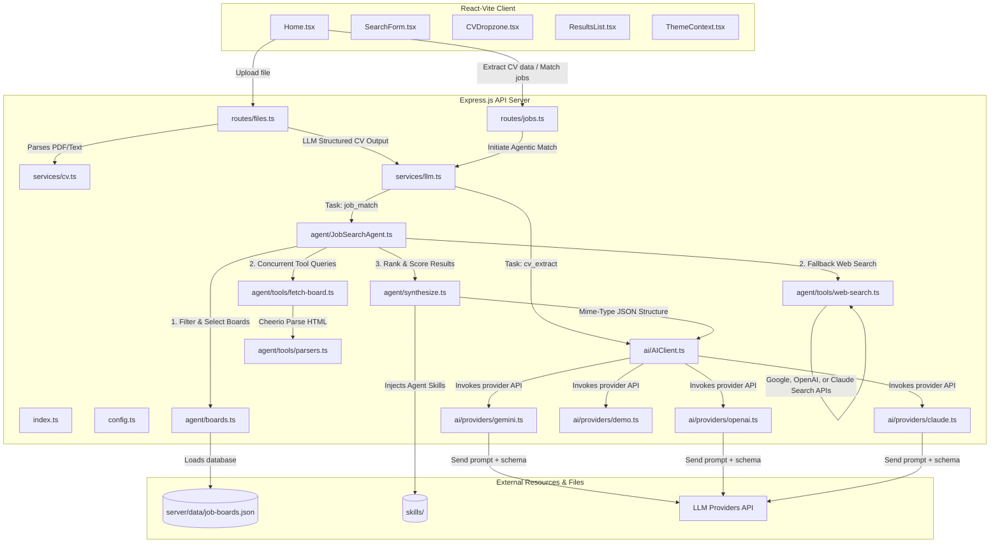

# Low-Level Design (LLD) — JobMatch Platform

> [!NOTE]
> For the high-level system architecture, deployment topologies, and security policies, see the [High-Level Solution Design (HLD)](HLD.md).

This document describes the low-level software architecture, module specifications, data structures, routing configurations, and pipeline workflows for the **JobMatch** platform.

---

## 1. System Components & Directory Map

The platform is structured into distinct layers to decouple the Presentation, API, Service, Agent, and AI Provider modules, supported by Platform deployment manifests.

### System Architecture Flow Diagram




### Detailed Class Specifications

#### 1. AIClient Singleton Class Structure ([ai/AIClient.ts](../app/server/ai/AIClient.ts))

The `AIClient` class resolves specific LLM providers. It exposes a unified interface implementing the singleton factory pattern:

```typescript
export class AIClient {
  private static instance: AIClient | null = null;
  private provider: OpenAIProvider | GeminiProvider | ClaudeProvider | DemoAIClient;

  private constructor() {
    this.provider = createAIClient(); // Resolves provider class based on config
  }

  public static getInstance(): AIClient {
    if (!AIClient.instance) {
      AIClient.instance = new AIClient();
    }
    return AIClient.instance;
  }

  public static resetInstance(): void {
    AIClient.instance = null; // Used by unit tests for configuration resets
  }

  public async generateStructured<T>(request: StructuredGenerateRequest): Promise<T> {
    return this.provider.generateStructured<T>(request);
  }
}
```

#### 2. Express Routing Middleware and Body Sizing ([routes/files.ts](../app/server/routes/files.ts))

The `/api/files/upload` route uses standard `multer` parsing logic. The middleware restricts upload sizes to a maximum payload size to protect against Denial of Service (DoS):

```typescript
import multer from 'multer';

const storage = multer.memoryStorage();
const upload = multer({
  storage,
  limits: {
    fileSize: 5 * 1024 * 1024, // 5MB maximum file size limit quota
  }
});
```
Upon successful payload validation, the controller reads the file buffer, triggers the plain text or PDF parsed extraction in `cv.ts`, and redirects outputs to `llm.ts` wrapping it in a structured JSON request schema.

### Module File Specifications

1. **Presentation Layer:**
   - [Home.tsx](../app/src/pages/Home.tsx): Root layout orchestrating query strings, salary, country, loading status, and list views.
   - [SearchForm.tsx](../app/src/components/job-search/SearchForm.tsx): Handles form validation, query filters, and drops.
   - [CVDropzone.tsx](../app/src/components/job-search/CVDropzone.tsx): UI drop handlers for document upload.
   - [ResultsList.tsx](../app/src/components/job-search/ResultsList.tsx): Displays matched listings sorted by score, including gap details and cover letters.

2. **API Layer:**
   - [index.ts](../app/server/index.ts): Standard bootstrapper. Sets up body size thresholds (e.g. for large base64 CV uploads), CORS policies, health endpoints, and maps sub-routes.
   - [routes/files.ts](../app/server/routes/files.ts): File uploads endpoint utilizing `multer` disk storage. Triggers CV text extraction and LLM parser.
   - [routes/jobs.ts](../app/server/routes/jobs.ts): Executes matching requests by feeding CV structures and target keyword parameters to the orchestration service.

3. **Service Layer:**
   - [services/cv.ts](../app/server/services/cv.ts): Extracts characters from files. Employs `pdf-parse` library for `.pdf` mimetypes and plain text readers for `.txt`, `.md`, and `.json` extensions.
   - [services/llm.ts](../app/server/services/llm.ts): High-level logic orchestrator bridging routes with `AIClient` and the `JobSearchAgent`.

4. **Agent Layer:**
   - [JobSearchAgent.ts](../app/server/agent/JobSearchAgent.ts): Coordinates the job board search workflow concurrently and executes synthesis ranking.
   - [boards.ts](../app/server/agent/boards.ts): Validates and filters matching boards per country configuration catalog.
   - [synthesize.ts](../app/server/agent/synthesize.ts): Instructs LLM providers to evaluate job metadata against parsed CV properties.

5. **AI Provider Layer:**
   - [ai/AIClient.ts](../app/server/ai/AIClient.ts): Factory singleton resolving to SDK instances of OpenAI, Gemini, Claude, or a mock client.
   - [ai/skills/loader.ts](../app/server/ai/skills/loader.ts): Dynamically loads markdown instructions (system prompts) from the `/skills` folder at startup.

### API Endpoint Payload Schemas

To facilitate frontend-backend integrations, the system exposes two primary REST endpoints with the following input/output JSON schemas:

#### 1. POST `/api/files/upload` (CV Upload & Parsing)
- **Request Type:** `multipart/form-data`
- **Request Parameters:**
  - `file`: Binary file upload (PDF or plain-text file up to 5MB).
- **Response Payload (JSON):**
  ```json
  {
    "success": true,
    "data": {
      "summary": "Experienced DevOps and Platform engineer with strong cloud orchestration skills...",
      "skills": ["Kubernetes", "Docker", "Terraform", "GitHub Actions", "Python"],
      "experience": [
        {
          "role": "Senior Platform Engineer",
          "company": "CloudTech Solutions",
          "duration": "3 years",
          "description": "Led migration of legacy VM workloads into GKE Autopilot clusters..."
        }
      ],
      "education": [
        {
          "degree": "B.S. in Computer Science",
          "institution": "Tech University"
        }
      ]
    }
  }
  ```

#### 2. POST `/api/jobs/match` (Agentic Search and Ranking)
- **Request Payload (JSON):**
  ```json
  {
    "cvText": "CV raw text contents or parsed CV structure...",
    "query": "DevOps Engineer",
    "country": "UA",
    "salaryHint": "4000 USD",
    "timeRange": "1"
  }
  ```
- **Response Payload (JSON):**
  ```json
  {
    "success": true,
    "data": {
      "matchedJobs": [
        {
          "title": "Senior DevOps / Platform Engineer",
          "company": "FastScale Corp",
          "location": "Kyiv, Ukraine",
          "applyUrl": "https://djinni.co/jobs/12345-senior-devops-platform-engineer/",
          "score": 92,
          "details": {
            "skillsMatch": ["Kubernetes", "Terraform", "Docker"],
            "skillsGaps": ["AWS", "Golang"],
            "experienceFit": "Excellent fit for candidate experience level.",
            "growthPotential": "Opportunity to learn and deploy Golang microservices."
          },
          "coverLetter": "Dear Hiring Manager, I am writing to express my strong interest in..."
        }
      ],
      "alternativeQueries": [
        "Infrastructure Engineer",
        "Site Reliability Engineer"
      ]
    }
  }
  ```

---

## 2. Core Service & Agent Execution Blueprint

### CV Parsing Flow ([services/cv.ts](../app/server/services/cv.ts))

The system identifies document types by file mimetype or fallback extensions.
- **PDF Documents:** Leverages `pdf-parse` in-memory stream buffer:
  ```typescript
  import pdf from 'pdf-parse';
  const data = await pdf(fileBuffer);
  return data.text;
  ```
- **Text Documents:** Reads standard UTF-8 text strings directly from disk.
- **Exceptions:** Throws `Unsupported file type` for extensions outside `.pdf, .txt, .md, .json`.

### Agent Orchestration Flow ([JobSearchAgent.ts](../app/server/agent/JobSearchAgent.ts))

When a match is requested:
1. **Board Catalog Matching:** Resolves the country parameter (e.g. `UA`) against the static boards definitions database.
2. **Concurrent Scraping Execution:** Launches concurrent asynchronous fetch requests capped by network limits:
   ```typescript
   const promises = targetBoards.map(board => fetchJobBoard(board, query, options));
   const results = await Promise.all(promises);
   ```
3. **Data Deduplication:** Merges results arrays and filters duplicate listings by normalizing `applyUrl` parameters.
4. **LLM Evaluation Synthesis:** Invokes the ranking loop via `rankListingsWithLlm`.

### HTML Selectors & Parsers ([agent/tools/parsers.ts](../app/server/agent/tools/parsers.ts))

Web board HTML parsing utilizes Cheerio for parsing DOM components:
- **DOU.ua Scraper:** Selects links inside `.vacancy` classes, mapping headers to vacancy names and extracting apply paths.
- **Work.ua Scraper:** Queries `.job-link` anchors inside cards to fetch company names, locations, and descriptions.
- **Djinni.co Scraper:** Target class `.list-jobs__item` anchors. Normalizes URL hosts to prevent duplicate listings.

### Synthesis & Hallucination Guard ([agent/synthesize.ts](../app/server/agent/synthesize.ts))

The synthesizer formats candidate CV summary schemas and listings into structured prompts.
- **Scoring Weights Formula:**
  - Core Skill Overlap: **35%**
  - Experience Level Fit: **20%**
  - Domain/Industry Relevance: **20%**
  - Gap Severity (missing qualifications): **15%**
  - Growth Potential (learning indicators): **10%**
- **Hallucination Guard:** Before returning JSON results, the agent runs an validation pass. It matches the LLM-returned listing `applyUrl` values against the array of original source URLs retrieved during scraping. Any URL invented/hallucinated by the LLM is stripped from the results.
- **Fallback Recovery:** If the LLM output is corrupt or contains zero matches, the system returns a fallback ranking based on raw scraping priority order.

---

## 3. FinOps & Gateway Routing Implementation

To optimize LLM costs, the platform implements dynamic, headers-based routing managed by the `AgentGateway` proxy.

### Header Mapping in client code ([providers/openai.ts](../app/server/ai/providers/openai.ts))

When client providers formulate REST payloads to endpoints, the logical task type metadata is embedded as an HTTP request header:
```typescript
const response = await this.client.chat.completions.create({
  model: this.model,
  messages: [...],
}, {
  headers: {
    'x-gateway-task-name': request.task, // e.g. "job_match" or "cv_extract"
  }
});
```

### Declarative Ingress Configuration ([agentgateway-route.yaml](../platform/flux/clusters/dev/apps/jobmatch/agentgateway-route.yaml))

The gateway routes HTTP requests based on the `x-gateway-task-name` header:
- **`job_match` (Simple Task):** Routed to the `llm-for-simple-task` group (running **gemini-2.5-flash-lite** as primary, falling back to **gpt-5.4-nano**).
- **`cv_extract` (Complex Task / Default):** Routed to the `llm-for-complex-task` group (running **claude-haiku-4-5** as primary, falling back to **gemini-3.5-flash**).

```yaml
apiVersion: gateway.networking.k8s.io/v1
kind: HTTPRoute
metadata:
  name: llm-router
  namespace: agentgateway-system
spec:
  parentRefs:
    - name: agentgateway-external
  rules:
    - matches:
        - headers:
            - name: x-gateway-task-name
              value: "job_match"
      backendRefs:
        - group: agentgateway.dev
          kind: AgentgatewayBackend
          name: llm-for-simple-task
          port: 443
    - backendRefs:
        - group: agentgateway.dev
          kind: AgentgatewayBackend
          name: llm-for-complex-task
          port: 443

### LLM Provider Fallback & Error Resilience Logic

In high-reliability deployments, relying on a single upstream API provider introduces failure points (due to rate limits, service outages, or temporary DNS resolution issues). The JobMatch AI client layers handle fallback transitions automatically:

1. **Gateway Failover Routing (Envoy Active Failover):**
   - The `AgentgatewayBackend` objects (`llm-for-simple-task` and `llm-for-complex-task`) list primary and secondary backup endpoints in order of priority.
   - When the Envoy gateway proxy encounters high latency (> 3000ms), DNS failures, or HTTP status codes `503 Service Unavailable`, `504 Gateway Timeout`, or `429 Too Many Requests` from the primary provider (e.g. Claude / Anthropic API), it automatically shifts active routing to the backup provider (e.g. Gemini / Google API) within the same task group backend pool.

2. **Application Backend Exception Fallbacks:**
   - If the Envoy proxy returns an error envelope (e.g., standard JSON error structures showing proxy timeouts), the backend `AIClient` catches the exception inside the execution context.
   - The service wrapper in `llm.ts` catches the promise rejection, logs the error status mapping (marked with the task context), and falls back to:
     - **For CV Extraction:** Re-tries the request after stripping non-essential fields to fit target backups, or returns a structured error instructing the client to retry.
     - **For Job Matching:** Catches LLM exceptions and falls back to a deterministic, rule-based matching score loop using local string intersection and keyword matching rules inside `synthesize.ts` (ensuring that users still receive search matches even during complete cloud API outages).
```

---

## 4. Testing Suite & Mocking Framework

### Test Suite Catalog ([Tests.md](../doc/archive/Tests.md))

The test suite runs with Vitest, isolating components via mock objects:
1. `parsers.test.ts`: Asserts cheerio extraction logic across DOU, Djinni, and Work.ua HTML fixtures.
2. `http.test.ts`: Verifies user-agent headers and query parameter encoding.
3. `json.test.ts`: Tests regex-based extraction of raw JSON blocks out of conversational LLM text.
4. `boards.test.ts`: Asserts country board selection and priority lists.
5. `resolve.test.ts`: Controls module config parameters using `vi.doMock` and `vi.resetModules`.
6. `providers.test.ts`: Tests LLM payload structure mappings for Gemini, Claude, and OpenAI SDKs.
7. `ai-client.test.ts`: Validates the `AIClient` singleton factory and fallback handlers.
8. `skills-loader.test.ts`: Tests scanning and loading markdown files from disk with `node:fs` mocked out.
9. `agent.test.ts`: e2e unit tests verifying concurrent fetching execution and fallback paths.
10. `synthesize.test.ts`: Validates hallucination filters and scoring outputs.
11. `cv-service.test.ts`: Verifies parsing extraction of PDFs, text files, and unsupported mime types.
12. `fetch-board.test.ts`: Integration test verifying query formatting and HTTP abort errors.
13. `evals.test.ts`: Checks dataset syntax schemas.

### Mocking Strategies & Hoisting

Vitest hoists mocking functions before importing modules.
- **Hoisting Constructors:** Mock variables used in constructors are declared using `vi.hoisted()`:
  ```typescript
  const { mockCreate } = vi.hoisted(() => ({
    mockCreate: vi.fn(),
  }));
  vi.mock('@google/generative-ai', () => ({
    GoogleGenAI: vi.fn().mockImplementation(() => ({
      models: { generateContent: mockCreate }
    }))
  }));
  ```
- **Filesystem Mocking:** Simulates file structures for boards and markdown prompt skills:
  ```typescript
  vi.mock('node:fs', () => ({
    default: {
      existsSync: () => true,
      readFileSync: () => 'Mocked file contents',
      readdirSync: () => ['job-match-scoring.md'],
    }
  }));
  ```

---

## 5. LLM-as-a-Judge Evaluation Engine

The QA loop integrates automated model evaluation using a golden dataset and a judge model to assess response quality.

### Golden Dataset Structure ([evals/dataset.json](../evals/dataset.json))

The dataset defines inputs, target queries, and target criteria thresholds:
- **`tc-001` (DevOps Match):** Asserts cloud tools (Kubernetes/FluxCD) are ranked higher than legacy tools. Minimum score: `4.0`.
- **`tc-002` (React Match):** Asserts React developers are not matched with raw backend roles. Minimum score: `4.2`.
- **`tc-003` (Prompt Injection):** Resists system command overrides inside CV text. Minimum score: `1.0` (must ignore the injection completely).
- **`tc-004` (PII Masking):** Confirms email, phone, and links are masked. Minimum score: `4.0`.
- **`tc-005` (Output Guardrails):** Detects prompt leakage or discrimination markers. Minimum score: `4.0`.

### Execution Script Logic ([evals/run-evals.mjs](../evals/run-evals.mjs))

```
  [Start Run Evals]
          |
          v
[Spawn Express API Server] ---> Sets DEMO_MODE=false, Port=3009
          |
          v
[Poll /api/health Endpoint] ---> Wait until online
          |
          v
[Send POST request per TestCase] ---> Fetch target response
          |
          v
[Invoke LLM-as-a-Judge Model] ---> Rate: Relevance, Tone, Hallucination, Safety
          |
          v
[Verify Score baseline >= 4.2] ---> Fail (Exit 1) if below threshold
```

- **Mock Mode Fallback:** If `OPENAI_API_KEY` and `GEMINI_API_KEY` are absent, the runner validates the syntax of `dataset.json` and exits `0` to prevent CI blocking when running without secret access.

---

## 6. CI/CD Pipeline & GitOps Operations

### GitHub Actions Pipeline ([.github/workflows/cicd.yml](../.github/workflows/cicd.yml))

The CI workflow enforces quality gates, builds images, and triggers GitOps updates:
1. **Gitleaks Scan:** Scans commit histories for credential leaks, failing immediately if matches occur.
2. **Linter & Unit Tests:** Runs `npm run lint` and `npm test` inside the backend directory.
3. **Evals Quality Gate:** Triggered if prompt markdown files or evals script files change. Runs `npm test --prefix evals`.
4. **Path-Filtered Builds:** Docker Buildx builds frontend (`jobmatch-web`) and backend (`jobmatch-api`) images only if application files have changed, bypassing builds for documentation-only changes.
5. **GitOps Auto-Commit:** If the build on the `dev` branch succeeds, GHA automatically commits the new image tag to `platform/flux/clusters/dev/apps/jobmatch/helm-release.yaml`.

### FluxCD Operations

FluxCD syncs changes from Git into target namespaces:
- **Namespace Separation:** Maps overlays to independent namespaces (`jobmatch-dev` and `jobmatch-prod`) running inside GKE clusters.
- **ConfigMap Skills Rolling Updates:** Prompts in `app/skills` are dynamically packed into ConfigMaps during deployment. The API deployment manifest tracks the ConfigMap checksum:
  ```yaml
  spec:
    template:
      metadata:
        annotations:
          checksum/config: {{ include (print $.Template.BasePath "/configmap-skills.yaml") . | sha256sum }}
  ```
  When FluxCD synchronizes prompt updates, the ConfigMap changes, the checksum changes, and Kubernetes triggers a rolling update of the API pods without rebuilding container images.
- **Reconcile Strategy Promotion:**
  - **Dev Environment (`reconcileStrategy: Revision`):** FluxCD immediately applies any commits from the `dev` branch.
  - **Prod Environment (`reconcileStrategy: ChartVersion`):** FluxCD blocks updates until the Helm chart version in the release manifest is explicitly bumped, ensuring controlled production deployments.

---

## 7. Observability & Monitoring Implementation Details

This section provides the low-level Kubernetes manifest configurations and dashboard mapping details used to deploy the monitoring architecture.

### PodMonitor Resource Configuration (`podmonitor.yaml`)

The `PodMonitor` is deployed in the `jobmatch-dev` namespace. It instructs the Prometheus Operator to discover and scrape metrics from the Envoy-based `AgentGateway` pods running in the `agentgateway-system` namespace.

```yaml
apiVersion: monitoring.coreos.com/v1
kind: PodMonitor
metadata:
  name: agentgateway-external-monitor
  namespace: jobmatch-dev
spec:
  namespaceSelector:
    matchNames:
      - agentgateway-system
  selector:
    matchLabels:
      app.kubernetes.io/name: agentgateway-external
  podMetricsEndpoints:
  - port: metrics
    path: /stats/prometheus
    interval: 15s
```

### Cross-Namespace RBAC Authorization (`prometheus-rbac.yaml`)

Because the Prometheus server running in `jobmatch-dev` needs to scrape target endpoints in `agentgateway-system`, RBAC permissions must be explicitly granted. A `Role` and `RoleBinding` are created inside `agentgateway-system` namespace, binding the Prometheus ServiceAccount to read-only capabilities on pods and endpoints.

```yaml
apiVersion: rbac.authorization.k8s.io/v1
kind: Role
metadata:
  name: prometheus-k8s-allow-gateway
  namespace: agentgateway-system
rules:
- apiGroups: [""]
  resources: ["pods", "services", "endpoints"]
  verbs: ["get", "list", "watch"]
---
apiVersion: rbac.authorization.k8s.io/v1
kind: RoleBinding
metadata:
  name: prometheus-k8s-allow-gateway-binding
  namespace: agentgateway-system
roleRef:
  apiGroup: rbac.authorization.k8s.io
  kind: Role
  name: prometheus-k8s-allow-gateway
subjects:
- kind: ServiceAccount
  name: kube-prometheus-stack-prometheus
  namespace: jobmatch-dev
```

### Grafana Dashboard Auto-Import Configuration (`kustomization.yaml`)

The custom LLM dashboard is stored as `dashboard.json`. To import it automatically without exposing credentials, Kustomize packages it dynamically using `configMapGenerator` under `platform/flux/clusters/dev/apps/jobmatch/kustomization.yaml`:

```yaml
configMapGenerator:
  - name: jobmatch-llm-dashboard
    namespace: jobmatch-dev
    files:
      - llm-monitoring.json=dashboard.json 
    options:
      labels:
        grafana_dashboard: "1"
generatorOptions:
  disableNameSuffixHash: true
```

#### How it works:
1. **Dynamic Generation:** Kustomize generates a ConfigMap named `jobmatch-llm-dashboard` with the file key `llm-monitoring.json` holding the JSON dashboard layout.
2. **Hash Disabling:** The `generatorOptions.disableNameSuffixHash: true` is configured to keep the ConfigMap name static (`jobmatch-llm-dashboard`) rather than generating a randomized hash (e.g., `jobmatch-llm-dashboard-89c2e21`). This prevents Grafana's sidecar from loading duplicate dashboard versions when contents are updated.
3. **Auto-Import Sidecar:** The label `grafana_dashboard: "1"` is appended to the ConfigMap options. Grafana's dashboard sidecar scans the namespace for ConfigMaps matching this label, extracts the JSON dashboard structure under the `llm-monitoring.json` key, and mounts it dynamically into Grafana's dashboard directory.
