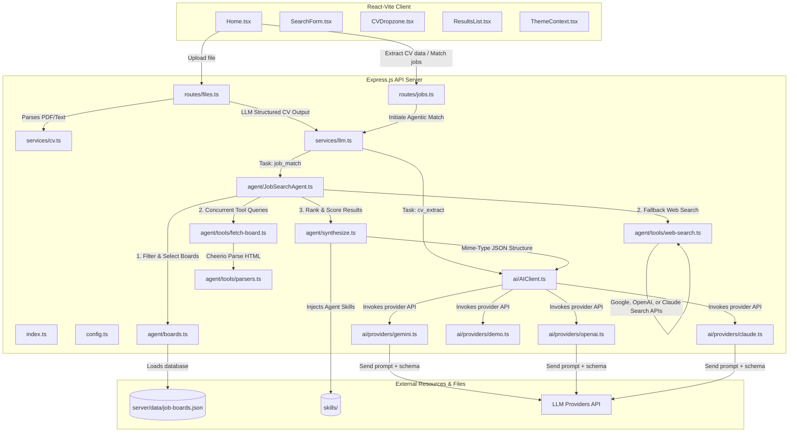

# JobMatch Project Exploration & Mind Map

## What is JobMatch?

**JobMatch** is an AI-powered job search application designed as a teaching reference and sandbox for **DevOps/SRE workflows**, containerization (Docker/Docker Compose), and **Kubernetes** deployments. 

## What the Code Does (Summary)

This repository is an **AI-powered Job Search and Matching application** called **JobMatch**. It serves as a learning sandbox for DevOps and Kubernetes environments.

- **CV Upload & Extraction**: Accepts PDF/text resumes on the frontend. The backend extracts text (using `pdf-parse` for PDFs) and uses structured LLM output to parse experience, education, skills, and summary.
- **Agentic Job Search**: The user inputs queries and regional settings. The backend searches targeted job boards (e.g., `DOU.ua`, `Work.ua`, `Djinni.co`, `Remote OK`, etc.) from [job-boards.json](file:///Users/pokhrime/work/Docs/Tranings/DevOpsIntensive/Hackathon/hackathon-devops/app/server/data/job-boards.json) using native scrapers (`cheerio`) or triggers search APIs (Gemini/OpenAI/Claude web searches) as fallbacks.
- **Scoring & Synthesis**: Integrates custom markdown-based instruction sets ("Agent Skills" under [skills/](file:///Users/pokhrime/work/Docs/Tranings/DevOpsIntensive/Hackathon/hackathon-devops/app/skills/)) into the LLM system prompt. The LLM ranks results based on a weighted matching model:
  - Core Skill Overlap: **35%**
  - Experience Fit: **20%**
  - Domain Relevance: **20%**
  - Gap Severity: **15%**
  - Growth Potential: **10%**
- **DevOps/SRE Sandbox**: Contains a Docker configuration (`Dockerfile`, `Dockerfile.api`, `docker-compose.yml`) structured to demonstrate deployment, reverse proxying, configuration maps, and Kubernetes deployment workflows.

The application matches job seekers with target opportunities by parsing their uploaded resumes (CVs), performing web scraping and LLM-native search queries across selected regional and global job boards, and ranking the results using customized "Agent Skills" context-injected into the LLM prompt.

---

## Architecture Overview

---

## Detailed Components Directory

### 1. Frontend (React / Vite / CSS)
- [Home.tsx](file:///Users/pokhrime/work/Docs/Tranings/DevOpsIntensive/Hackathon/hackathon-devops/app/src/pages/Home.tsx): The central page controller. Manages state for user query, selected country, salary range, uploaded CV, loading progress, matching job results, and search query suggestions.
- [SearchForm.tsx](file:///Users/pokhrime/work/Docs/Tranings/DevOpsIntensive/Hackathon/hackathon-devops/app/src/components/job-search/SearchForm.tsx): The form for entering search keywords, filters (country, time-range, salary), and dropping the CV file.
- [CVDropzone.tsx](file:///Users/pokhrime/work/Docs/Tranings/DevOpsIntensive/Hackathon/hackathon-devops/app/src/components/job-search/CVDropzone.tsx): Drag-and-drop handler for uploading CV documents.
- [ResultsList.tsx](file:///Users/pokhrime/work/Docs/Tranings/DevOpsIntensive/Hackathon/hackathon-devops/app/src/components/job-search/ResultsList.tsx): Renders the resulting matched jobs (with scores, tags, logo, and apply links) and lists alternative search queries.

### 2. Backend Server (Express / TypeScript)
- [index.ts](file:///Users/pokhrime/work/Docs/Tranings/DevOpsIntensive/Hackathon/hackathon-devops/app/server/index.ts): Configures CORS, sets request payloads body sizes, checks backend health (including loaded LLM provider configurations and agent skills availability), and attaches routing endpoints (`/api/files`, `/api/cv`, `/api/jobs`).
- [routes/files.ts](file:///Users/pokhrime/work/Docs/Tranings/DevOpsIntensive/Hackathon/hackathon-devops/app/server/routes/files.ts): Handlers for file uploads (via `multer`) and structural CV parsing.
- [routes/jobs.ts](file:///Users/pokhrime/work/Docs/Tranings/DevOpsIntensive/Hackathon/hackathon-devops/app/server/routes/jobs.ts): Receives job search matches prompts and triggers agentic matching.

### 3. Business Logic Services
- [services/cv.ts](file:///Users/pokhrime/work/Docs/Tranings/DevOpsIntensive/Hackathon/hackathon-devops/app/server/services/cv.ts): Extracts raw text from uploaded files. Supports PDF documents (parsing via `pdf-parse`) and plain-text files (TXT, MD, CSV).
- [services/llm.ts](file:///Users/pokhrime/work/Docs/Tranings/DevOpsIntensive/Hackathon/hackathon-devops/app/server/services/llm.ts): High-level integration bridging the Express routes with the AI providers client and the `JobSearchAgent`.

### 4. Agent Architecture
- [JobSearchAgent.ts](file:///Users/pokhrime/work/Docs/Tranings/DevOpsIntensive/Hackathon/hackathon-devops/app/server/agent/JobSearchAgent.ts): Coordinates the job search workflow:
  1. Identifies relevant job boards based on target country codes (loaded from `job-boards.json`).
  2. Queries job boards concurrently (respecting concurrency settings) using HTML scrapers or web search engines.
  3. Merges and deduplicates listings.
  4. Evaluates and scores matching candidates using `rankListingsWithLlm`.
- [boards.ts](file:///Users/pokhrime/work/Docs/Tranings/DevOpsIntensive/Hackathon/hackathon-devops/app/server/agent/boards.ts): Controls target-board filtering, country mapping, and prompt formatting.
- [synthesize.ts](file:///Users/pokhrime/work/Docs/Tranings/DevOpsIntensive/Hackathon/hackathon-devops/app/server/agent/synthesize.ts): Instructs the LLM to rate job listings against CV data using specific matching criteria (experience level fit, core skill overlaps, growth opportunities, domains). Includes a mock/fallback parser.

### 5. Scraping & Search Tools
- [agent/tools/fetch-board.ts](file:///Users/pokhrime/work/Docs/Tranings/DevOpsIntensive/Hackathon/hackathon-devops/app/server/agent/tools/fetch-board.ts): Performs HTML gets/fetches against target URLs.
- [agent/tools/parsers.ts](file:///Users/pokhrime/work/Docs/Tranings/DevOpsIntensive/Hackathon/hackathon-devops/app/server/agent/tools/parsers.ts): Parsers utilizing `cheerio` to map raw HTML into listing objects. Features dedicated parsers for Ukrainian platforms (`DOU.ua`, `Work.ua`, `Djinni.co`) and a generic anchor-based pattern parser.
- [agent/tools/web-search.ts](file:///Users/pokhrime/work/Docs/Tranings/DevOpsIntensive/Hackathon/hackathon-devops/app/server/agent/tools/web-search.ts): Integrates with search tools from Gemini (Google Search Grounding), OpenAI (Web Search), or Claude (Search tools) to discover listing web pages.

### 6. AI Providers & Skills Core
- [ai/AIClient.ts](file:///Users/pokhrime/work/Docs/Tranings/DevOpsIntensive/Hackathon/hackathon-devops/app/server/ai/AIClient.ts): Singleton factory mapping requests to Google Gemini, OpenAI, Anthropic Claude, or a Mock/Demo client.
- [ai/skills/loader.ts](file:///Users/pokhrime/work/Docs/Tranings/DevOpsIntensive/Hackathon/hackathon-devops/app/server/ai/skills/loader.ts): Dynamically scans the `skills/` directory (at the workspace root), compiles custom guidelines from markdown pages (e.g. `job-match-scoring`, `agent-tools`, `transferable-skills`), and injects them into system prompts per task.

---

## Agent System Prompt Injections (Skills)

| Skill ID | Associated Task | Purpose |
|---|---|---|
| `cv-extraction` | `cv_extract` | Specifies parsing formatting schemas for resumes. |
| `structured-output` | `cv_extract`, `job_match` | Enforces JSON structural responses. |
| `job-search` | `job_match` | System workflow strategies for matching jobs. |
| `global-job-boards` | `job_match` | Contextual details on global platforms (LinkedIn, Glassdoor, etc.). |
| `agent-tools` | `job_match` | Instructions on executing board fetches. |
| `job-crawler` | `job_match` | Flow guidelines for indexing web results. |
| `job-match-scoring` | `job_match` | Specifies weights for scoring: Core skills (35%), Experience level (20%), Domain relevance (20%), Gap severity (15%), Growth (10%). |
| `job-analyzer` | `job_match` | Guidelines on analyzing title keywords and specifications. |
| `transferable-skills` | `job_match` | Directives on mapping adjacent skills (e.g. Docker ↔ Podman, GCP ↔ AWS). |
