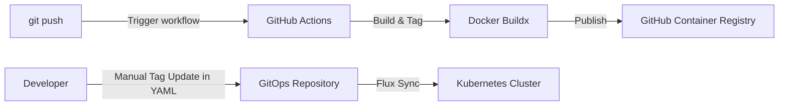

# CI/CD Pipeline and GitOps Delivery

This document describes the CI/CD pipeline and GitOps delivery strategy for the **Scout startup** application, which is containerized and deployed in Kubernetes clusters managed by **FluxCD**.

---

## Architecture Schema



---

## 1. Pipeline Trigger Strategy
The GitHub Actions workflow is located at [.github/workflows/cicd.yml](../../.github/workflows/cicd.yml) and is triggered on commits to the following branches:
- **`dev` branch**: Builds and delivers images for the **Development Environment** (`dev`).
- **`main` branch**: Builds and delivers images for the **Production Environment** (`prod`).

---

## 2. Container Registry and Artifact Names
To maintain symmetry between environments, identical container image names are used. Images are published to the **GitHub Container Registry (GHCR)**:
* **Frontend Service**: `ghcr.io/<repository-owner>/jobmatch-web`
* **Backend API Service**: `ghcr.io/<repository-owner>/jobmatch-api`

---

## 3. Image Versioning and Tagging Schema
The pipeline dynamically extracts the base semantic version from the backend configuration ([app/server/package.json](../../app/server/package.json)) and appends a short 7-character Git commit SHA.

### A. Unified Container Tagging
To ensure image identity and simplify promotional workflows, builds from both branches (`dev` and `main`) use a unified tagging format:
* Format: `<version>-<short-sha>` and `latest`
* Web:
  - `ghcr.io/<owner>/jobmatch-web:v1.0.0-gitsha`
  - `ghcr.io/<owner>/jobmatch-web:latest`
* API:
  - `ghcr.io/<owner>/jobmatch-api:v1.0.0-gitsha`
  - `ghcr.io/<owner>/jobmatch-api:latest`

---

## 4. FluxCD Integration Strategy (HelmRelease)

Instead of using automated image updates via additional Flux controllers, application delivery is entirely based on the **declarative description in HelmRelease resources** (environment overlays) with manual tag updates in git.

### A. GitOps Directory Structure and Branch Separation
Configurations for each cluster are completely separated at the directory level and mapped to Git branches:

* **Dev Cluster (development branch `dev`)**:
  - Synced from directory: `platform/flux/clusters/dev/`
  - Application config files are located directly in `platform/flux/clusters/dev/apps/jobmatch/`.
  - `ns.yaml` — creates the `jobmatch-dev` namespace.
  - `helm-release.yaml` — declaratively describes the dev release of `jobmatch-dev`.
  - All changes on the `dev` branch are automatically deployed to the dev cluster.

* **Prod Cluster (production branch `main`)**:
  - Synced from directory: `platform/flux/clusters/prod/`
  - Application config files are located in `platform/flux/clusters/prod/apps/jobmatch/`.
  - `ns.yaml` — creates the `jobmatch-prod` namespace.
  - `helm-release.yaml` — declaratively describes the `jobmatch-prod` release with production resource limits and replica counts.
  - Changes are applied only after merging a Pull Request into the `main` branch.

### B. Benefits and Promotion Process (Promotion):
1. **Control and Security (PR-based CD):** Any changes to the production configuration (image tag updates, limits, or prompts) must first pass through a Pull Request to the `main` branch. Once approved and merged, FluxCD automatically updates the application on the prod cluster.
2. **Simple Promotion:** To promote a verified image version from dev to prod, you copy the image tag from `clusters/dev/apps/jobmatch/helm-release.yaml` to `clusters/prod/apps/jobmatch/helm-release.yaml` on the `dev` branch, create a PR to `main`, and merge it.
3. **Environment Isolation:** Since configurations reside in separate cluster directories, there is zero chance of overriding production settings when merging general application code changes from `dev` to `main`.

---

## 5. Decoupled Prompt Delivery (PromptOps)

To avoid compiling and pushing full container images for minor prompt updates (files in `app/skills/**`), a decoupled pipeline is configured:

### A. Path Filtering in CI (GitHub Actions)
Path filtering is set up in the workflow settings. If only files under `app/skills/**` are changed, the Docker build steps are skipped, saving time and resources.

### B. Dynamic Packaging to ConfigMap
Prompts are automatically packaged into a ConfigMap using the Helm template `platform/helm/jobmatch/templates/configmap-skills.yaml` with the built-in Helm functions `.Files.Glob` and `.Files.Get`.

In `deployment-api.yaml`, this ConfigMap is mounted into the API container as a volume:
```yaml
          volumeMounts:
            - name: skills-volume
              mountPath: /app/skills
```

### C. Automatic Rolling Update upon Prompt Changes
The Deployment template tracks the ConfigMap checksum:
```yaml
    annotations:
      checksum/config: {{ include (print $.Template.BasePath "/configmap-skills.yaml") . | sha256sum }}
```
Upon prompt changes, FluxCD updates the ConfigMap, the checksum changes, and Kubernetes triggers a **Rolling Update** of the API pods. The new pods start in less than 5 seconds and immediately use the new prompts.

### D. Automated Quality Gate (Evals)
To ensure that prompt updates do not degrade AI matching quality or introduce prompt injection vulnerabilities, evaluations are run inside the pipeline:
* **Trigger condition:** Runs on any branch (`dev` or `main`) upon push or pull requests if any file is modified in `app/skills/*`, `app/prompts/*`, `platform/helm/jobmatch/skills/*`, or `evals/*`.
* **Dependencies and Secrets:** Real evaluations use the secrets `OPENAI_API_KEY` and `GEMINI_API_KEY` configured in the repository.
* **Blocking Mechanism (Quality Gate):** If the average score falls below **4.2 / 5.0** or any critical safety check fails, the pipeline fails (exit code 1), blocking the deployment.

See [eval.md](./archive/eval.md) for details on test cases.

---

## 6. Security Gates in CI/CD

To prevent credential leaks and ensure prompt safety, the pipeline executes automated security controls:

### A. Gitleaks Scan (Secret Leaks)
* **Mechanism:** Runs in the `quality-gate` job using `gitleaks/gitleaks-action@v2` to analyze commit history.
* **Action:** If hardcoded secrets are found, the pipeline fails, blocking the build.

### B. Evals Quality Gate (Prompt Safety & Quality)
* **Mechanism:** Triggered when prompts or skill files are changed, running `npm test --prefix evals` (calling `evals/run-evals.mjs`). Evaluates prompt injection and leakage metrics.
* **Action:** Fails if the average score falls below 4.2 or any safety criteria are violated.
