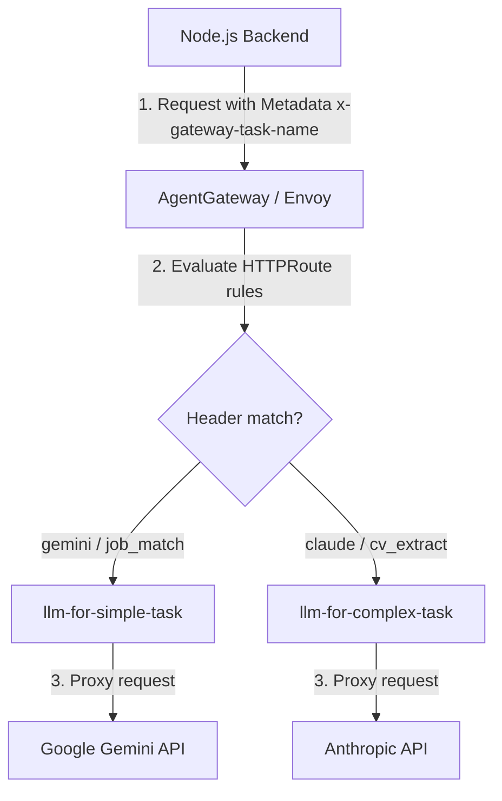

# FinOps LLM Routing: Managing Complexity and Cost of Requests

This document describes the concept and technical options for dynamic routing of LLM requests based on task complexity (FinOps routing) using `AgentGateway`.

The main goal is to automatically send simple or routine tasks (e.g. initial job match scoring) to fast and cheap models (e.g., **gemini-2.5-flash-lite** as primary or **gpt-5.4-nano** as backup), while routing complex, creative, or reasoning tasks (e.g. detailed CV extraction and cover letter generation) to more powerful models (e.g., **claude-haiku-4-5** as primary or **gemini-3.5-flash** as backup).

---

## 🏗️ Routing Flow Schema



---

## 📋 Initial State: Passing Task Type in the API Backend

At the level of internal business logic, the backend **already identifies** the task type and creates `StructuredGenerateRequest` payloads containing the corresponding `task` field:

1. **For matching CVs to job listings (simple task):**
   In the file [synthesize.ts](../../app/server/agent/synthesize.ts#L54-L60), the method `generateStructured` is invoked with the `'job_match'` task parameter:
   ```typescript
   const client = getAIClient();
   const result = await client.generateStructured<JobMatchResult>({
     task: 'job_match', // <-- Logical task type
     systemPrompt: RANK_SYSTEM + skills,
     userPrompt: userBlock,
     jsonSchema: input.jsonSchema,
   });
   ```

2. **For structured parsing of CV text (complex task):**
   In the file [llm.ts](../../app/server/services/llm.ts#L58-L64), the service call is initiated with the `'cv_extract'` parameter:
   ```typescript
   const client = getAIClient();
   const output = await client.generateStructured<Record<string, unknown>>({
     task: 'cv_extract', // <-- Logical task type
     systemPrompt: CV_SYSTEM,
     userPrompt: `CV text:\n\n${text}`,
     jsonSchema: json_schema,
   });
   ```

Although the backend *internally* contains this metadata in `request.task`, it originally did not forward the task type upstream to `AgentGateway`.

---

## 🛠️ Implemented Approach: Declarative Routing by Task Type (Variant B)

*Recommended approach for separation of concerns.*
In this scenario, the application code remains agnostic of specific model identifiers or providers. It only tags the logical task type (`task: 'job_match'` or `task: 'cv_extract'`). The client forwards this tag as an HTTP header, and the routing resolution is resolved declaratively inside Kubernetes cluster manifests.

### Step 1: Forwarding the Task Type via an HTTP Header in Code
To pass the task type upstream, we add the `x-gateway-task-name` header to client request options in [openai.ts](../../app/server/ai/providers/openai.ts#L31-L47):

```typescript
    const response = await this.client.chat.completions.create({
      model: this.model,
      messages: [
        { role: 'system', content: system },
        { role: 'user', content: request.userPrompt },
      ],
      response_format: request.jsonSchema
        ? {
            type: 'json_schema',
            json_schema: {
              name: `${request.task}_response`,
              strict: false,
              schema: request.jsonSchema,
            },
          }
        : { type: 'json_object' },
    }, {
      headers: {
        'x-gateway-task-name': request.task, // <-- Forward the task type to the gateway
      }
    });
```

All other providers (such as Claude and Gemini when `GATEWAY_URL` is set) delegate calls to this `OpenAIProvider`, thereby inheriting this header.

---

### Step 2: Updating Routing Rules in the HTTPRoute
In [agentgateway-route.yaml](../../platform/flux/clusters/dev/apps/jobmatch/agentgateway-route.yaml), we distribute traffic depending on the `x-gateway-task-name` header value:

```yaml
apiVersion: gateway.networking.k8s.io/v1
kind: HTTPRoute
metadata:
  name: llm-router
  namespace: agentgateway-system
spec:
  parentRefs:
    - name: agentgateway-external
  rules:
    # 1. Matching tasks (job_match) are routed to the cheap Gemini backend
    - matches:
        - headers:
            - name: x-gateway-task-name
              value: "job_match"
      backendRefs:
        - group: agentgateway.dev
          kind: AgentgatewayBackend
          name: llm-for-simple-task
          port: 443
    # 2. Complex tasks and by default -> expensive model group
    - backendRefs:
        - group: agentgateway.dev
          kind: AgentgatewayBackend
          name: llm-for-complex-task
          port: 443
```

---

## ⚖️ Benefits of Declarative Routing (Variant B)

1. **FinOps Agility Without Releases:** If model prices drop or a new cost-effective option (e.g. Claude Haiku) is released, an SRE engineer can edit the `AgentgatewayBackend` manifests directly in Git without rebuilding Docker images.
2. **Single Source of Truth:** Task-to-provider mappings are managed at the platform configuration tier, not scattered across codebases.
3. **Local Dev Simplicity:** Developers run against logical tags, and the local gateway resolves routing to local mocks (e.g., `mock-llm`) seamlessly.

---

## 🎯 Recommendations for Model Selections (FinOps Optimization)

To optimize cost and service quality, we recommend choosing models based on two metrics: **reasoning complexity** and **context size**.

### 1. Resume Parsing Task (`cv_extract`)
* **Characteristics:** High precision required for parsing unstructured layouts, listing skills, education, and mapping strictly to a detailed JSON schema.
* **Recommended Models:** **claude-haiku-4-5** (Primary) or **gemini-3.5-flash** (Backup).
  - *Justification:* `claude-haiku-4-5` demonstrates excellent extraction capabilities at an optimized rate ($1.00 / 1M input), making it the prime choice. `gemini-3.5-flash` acts as a highly capable backup with a massive context window.

### 2. Job Ranking Task (`job_match`)
* **Characteristics:** Scoring 10+ vacancies simultaneously and writing brief fit descriptions. Demands low latency and processes large amounts of text (high volume of input tokens).
* **Recommended Models:** **gemini-2.5-flash-lite** (Primary) or **gpt-5.4-nano** (Backup).
  - *Justification:* Input tokens cost only $0.075 per 1M. It offers unmatched speed and budget targets for concurrent scraper runs. `gpt-5.4-nano` is a solid backup alternative.

---

## 🔍 How to Verify Routing Is Working Correctly?

You can verify dynamic routing via the `x-gateway-task-name` header using `curl` inside the Kubernetes cluster.

### Step 1: Start a Test Pod
Spawn a temporary curl client inside the `jobmatch-dev` namespace:
```bash
kubectl run curl-test -n jobmatch-dev --image=curlimages/curl --rm -it --restart=Never -- sh
```

### Step 2: Send Requests with Task Headers
Execute the following commands inside the container:

1. **Test simple task routing (should route to `llm-for-simple-task`):**
   ```bash
   curl -s -X POST "http://agentgateway-external.agentgateway-system.svc.cluster.local/v1/chat/completions" \
     -H "Content-Type: application/json" \
     -H "x-gateway-task-name: job_match" \
     -d '{"messages":[{"role":"user","content":"Compare this resume and job descriptions."}]}'
   ```

2. **Test complex task routing (should route to `llm-for-complex-task`):**
   ```bash
   curl -s -X POST "http://agentgateway-external.agentgateway-system.svc.cluster.local/v1/chat/completions" \
     -H "Content-Type: application/json" \
     -H "x-gateway-task-name: cv_extract" \
     -d '{"messages":[{"role":"user","content":"Extract skills from the resume text."}]}'
   ```

### Step 3: Check Mock LLM Logs
In a separate terminal, watch the logs of the `mock-llm` deployment to confirm that the gateway correctly maps the upstream endpoints and inserts auth tokens:
```bash
kubectl logs -n jobmatch-dev deployments/mock-llm -f
```

* **For the `job_match` request**, the log will show a request resolving with the **`gemini-2.5-flash-lite`** model name.
* **For the `cv_extract` request**, the log will show a request resolving with the **`claude-haiku-4-5`** model name.
