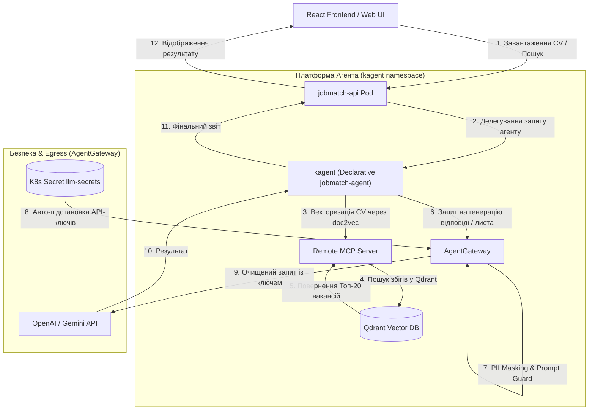

# Scout SRE Harness Implementation Plan

This plan describes the architectural design and implementation tasks to transform the Scout Job Searcher prototype into a secure, production-grade, and cost-controlled system. It directly addresses the requirements of [hackathon-task.md](../hackathon-task.md) and integrates the existing Kubernetes workload topology.

---

## Теорія: Єдиний Декларативний Контур Агента (Unified Agentic Harness)

На основі вашого бачення, ми об'єднуємо архітектуру в **один цілісний інженерний контур**, де управління життєвим циклом агента повністю виноситься на рівень платформи Kubernetes за допомогою **kagent**, а безпека та маршрутизація трафіку — на **AgentGateway**.

Бекенд додатку `jobmatch-api` стає «тонким» клієнтом, який лише приймає HTTP-запити від користувача, а всю інтелектуальну роботу (пошук вакансій, матчинг, векторизацію резюме та генерацію листів) передає платформі.

### Основні компоненти архітектури:
1. **Декларативний Агент (`kind: Agent` від kagent):**
   * Ми створюємо Kubernetes-ресурс `jobmatch-agent`. Його системний промпт, навички (`Skills`) та конфігурація моделі повністю керуються через GitOps (FluxCD).
2. **Семантична пам'ять (Qdrant + `doc2vec`):**
   * Використовуємо інструментарій `doc2vec` (по аналогії з [kagent documentation agent](https://kagent.dev/docs/kagent/examples/documentation)) для векторизації описів вакансій та тексту завантаженого резюме.
   * Збережені вектори знаходяться в **Qdrant**. Пошук вакансій відбувається за семантичною схожістю (косинусна відстань між вектором CV та вектором вакансії), що замінює класичний повнотекстовий пошук та знижує навантаження на LLM (RAG-патерн).
3. **Безпека & Секрети (AgentGateway):**
   * Коли `kagent` робить запит до LLM (OpenAI/Gemini) для остаточного оцінювання та генерації листа, запит проходить через **AgentGateway**.
   * Шлюз перевіряє промпт на ін'єкції (Prompt Guard), видаляє чутливі PII (Email, телефони) та підставляє API-ключ з Kubernetes Secret `llm-secrets`.



---

## Деталі Делегування Запиту (Technical Breakdown)

Коли бекенд додатку `jobmatch-api` делегує завдання штучному інтелекту, взаємодія відбувається за такою схемою:

### 1. Які об'єкти задіяні в кластері та їх роль

#### А. Контур Керування Агентом (Namespace: `kagent`)
* **`Agent` (Custom Resource):** Ресурс `agent.kagent.dev/jobmatch-agent`. Декларує нашого агента, його `systemMessage` та посилання на `modelConfig` і `tools`.
* **`Deployment` & `Pod`:** Створюються автоматично оператором `kagent-controller`. Запускають рантайм нашого `jobmatch-agent`.
* **`Service`:** ClusterIP Service `jobmatch-agent` на порту `8080`. Забезпечує точку доступу (endpoint) для бекенду.
* **`ModelConfig` (Custom Resource):** Конфігурує модель (наприклад, `gpt-4o-mini`) та вказує на `AgentGateway` як `baseURL`.
* **`MCPServer` (Custom Resource):** Реєструє інструменти (`search_jobs`, `tailor_cv`) нашого MCP-сервера в системі `kagent`.

#### Б. Контур Пам'яті (Namespace: `jobmatch-dev`)
* **`Deployment` & `Service` (MCP Server):** Виконує код MCP-сервера (семантичний пошук по базі вакансій через Qdrant).
* **`StatefulSet` & `Service` (Qdrant):** Векторна база даних, що зберігає очікувані ембедінги вакансій.

#### В. Контур Безпеки (Namespace: `agentgateway-system`)
* **`AgentgatewayBackend` (Custom Resource):** Проксі-ресурс, що зв'язує шлюз із OpenAI/Gemini API та підставляє API-ключі з K8s Secret.
* **`AgentgatewayPolicy` (Custom Resource):** Застосовує правила маскування PII та перевірку на Prompt Injection.

---

### 2. Технічні деталі виклику (API-контракт)

Бекенд `jobmatch-api` викликає агента через його ClusterIP Service за стандартним OpenAI-сумісним HTTP API:

* **HTTP Method / URL:** `POST http://jobmatch-agent.kagent.svc.cluster.local:8080/v1/chat/completions`
* **Headers:** `Content-Type: application/json`
* **Request Payload (Приклад):**
  ```json
  {
    "model": "gpt-4o-mini",
    "messages": [
      {
        "role": "user",
        "content": "CV_TEXT:\nName: John Doe\nSkills: TypeScript, Kubernetes, FluxCD\nExperience: 5 years SRE\n\nQUERY: Senior DevOps / SRE in Munich"
      }
    ]
  }
  ```
* **Response Payload (Приклад):**
  ```json
  {
    "id": "chatcmpl-jobmatch-12345",
    "object": "chat.completion",
    "choices": [
      {
        "index": 0,
        "message": {
          "role": "assistant",
          "content": "{\n  \"score\": 4.8,\n  \"explanation\": \"John Doe matches the Senior SRE role in Munich perfectly due to his 5 years experience and expertise in Kubernetes and FluxCD.\",\n  \"matchedJobs\": [\n    {\n      \"title\": \"Senior SRE Engineer\",\n      \"company\": \"TechCorp Munich\",\n      \"url\": \"https://example.com/jobs/1\"\n    }\n  ]\n}"
        },
        "finish_reason": "stop"
      }
    ]
  }
  ```

---

## Existing Cluster Status

Наш план будується безпосередньо на активному стані кластера:
* **`agentgateway-system`**: Агентний шлюз розгорнутий і готовий приймати AI-трафік через сервіс `agentgateway-external`.
* **`kagent`**: Контролер kagent та набір базових агентів (наприклад, `k8s-agent`) готові для розширення.
* **`jobmatch-dev`**: Додаток запущений поруч із Qdrant та Redis, готовий до перемикання на шлюз.
* **`external-secrets`**: Використовується для синхронізації `llm-secrets`.

---

## User Review Required

> [!IMPORTANT]
> 1. **Перенесення логіки з додатку до kagent**: Вся логіка запуску агента з файлу [JobSearchAgent.ts](../../app/server/agent/JobSearchAgent.ts) переноситься в маніфест `jobmatch-agent.yaml` та MCP-сервер.
> 2. **Активація Evals гейту в GitHub Actions**: Скрипт `run-evals.mjs` стане обов'язковим блокуючим кроком (baseline `4.2`) для перевірки змін у коді та декларативних промптах/скілах.
> 3. **Параметри маскування PII**: У плані закладено маскування Email, Phone, SSN та лінків на профілі розробників. Будь ласка, підтвердьте, чи потрібно маскувати ПІБ кандидата.

---

## Proposed Changes

### 1. Harness Engineering & Agent Architecture (kagent & Qdrant)

#### [NEW] [mcp-server.yaml](../../platform/flux/clusters/dev/apps/jobmatch/mcp-server.yaml)
* Створити опис `RemoteMCPServer` для підключення інструментів роботи з базою вакансій та резюме.
* Оголосити інструменти: `search_jobs`, `tailor_cv`, `draft_cover_letter`.

#### [NEW] [jobmatch-agent.yaml](../../platform/flux/clusters/dev/apps/jobmatch/jobmatch-agent.yaml)
* Описати декларативного агента `Agent` CRD (`kagent.dev/v1alpha2`) для виконання бізнес-логіки Scout.
* Перенести системні інструкції в поле `declarative.systemMessage`.
* Підключити створений MCP-сервер з інструментами.

#### [MODIFY] [deployment-api.yaml](../../platform/helm/jobmatch/templates/deployment-api.yaml)
* Додати передачу змінної середоваща `GATEWAY_URL` в контейнер бекенду.
* Підмонтувати Skills через ConfigMap для динамічного оновлення без перезапуску подів.

---

### 2. Platform Security & Dynamic Routing (AgentGateway, Guardrails & Secrets)

#### [NEW] [agentgateway-policy.yaml](../../platform/flux/clusters/dev/apps/jobmatch/agentgateway-policy.yaml)
* Створити ресурс політик `AgentgatewayPolicy` у просторі імен `agentgateway-system`.
* Налаштувати **Prompt Guard (Request)**:
  * Вбудовані фільтри для `Email`, `PhoneNumber`, `Ssn`.
  * Regex-фільтр для маскування лінків на GitHub та LinkedIn.
  * Regex-фільтр для виявлення спроб Prompt Injection (повертає `403 Forbidden`).
* Налаштувати **Prompt Enrichment**:
  * Статичне додавання системного промпту на початку запиту (`prepend` блок).
  * Динамічне інжектування контексту користувача (наприклад, `x-user-id` за допомогою CEL-трансформації).
* Налаштувати **Екстракцію моделі для Dynamic Routing (PreRouting)**:
  * Використовувати фазу `PreRouting` для парсингу тіла запиту за допомогою CEL:
    ```yaml
    apiVersion: agentgateway.dev/v1alpha1
    kind: AgentgatewayPolicy
    metadata:
      name: model-routing-policy
      namespace: agentgateway-system
    spec:
      targetRefs:
        - group: gateway.networking.k8s.io
          kind: Gateway
          name: agentgateway-external
      traffic:
        phase: PreRouting
        transformation:
          request:
            set:
              - name: x-gateway-model-name
                value: "json(request.body).model"
    ```

#### [NEW] [agentgateway-route.yaml](../../platform/flux/clusters/dev/apps/jobmatch/agentgateway-route.yaml)
* Створити `HTTPRoute` для інтелектуальної маршрутизації за назвою моделі:
  * Налаштувати правила відповідності (matches) на основі заголовка `x-gateway-model-name`.
  * Маршрутизувати дешеві завдання (`gemini-*`, `gpt-4o-mini`, `flash` тощо) на Gemini:
    ```yaml
    apiVersion: gateway.networking.k8s.io/v1
    kind: HTTPRoute
    metadata:
      name: llm-router
      namespace: agentgateway-system
    spec:
      parentRefs:
        - name: agentgateway-external
      rules:
        # 1. Роутинг дешевих задач на Gemini backend
        - matches:
            - headers:
                - name: x-gateway-model-name
                  value: ".*(gemini|mini|flash).*"
                  type: RegularExpression
          backendRefs:
            - group: agentgateway.dev
              kind: AgentgatewayBackend
              name: gemini-backend
              port: 443
        # 2. Роутинг дорогих завдань за замовчуванням (Claude)
        - backendRefs:
            - group: agentgateway.dev
              kind: AgentgatewayBackend
              name: claude-backend
              port: 443
    ```

#### [NEW] [agentgateway-backend.yaml](../../platform/flux/clusters/dev/apps/jobmatch/agentgateway-backend.yaml)
* Створити ресурси `AgentgatewayBackend` для Claude та Gemini.
* Налаштувати безпечне читання API-ключів через посилання `secretRef` на K8s Secret `llm-secrets` (key: `gemini-api-key` для Gemini):
  ```yaml
  apiVersion: agentgateway.dev/v1alpha1
  kind: AgentgatewayBackend
  metadata:
    name: gemini-backend
    namespace: agentgateway-system
  spec:
    ai:
      provider:
        gemini: {}
    policies:
      auth:
        secretRef:
          name: llm-secrets
          key: gemini-api-key
          namespace: jobmatch-dev
  ```

---

### 3. SDLC, Evals & CI/CD Pipeline

#### [NEW] [ci-cd.yml](../../.github/workflows/ci-cd.yml)
* Додати автоматичний запуск `node evals/run-evals.mjs` на етапі CI перед збіркою Docker-образу.
* Якщо LLM-as-a-Judge фіксує середню оцінку нижче `4.2/5.0`, збірка завершується з помилкою.

#### [MODIFY] [dataset.json](../../evals/dataset.json)
* Додати негативні тест-кейси: резюме зі спробою Prompt Injection та резюме з відкритими PII для перевірки роботи маскування.

---

### 4. Architectural Records & Documentation

#### [MODIFY] [ADR.md](../ADR.md#adr-008-інтеграція-уніфікованого-контуру-штучного-інтелекту-platform-ai-harness)
* Architectural Decision Record: Обґрунтування вибору kagent для життєвого циклу агентів, AgentGateway для проксіювання та Qdrant для семантичної пам'яті (додано як ADR-008).

#### [MODIFY] [HLD.md](../HLD.md)
* High-Level Solution Design: Опис архітектури платформи, взаємодія компонентів та схема руху даних (Mermaid діаграми оновлено та інтегровано в загальний HLD).

---

## Hosting, AI Provider & FinOps Cost Calculation

### Моделі на вибір
1. **Google Gemini 2.5 Flash**: Найбільш економічний варіант ($0.075 - $0.25 за 1M вхідних токенів). Ідеально для первинного скорингу та масових операцій.
2. **OpenAI GPT-4o-mini**: Збалансований стандарт ($0.150 вхід / $0.600 вихід за 1M токенів). Хороша точність і швидкість.
3. **Claude 3.5 Sonnet**: Максимальна якість ($3.00 вхід / $15.00 вихід за 1M токенів). Для фінального написання складних супровідних листів.

### FinOps Розрахунок (5 000 користувачів, 20 запитів/міс)
Загальне місячне навантаження: **300M input tokens** + **80M output tokens**.

* **Сценарій GPT-4o-mini**:
  * Вхід: 300 * $0.15 = $45.00
  * Вихід: 80 * $0.60 = $48.00
  * **Разом: $93.00/місяць** (Unit-метрика: **$0.0186 на активного користувача**)
* **Сценарій Gemini 2.5 Flash**:
  * Вхід: 300 * $0.075 = $22.50
  * Вихід: 80 * $0.30 = $24.00
  * **Разом: $46.50/місяць** (Unit-метрика: **$0.0093 на активного користувача**)
* **Сценарій Claude 3.5 Sonnet**:
  * Вхід: 300 * $3.00 = $900.00
  * Вихід: 80 * $15.00 = $1,200.00
  * **Разом: $2,100.00/місяць** (Unit-метрика: **$0.4200 на активного користувача**)

*Оптимізація: Ми реалізуємо Gateway Caching (кешування відповідей на однакові промпти) та Dynamic Routing (Gemini Flash для дешевого відбору вакансій, Claude 3.5 Sonnet — тільки для написання фінального cover letter).*

---

## Verification Plan

### Automated Tests
* Локальний запуск `node evals/run-evals.mjs` для валідації якості відповідей та оцінок судді.
* Тестування безпеки: Запит з Prompt Injection через шлюз повинен отримати HTTP-код `403`.

### Manual Verification
* Деплой оновленого Helm-релізу в простір `jobmatch-dev` та перевірка логів `agentgateway`, щоб переконатися, що запити бекенду до OpenAI перенаправляються через локальну адресу шлюзу без передачі ключів у коді.
