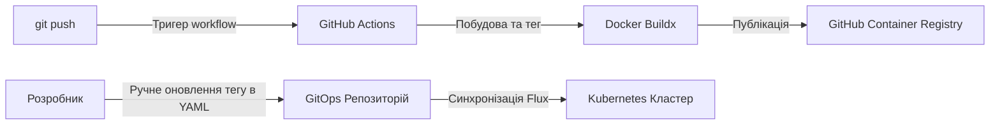

# CI/CD Пайплайн та GitOps Доставка

Цей документ описує CI/CD пайплайн та стратегію доставки GitOps для застосунку **стартап Scout**, який контейнеризований та розгортається у Kubernetes-кластерах під керуванням **FluxCD**.

---

## Схема архітектури



---

## 1. Стратегія тригерів пайплайну
Робочий процес GitHub Actions розміщений у [.github/workflows/deploy.yml](../.github/workflows/deploy.yml) і запускається при коммітах у відповідні гілки:
- **Гілка `dev`**: Збирає та доставляє образи для **Середовища розробки** (`dev`).
- **Гілка `main`**: Збирає та доставляє образи для **Продакшен середовища** (`prod`).

---

## 2. Реєстр контейнерів та назви артефактів
Для збереження симетрії між середовищами використовуються однакові назви образів контейнерів. Образи публікуються в **GitHub Container Registry (GHCR)**:
* **Фронтенд сервіс**: `ghcr.io/<repository-owner>/jobmatch-web`
* **Бекенд API сервіс**: `ghcr.io/<repository-owner>/jobmatch-api`

---

## 3. Схема версіонування та тегування образів
Пайплайн динамічно витягує базову семантичну версію з конфігурації бекенду ([app/server/package.json](../app/server/package.json)) і додає короткий 7-символьний Git commit SHA.

### А. Тегування для розробки (гілка `dev`)
Збірки гілки `dev` використовують суфікс `-dev` для ізоляції тестових оновлень:
* Формат: `<version>-<short-sha>-dev`
* Web: `ghcr.io/<owner>/jobmatch-web:v1.0.0-e5f6g7h-dev`
* API: `ghcr.io/<owner>/jobmatch-api:v1.0.0-e5f6g7h-dev`

### Б. Тегування для продакшену (гілка `main`)
Збірки гілки `main` використовують чисті версії та оновлюють плаваючий тег `latest`:
* Формат: `<version>-<short-sha>` та `latest`
* Web: 
  - `ghcr.io/<owner>/jobmatch-web:v1.0.0-e5f6g7h`
  - `ghcr.io/<owner>/jobmatch-web:latest`
* API: 
  - `ghcr.io/<owner>/jobmatch-api:v1.0.0-e5f6g7h`
  - `ghcr.io/<owner>/jobmatch-api:latest`

---

## 4. Стратегія інтеграції FluxCD (HelmRelease)

Замість використання автоматичного оновлення образів через додаткові контролери Flux, доставка застосунку повністю базується на **декларативному описі в ресурсах HelmRelease** (оверлеї середовищ) з ручним оновленням тегів.

### А. Структура каталогів GitOps
Усі системні конфігурації Flux для кластера живуть у єдиній папці `platform/flux/clusters/k8s`. Ця папка підключається один раз при бутстрапі кластера.

Різниця між оточеннями реалізована через оверлеї в каталозі `platform/environments/`:
* **`platform/environments/dev/`** (неймспейс `jobmatch-dev`):
  * `ns.yaml` — створює простір імен `jobmatch-dev`.
  * `helm-release.yaml` — декларативно описує реліз `jobmatch-dev`, використовуючи dev-тег образу (`v1.0.0-c001f8a-dev`) та стратегію узгодження `reconcileStrategy: Revision`.
* **`platform/environments/prod/`** (неймспейс `jobmatch-prod`):
  * `ns.yaml` — створює простір імен `jobmatch-prod`.
  * `helm-release.yaml` — декларативно описує реліз `jobmatch-prod` з продакшен-тегами та лімітами ресурсів.

Усі ці середовища паралельно запускаються за допомогою `kustomizations.yaml` (plural) у папці `platform/flux/clusters/k8s/apps/jobmatch/`.

### Б. Переваги стратегії HelmRelease (ручне оновлення):
1. **Контроль та стабільність:** Розробник або реліз-інженер чітко контролює, яка саме версія зараз деплоїться. Жодних автоматичних викатів сирих образів на прод.
2. **Безпека репозиторію:** Flux не потребує прав на запис (Write-Access) у ваш репозиторій Git, оскільки йому не потрібно пушити оновлені теги. Достатньо прав Read-Only.
3. **Простота просування змін (Promotion):** Перенесення змін з `dev` на `prod` відбувається шляхом простого копіювання перевіреного тегу образу з `environments/dev/helm-release.yaml` в `environments/prod/helm-release.yaml` і створення Pull Request. Оскільки конфігурації розділені за папками-оверлеями, виключається ризик випадкового перезапису прод-параметрів під час мержу гілок.

---

## 5. Декоплінг доставки промптів (PromptOps)

Щоб уникнути тривалого складання та пушу повних образів контейнерів при зміні лише системних промптів (файли в `app/skills/**`), реалізовано наступний робочий процес:

### А. Фільтрація шляхів у CI (GitHub Actions)
У налаштуваннях пайплайну налаштовано фільтрацію шляхів. Якщо змінено лише файли в `app/skills/**`, етап збирання Docker-образів пропускається, що економить час та ресурси.

### Б. Динамічне пакування в ConfigMap
Промпти автоматично пакуються в ConfigMap за допомогою Helm-шаблону `platform/helm/jobmatch/templates/configmap-skills.yaml` з використанням вбудованих функцій Helm `.Files.Glob` та `.Files.Get`. 

У `deployment-api.yaml` цей ConfigMap монтується в контейнер API як розділ:
```yaml
          volumeMounts:
            - name: skills-volume
              mountPath: /app/skills
```

### В. Автоматичний Rolling Update при зміні промптів
У шаблоні Deployment прораховується контрольна сума ConfigMap:
```yaml
    annotations:
      checksum/config: {{ include (print $.Template.BasePath "/configmap-skills.yaml") . | sha256sum }}
```
При будь-якій зміні промптів та наступному комміті, FluxCD оновлює ConfigMap, контрольна сума змінюється, і Kubernetes автоматично запускає **Rolling Update** для API-подів. Нові поди запускаються менш ніж за 5 секунд і одразу використовують оновлені промпти.
