# CI/CD Pipeline & GitOps Delivery

This document describes the CI/CD pipeline and GitOps delivery strategy for the **JobMatch** application, which is containerized and deployed to Kubernetes clusters managed by **FluxCD**.

---

## Architecture Flow

```mermaid
graph LR
    Push[git push] -->|Trigger Workflow| GHA[GitHub Actions]
    GHA -->|Build & Tag| Docker[Docker Buildx]
    Docker -->|Publish| GHCR[GitHub Container Registry]
    GHCR -->|Scan Registry| Flux[FluxCD Reflector]
    Flux -->|Update manifest in Git| GitOps[GitOps Repo / Path]
    GitOps -->|Deploy to Cluster| K8s[Kubernetes Cluster]
```



---

## 1. Pipeline Trigger Strategy
The GitHub Actions workflow resides at [.github/workflows/deploy.yml](../.github/workflows/deploy.yml) and is triggered by commits to specific target branches:
- **`dev` branch**: Builds and delivers to the **Development Environment** (`dev`).
- **`main` branch**: Builds and delivers to the **Production Environment** (`prod`).

---

## 2. Container Registry & Artifact Names
To maintain symmetry across environments, the exact same container image names are reused. Registry references are published to **GitHub Container Registry (GHCR)**:
* **Frontend Service**: `ghcr.io/<repository-owner>/jobmatch-web`
* **Backend API Service**: `ghcr.io/<repository-owner>/jobmatch-api`

---

## 3. Image Versioning & Tagging Scheme
The workflow dynamically extracts the core semantic version from the backend configuration ([app/server/package.json](../app/server/package.json)) and appends the short 7-character Git commit SHA.

### A. Development Tagging (dev branch)
Dev branch builds use the suffix `-dev` to isolate staging updates:
* Format: `<version>-<short-sha>-dev`
* Web: `ghcr.io/<owner>/jobmatch-web:v1.0.0-e5f6g7h-dev`
* API: `ghcr.io/<owner>/jobmatch-api:v1.0.0-e5f6g7h-dev`

### B. Production Tagging (main branch)
Main branch builds write immutable SHA tags and advance the floating `latest` tag:
* Format: `<version>-<short-sha>` and `latest`
* Web: 
  - `ghcr.io/<owner>/jobmatch-web:v1.0.0-e5f6g7h`
  - `ghcr.io/<owner>/jobmatch-web:latest`
* API: 
  - `ghcr.io/<owner>/jobmatch-api:v1.0.0-e5f6g7h`
  - `ghcr.io/<owner>/jobmatch-api:latest`

---

## 4. FluxCD Integration Strategy
To deploy the builds automatically using **FluxCD**, the cluster uses Flux's Image Automation controllers. 

### Step 1: Configure ImageRepository
Tell FluxCD to scan GHCR for new tags:
```yaml
apiVersion: image.toolkit.fluxcd.io/v1beta2
kind: ImageRepository
metadata:
  name: jobmatch-web
  namespace: flux-system
spec:
  image: ghcr.io/<owner>/jobmatch-web
  interval: 2m
```

### Step 2: Configure ImagePolicies
Create distinct policies filtering tags based on target environments:

#### Development Environment Policy
Scans for tags matching the `-dev` suffix:
```yaml
apiVersion: image.toolkit.fluxcd.io/v1beta2
kind: ImagePolicy
metadata:
  name: jobmatch-web-dev
  namespace: flux-system
spec:
  imageRepositoryRef:
    name: jobmatch-web
  policy:
    numerical:
      order: asc # Or regex filtering for *-dev
```

#### Production Environment Policy
Scans only for clean semantic version tags (ignoring dev tags):
```yaml
apiVersion: image.toolkit.fluxcd.io/v1beta2
kind: ImagePolicy
metadata:
  name: jobmatch-web-prod
  namespace: flux-system
spec:
  imageRepositoryRef:
    name: jobmatch-web
  policy:
    semver:
      range: '>=1.0.0 <2.0.0' # Matches v1.0.0-e5f6g7h, excludes *-dev
```

### Step 3: Configure ImageUpdateAutomation
Flux automatically writes the updated tag back into the HelmRelease manifests (e.g. `platform/environments/dev/helm-release.yaml` or `platform/environments/prod/helm-release.yaml`) using setter markers:
```yaml
    api:
      replicaCount: 1
      image:
        tag: v1.0.0-dev # {"$imagepolicy": "flux-system:jobmatch-api-dev"}
```
Once Flux commits the updated values to the repository, it reconciles the cluster state to match the manifest update.

---

## 5. Decoupled Prompt & Skill Delivery Strategy

To avoid rebuilding and pushing full container images when only system prompts or skills (e.g., `app/skills/**` or `app/prompts/**`) are changed, the following decoupled GitOps workflow is implemented:

### A. CI Path Filtering (GitHub Actions)
In [.github/workflows/deploy.yml](../.github/workflows/deploy.yml), we configure path filters on the Docker build jobs. 
* If only files in `app/skills/**` are changed, GHA **skips** the container build/push jobs.
* If any source code files are changed (`app/server/**`, `app/src/**`, `app/package.json`), GHA triggers the full build & push.

### B. Local Helm ConfigMap Templates (GitOps)
We package prompt/skill markdown files into a ConfigMap dynamically using Helm's `.Files.Glob` and `.Files.Get` template features in the local umbrella chart.
In `platform/helm/jobmatch/templates/configmap-skills.yaml`:
```yaml
apiVersion: v1
kind: ConfigMap
metadata:
  name: {{ include "jobmatch.fullname" . }}-skills
data:
  {{- range $path, $_ :=  .Files.Glob "skills/**/SKILL.md" }}
  {{- $key := printf "%s.md" (dir $path | base) }}
  {{ $key }}: |
{{ $.Files.Get $path | indent 4 }}
  {{- end }}
```

In `platform/helm/jobmatch/templates/deployment-api.yaml`, we mount this ConfigMap into the `jobmatch-api` container at the configured `SKILLS_DIR` `/app/skills`:
```yaml
          volumeMounts:
            - name: skills-volume
              mountPath: {{ .Values.api.env.SKILLS_DIR }}
      volumes:
        - name: skills-volume
          configMap:
            name: {{ include "jobmatch.fullname" . }}-skills
```

### C. Automatic Hot-Reloading / Rolling Updates
1. When a prompt or skill file in `app/skills` is modified, developers run `scripts/sync-skills.sh` to sync it to the Helm chart under `platform/helm/jobmatch/skills/` and commit.
2. In the Deployment template, we calculate a SHA256 checksum of the ConfigMap template:
   ```yaml
   annotations:
     checksum/config: {{ include (print $.Template.BasePath "/configmap-skills.yaml") . | sha256sum }}
   ```
3. When FluxCD reconciles, it detects the change in the files, updates the ConfigMap, and the checksum annotation changes.
4. Kubernetes immediately triggers a **Rolling Update** of the API pods because the Pod template metadata spec changed.
5. The new API pods start up instantly (in <5 seconds) loading the updated prompts from the mounted ConfigMap volume, bypassing the slow 5-10 minute container build/push pipeline.

