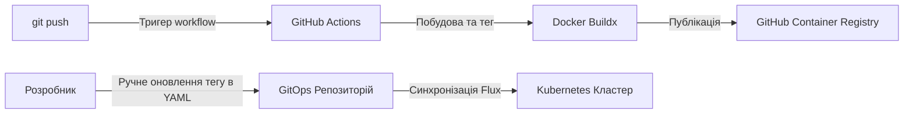

# CI/CD Пайплайн та GitOps Доставка

Цей документ описує CI/CD пайплайн та стратегію доставки GitOps для застосунку **стартап Scout**, який контейнеризований та розгортається у Kubernetes-кластерах під керуванням **FluxCD**.

---

## Схема архітектури



---

## 1. Стратегія тригерів пайплайну
Робочий процес GitHub Actions розміщений у [.github/workflows/deploy.yml](../.github/workflows/deploy.yml) і запускається при коммітах у відповідні гілки:
- **Гілка `dev`**: Збирає та доставляє образи для **Середовища розробки** (`dev`).
- **Гілка `main`**: Збирає та доставляє образи для **Продакшен середовища** (`prod`).

---

## 2. Реєстр контейнерів та назви артефактів
Для збереження симетрії між середовищами використовуються однакові назви образів контейнерів. Образи публікуються в **GitHub Container Registry (GHCR)**:
* **Фронтенд сервіс**: `ghcr.io/<repository-owner>/jobmatch-web`
* **Бекенд API сервіс**: `ghcr.io/<repository-owner>/jobmatch-api`

---

## 3. Схема версіонування та тегування образів
Пайплайн динамічно витягує базову семантичну версію з конфігурації бекенду ([app/server/package.json](../app/server/package.json)) і додає короткий 7-символьний Git commit SHA.

### А. Уніфіковане тегування контейнерів
Для забезпечення ідентичності образів та спрощення просування змін, збірки з обох гілок (`dev` та `main`) використовують єдиний формат тегування:
* Формат: `<version>-<short-sha>` та `latest`
* Web: 
  - `ghcr.io/<owner>/jobmatch-web:v1.0.0-e5f6g7h`
  - `ghcr.io/<owner>/jobmatch-web:latest`
* API: 
  - `ghcr.io/<owner>/jobmatch-api:v1.0.0-e5f6g7h`
  - `ghcr.io/<owner>/jobmatch-api:latest`

---

## 4. Стратегія інтеграції FluxCD (HelmRelease)

Замість використання автоматичного оновлення образів через додаткові контролери Flux, доставка застосунку повністю базується на **декларативному описі в ресурсах HelmRelease** (оверлеї середовищ) з ручним оновленням тегів.

### А. Структура каталогів GitOps та розподіл за гілками
Конфігурації для кожного кластера повністю відокремлені на рівні файлової структури та Git-гілок:

* **Dev-кластер (гілка розробки `dev`)**:
  * Синхронізується з папки: `platform/flux/clusters/dev/`
  * Конфігураційні файли застосунку розміщені безпосередньо в `platform/flux/clusters/dev/apps/jobmatch/`.
  * `ns.yaml` — створює простір імен `jobmatch-dev`.
  * `helm-release.yaml` — декларативно описує реліз `jobmatch-dev` для розробки.
  * Усі зміни на гілці `dev` автоматично деплояться на dev-кластер.

* **Prod-кластер (продуктова гілка `main`)**:
  * Синхронізується з папки: `platform/flux/clusters/prod/`
  * Конфігураційні файли застосунку розміщені в `platform/flux/clusters/prod/apps/jobmatch/`.
  * `ns.yaml` — створює простір імен `jobmatch-prod`.
  * `helm-release.yaml` — декларативно описує реліз `jobmatch-prod` з прод-лімітами ресурсів та кількістю реплік.
  * Зміни застосовуються тільки після злиття Pull Request у гілку `main`.

### Б. Переваги та процес просування змін (Promotion):
1. **Контроль та безпека (PR-based CD):** Будь-які зміни конфігурації продакшену (оновлення образів, лімітів чи промптів) спочатку проходять стадію Pull Request у гілку `main`. Лише після схвалення та злиття PR, Flux на prod-кластері автоматично оновлює застосунок.
2. **Простота просування змін:** Щоб перенести перевірену версію образу з розробки на продакшен, ви копіюєте тег образу з `clusters/dev/apps/jobmatch/helm-release.yaml` у `clusters/prod/apps/jobmatch/helm-release.yaml` на гілці `dev`, створюєте PR у `main` та мержите його.
3. **Ізоляція оточень:** Оскільки конфігурації лежать в окремих папках кластерів, виключається будь-яка ймовірність затерти налаштування продакшену під час мержу загальних змін коду застосунку з `dev` у `main`.

---

## 5. Декоплінг доставки промптів (PromptOps)

Щоб уникнути тривалого складання та пушу повних образів контейнерів при зміні лише системних промптів (файли в `app/skills/**`), реалізовано наступний робочий процес:

### А. Фільтрація шляхів у CI (GitHub Actions)
У налаштуваннях пайплайну налаштовано фільтрацію шляхів. Якщо змінено лише файли в `app/skills/**`, етап збирання Docker-образів пропускається, що економить час та ресурси.

### Б. Динамічне пакування в ConfigMap
Промпти автоматично пакуються в ConfigMap за допомогою Helm-шаблону `platform/helm/jobmatch/templates/configmap-skills.yaml` з використанням вбудованих функцій Helm `.Files.Glob` та `.Files.Get`. 

У `deployment-api.yaml` цей ConfigMap монтується в контейнер API як розділ:
```yaml
          volumeMounts:
            - name: skills-volume
              mountPath: /app/skills
```

### В. Автоматичний Rolling Update при зміні промптів
У шаблоні Deployment прораховується контрольна сума ConfigMap:
```yaml
    annotations:
      checksum/config: {{ include (print $.Template.BasePath "/configmap-skills.yaml") . | sha256sum }}
```
При будь-якій зміні промптів та наступному комміті, FluxCD оновлює ConfigMap, контрольна сума змінюється, і Kubernetes автоматично запускає **Rolling Update** для API-подів. Нові поди запускаються менш ніж за 5 секунд і одразу використовують оновлені промпти.
