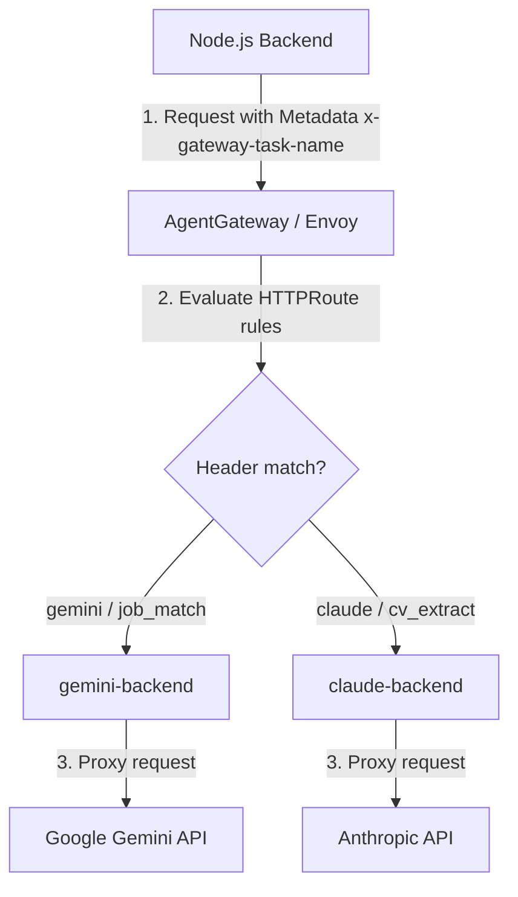

# FinOps LLM Маршрутизація: Управління Складністю та Собівартістю Запитів

Цей документ описує концепцію та технічні варіанти реалізації динамічної маршрутизації LLM-запитів на основі складності задач (FinOps роутинг) за допомогою `AgentGateway`.

Основна мета — автоматично надсилати прості чи рутинні задачі (наприклад, первинний аналіз збігів резюме з вакансією) на швидкі та дешеві моделі (наприклад, **Google Gemini 2.5 Flash**), а складні, творчі або синтетичні завдання (наприклад, фінальний аналіз або написання супровідного листа - Cover Letter) — на дорожчі й потужніші моделі (наприклад, **Anthropic Claude 3.5 Sonnet**).

---

## 🏗️ Схема роботи маршрутизації



---

## 📋 Вихідний стан: Передача типу задачі в API Бекенді

На рівні внутрішньої бізнес-логіки бекенд **вже визначає** тип завдання і створює запити типу `StructuredGenerateRequest` з відповідним полем `task`:

1. **Для оцінки збігу резюме з вакансіями (легке завдання):**  
   У файлі [synthesize.ts](../app/server/agent/synthesize.ts#L54-L60) викликається метод `generateStructured` із тегом `'job_match'`:
   ```typescript
   const client = getAIClient();
   const result = await client.generateStructured<JobMatchResult>({
     task: 'job_match', // <-- Логічний тип завдання
     systemPrompt: RANK_SYSTEM + skills,
     userPrompt: userBlock,
     jsonSchema: input.jsonSchema,
   });
   ```

2. **Для структурованого розбору CV (складне завдання):**  
   У файлі [llm.ts](../app/server/services/llm.ts#L58-L64) виконується виклик із тегом `'cv_extract'`:
   ```typescript
   const client = getAIClient();
   const output = await client.generateStructured<Record<string, unknown>>({
     task: 'cv_extract', // <-- Логічний тип завдання
     systemPrompt: CV_SYSTEM,
     userPrompt: `CV text:\n\n${text}`,
     jsonSchema: json_schema,
   });
   ```

Хоча бекенд *внутрішньо* володіє цими метаданими в `request.task`, клієнт застосунку **не відправляв** цей тип завдання назовні до `AgentGateway`.

---

## 🛠️ Реалізований підхід: Декларативний роутинг за типом задачі (Variant B)

*Рекомендований підхід для розділення обов'язків (Separation of Concerns).*  
У цьому випадку код застосунку нічого не знає про назви моделей і провайдерів. Застосунок лише маркує логічний тип задачі (`task: 'job_match'` або `task: 'cv_extract'`). Клієнт прокидає цей тип як HTTP-заголовок, а вибір конкретної моделі та бекенду здійснюється суто через Kubernetes/Flux декларативні маніфести.

### Крок 1: Передача типу задачі через HTTP-заголовок у коді
Щоб передати тип завдання на шлюз безпеки, ми додаємо HTTP-заголовок `x-gateway-task-name` у параметри запиту клієнта [openai.ts](../app/server/ai/providers/openai.ts#L31-L47):

```typescript
    const response = await this.client.chat.completions.create({
      model: this.model,
      messages: [
        { role: 'system', content: system },
        { role: 'user', content: request.userPrompt },
      ],
      response_format: request.jsonSchema
        ? {
            type: 'json_schema',
            json_schema: {
              name: `${request.task}_response`,
              strict: false,
              schema: request.jsonSchema,
            },
          }
        : { type: 'json_object' },
    }, {
      headers: {
        'x-gateway-task-name': request.task, // <-- Прокидаємо тип задачі на шлюз
      }
    });
```

Усі інші провайдери (як-от Claude та Gemini за наявності `GATEWAY_URL`) автоматично делегують свої виклики цьому `OpenAIProvider`, тому вони також успадковують цей заголовок.

---

### Крок 2: Оновлення правил роутингу в HTTPRoute
У файлі [agentgateway-route.yaml](../platform/flux/clusters/dev/apps/jobmatch/agentgateway-route.yaml) ми розподіляємо трафік залежно від заголовка `x-gateway-task-name`:

```yaml
apiVersion: gateway.networking.k8s.io/v1
kind: HTTPRoute
metadata:
  name: llm-router
  namespace: agentgateway-system
spec:
  parentRefs:
    - name: agentgateway-external
  rules:
    # 1. Задачі матчингу (job_match) спрямовуються на дешевий Gemini
    - matches:
        - headers:
            - name: x-gateway-task-name
              value: "job_match"
      backendRefs:
        - group: agentgateway.dev
          kind: AgentgatewayBackend
          name: gemini-backend
          port: 443
    # 2. Задачі вилучення даних з CV (cv_extract) або дефолт -> Claude
    - matches:
        - headers:
            - name: x-gateway-task-name
              value: "cv_extract"
      backendRefs:
        - group: agentgateway.dev
          kind: AgentgatewayBackend
          name: claude-backend
          port: 443
```

---

## ⚖️ Переваги Варіанту Б (Декларативний роутинг)

1. **Гнучкість FinOps без релізу коду:** Якщо завтра вартість Gemini знизиться чи вийде нова дешева модель Claude Haiku, SRE-інженер може оновити маніфести `AgentgatewayBackend` та перенаправити задачу `job_match` на нову модель суто в Git, без потреби перебудовувати Docker-образ чи деплоїти бекенд.
2. **Єдине джерело істини:** Співвідношення типу завдання до вартості та провайдера зберігається у конфігурації платформи, а не розсіюється по коду різних сервісів.
3. **Простота локальної розробки:** Розробник на локальній машині просто маркує завдання за їх призначенням, а шлюз локально сам вирішує, куди їх пересилати (наприклад, на локальний `mock-llm`).
