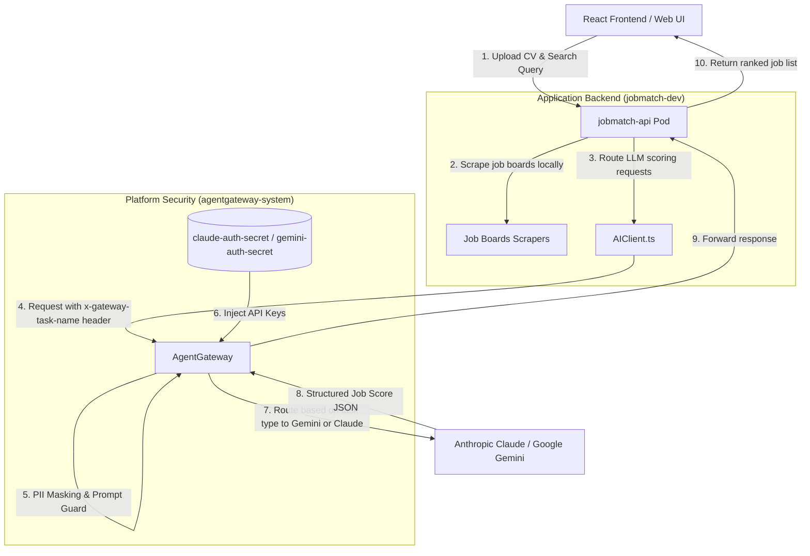
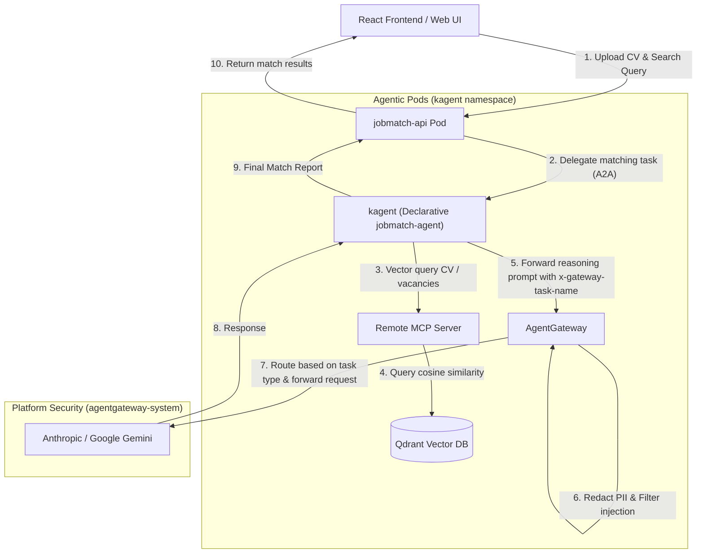
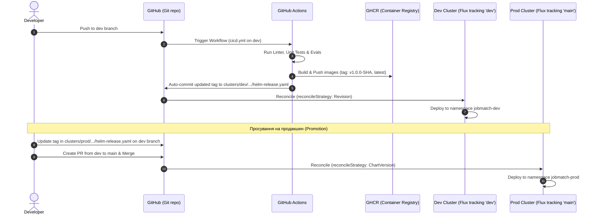
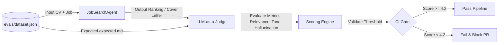
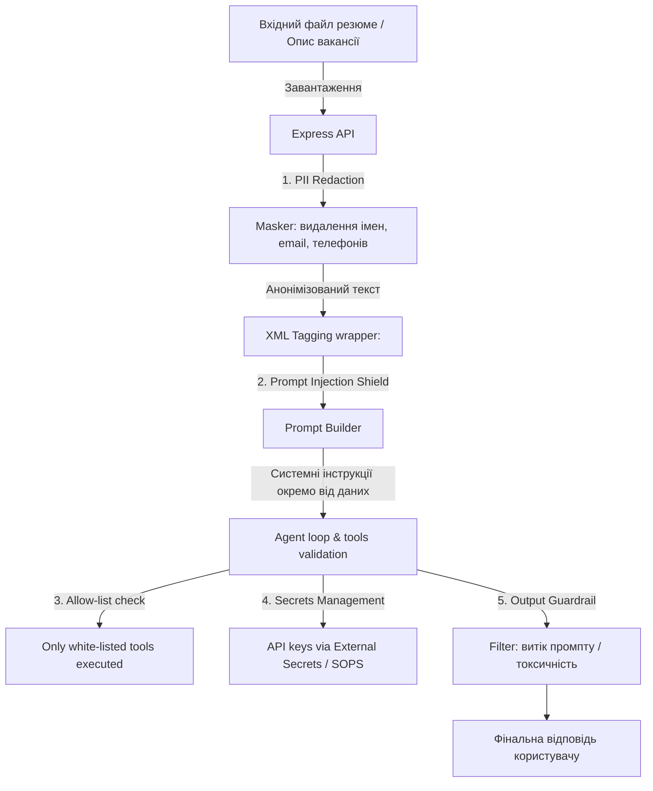
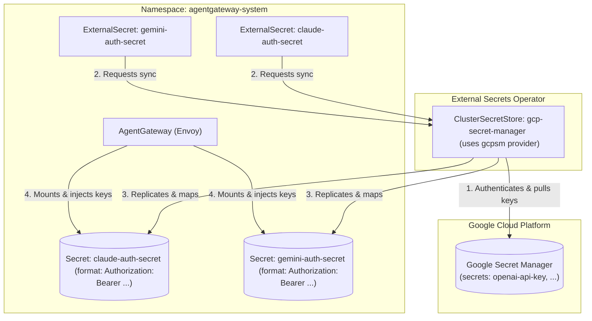
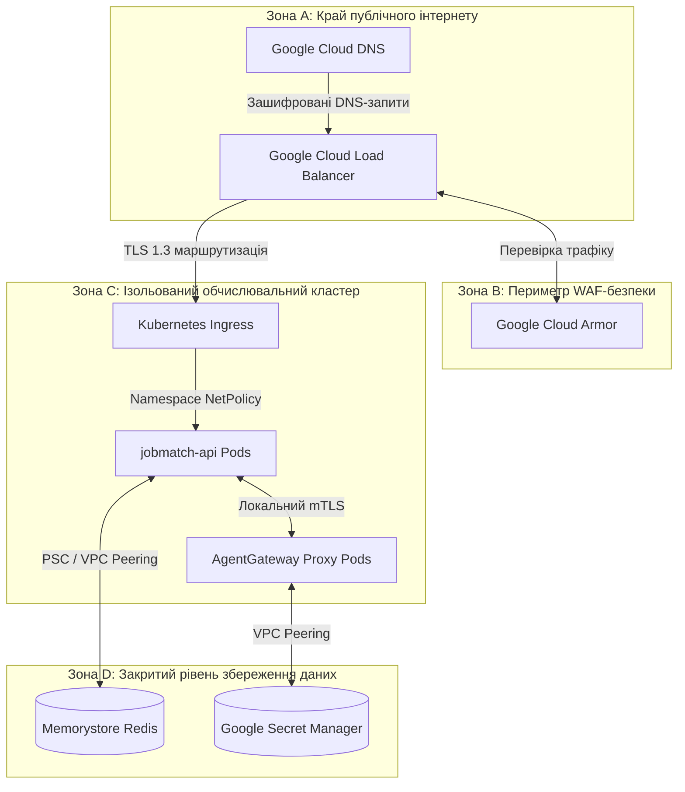

# High-Level Solution Design (HLD) — JobMatch Platform

Цей документ визначає високорівневу архітектуру платформи **JobMatch**, включаючи дизайн компонентів, життєвий цикл запитів, процес CI/CD автоматизації та контур тестування якості (Evals) для стартапу Scout.

---

## 1. Архітектурна діаграма системи (System Architecture)

Для забезпечення безпеки, FinOps контролю та масштабованості архітектура впроваджується у два етапи:

### Фаза 1: Інтеграція Agent Gateway (Поточний стан)
Локальний збір та оркестрація пошуку вакансій ([JobSearchAgent.ts](../../app/server/agent/JobSearchAgent.ts)) залишаються на Node.js API сервері, але всі запити до LLM проксіюються через **AgentGateway** (на базі Envoy). Шлюз виконує анонімізацію даних (PII), фільтрує ін'єкції промптів та інжектує API-ключі.

---

### Фаза 2: Декларативний Агент та Векторна БД (Цільова архітектура)
Локальна логіка оркестрації повністю вилучається з API-сервера та переноситься у декларативні под-агенти **kagent**, які взаємодіють з віддаленими серверами **MCP** для векторизації та семантичного пошуку у **Qdrant Vector DB**.

---

### Основні компоненти системи:
1. **React/Vite Frontend (Web):** Клієнтська частина для завантаження резюме та введення пошукових запитів.
2. **Backend API (Express):** Обробляє запити, запускає локальні парсери/скрапери вакансій (Фаза 1) та перенаправляє завдання агентам kagent через A2A (Фаза 2).
3. **AI Client Layer ([AIClient.ts](../../app/server/ai/AIClient.ts)):** Уніфікований клієнт, що перенаправляє всі LLM запити на `AgentGateway`.
4. **Agent Gateway ([AgentGateway](../../platform/flux/clusters/dev/apps/jobmatch/agentgateway-policy.yaml)):** Envoy-посередник для фільтрації Prompt Injection, маскування персональних даних (PII, як-от Email, телефони, SSN, посилання на LinkedIn/GitHub) та динамічного FinOps роутингу на основі типу задачі (через HTTP-заголовок `x-gateway-task-name`, який спрямовує `job_match` на дешеві моделі Gemini, а `cv_extract` — на Claude).
5. **Declarative Agent (jobmatch-agent) (Фаза 2):** Спеціалізоване середовище виконання kagent для обробки промптів та взаємодії з MCP.
6. **Memory (MCP + Qdrant) (Фаза 2):** MCP-сервер для семантичного пошуку збігів у векторній базі даних Qdrant.

---

## 2. CI/CD Пайплайн та GitOps Реліз-Процес

Розгортання платформи здійснюється повністю декларативно за допомогою GitOps-контролера FluxCD, розділеного на рівні окремих каталогів кластерів та відповідних гілок.

### Стратегія просування (Promotion Strategy):
* **Dev-кластер (Гілка dev):** Синхронізується з каталогом `platform/flux/clusters/dev`. При кожному пуші в dev GitHub Actions автоматично збирає контейнери з тегом `v1.0.0-<git-sha>` та за допомогою кроку автоматичного запису оновлює цей тег у `dev/apps/jobmatch/helm-release.yaml`.
* **Prod-кластер (Гілка main):** Синхронізується з каталогом `platform/flux/clusters/prod`. Для доставки оновлень розробник оновлює тег у `prod/apps/jobmatch/helm-release.yaml` на перевірений у dev, створює PR у main та зливає його після перевірки.

---

### Порівняння стратегій узгодження (reconcileStrategy)

Для балансу між швидкістю розробки в Dev та стабільністю в Prod використовуються різні стратегії узгодження HelmRelease:

1. **Dev-середовище: reconcileStrategy: Revision**
   * **Суть:** Flux миттєво реагує на будь-які комміти в Git (зміна тегів образів, значень values або конфігураційних файлів), оскільки він відслідковує зміну Git-ревізії.
   * **Перевага:** Максимальна швидкість доставки без необхідності підняття версії чарту в `Chart.yaml` при кожній зміні (зручно для швидкої ітерації).

2. **Prod-середовище: reconcileStrategy: ChartVersion**
   * **Суть:** Flux виконує оновлення релізу на продакшені тільки тоді, коли версія Helm-чарту (`spec.chart.spec.version` у `HelmRelease` або версія чарту у репозиторії) явно змінюється.
   * **Перевага:** Захист від випадкових змін конфігурації. Будь-які зміни в values чи параметрах шлюзу не будуть застосовані на Prod, доки розробник явно не оновить версію чарту. Це гарантує суворий релізний контроль, однозначність версіонування (SemVer) та мінімізує ризики людських помилок при злитті PR.

---

## 3. Контур оцінки якості LLM-as-a-Judge (Evaluation Engine)

Для вимірювання якості роботи агента при зміні коду або промптів використовується LLM-суддя.

### Метрики оцінювання (Metrics Framework):
1. **Relevance (Релевантність):** Чи дійсно підібрані вакансії відповідають навичкам та досвіду кандидата з резюме? (Шкала 1-5).
2. **Tone (Тональність):** Чи відповідає згенерований супровідний лист (cover letter) професійному корпоративному стилю без зайвого "хайпу" (Шкала 1-5).
3. **Hallucination-free (Відсутність галюцинацій):** Чи не придумує модель вакансії або досвід, якого не було в резюме (Шкала 1-5).

---

## 4. Схема безпеки (Security Architecture)

Багаторівневий захист забезпечує ізоляцію конфіденційних даних та захист від зовнішніх атак.

### Ключові механізми безпеки:
* **PII Redaction:** Усі резюме анонімізуються на рівні Express-сервера (або через політику AgentGateway Guardrails) перед надсиланням до хмарних LLM.
* **Структурне тегування:** Вхідні дані користувача відокремлюються від системних інструкцій за допомогою суворих XML-тегів, що мінімізує успішність атак "ignore previous instructions".
* **allow-list інструментів:** Агент має обмежений набір дій (наприклад, дозволено робити HTTP GET тільки на валідовані домени дощок вакансій).
* **secrets поза git:** Усі API-ключі LLM-провайдерів ізольовані від контейнера застосунку. Вони управляються централізовано на рівні **AgentGateway** (з використанням Kubernetes Secrets / External Secrets Operator у просторі імен `agentgateway-system`) та автоматично підставляються у вихідні запити до LLM-провайдерів на рівні шлюзу.
* **Output Guardrails:** Перевірка згенерованої моделями відповіді (response) на рівні **AgentGateway** за допомогою регулярних виразів. Шлюз аналізує вихідний потік на наявність витоку системних інструкцій (наприклад, фраз типу «You are a secure Job Matching System», «ignore previous instructions») та маркерів дискримінації чи упередженості («only men», «under 35»), блокуючи такі відповіді з поверненням повідомлення про порушення політики безпеки. Для покращення **Output Moderation** пропонується надалі реалізувати використання Webhook для аналізу токсичності зовнішніми моделями класифікації, що дозволяє автоматично відправляти кожну відповідь LLM на зовнішній сервіс класифікації токсичності (наприклад, на базі моделей Llama Guard, Perspective API від Google або локальний мікросервіс із бібліотекою `detoxify`).

---

## 5. Управління секретами (Secrets Management)

Безпека API-ключів для LLM-провайдерів (OpenAI, Anthropic, Gemini) є критично важливою. Усі ключі повністю ізольовані від коду додатків і підставляються динамічно на рівні шлюзу безпеки **AgentGateway**. Синхронізація ключів реалізована за допомогою **External Secrets Operator (ESO)**.

### Уніфікація хмарних середовищ (GCP Secret Manager)

Для дотримання принципу відповідності середовищ (Dev-Prod parity) усі хмарні контури платформи (**Dev** та **Prod**) використовують єдиний підхід до управління секретами на базі **Google Secret Manager (GCP SM)**. Це дозволяє уникнути відмінностей у конфігураціях між середовищами в хмарі.

---

### Архітектурне рішення та життєвий цикл секретів у хмарі (Dev & Prod)

#### Процес синхронізації:
1. **Джерело правди (Source of Truth):** Усі API-ключі хмарних сервісів зберігаються в Google Secret Manager у відповідному GCP-проекті.
2. **Авторизація оператора:** `ClusterSecretStore` під назвою `gcp-secret-manager` використовує провайдер `gcpsm`. Він авторизується в Google Cloud за допомогою механізму **Workload Identity** (для Kubernetes Service Account оператора ESO) або за допомогою змонтованого сервісного ключа GCP.
3. **Мапування та форматування:** Ресурси `ExternalSecret` в `agentgateway-system` зчитують ключі з GCP SM та автоматично форматують їх, створюючи кінцевий секрет (наприклад, з полем `Authorization: Bearer <key>`), який використовує `AgentGateway`.
4. **GitOps-сумісність:** Конфігураційні файли (декларативні описи `ExternalSecret` та `ClusterSecretStore`) безпечно зберігаються в Git-репозиторії та синхронізуються за допомогою **FluxCD**, тоді як самі секретні дані ніколи не коммітяться в репозиторій.

---

### Локальна розробка та тестування (Local Development & Testing)

Для роботи системи локально на ноутбуці (у k3s / minikube / kind) передбачено механізми запуску без зовнішніх хмарних залежностей:

#### 1. Локальне управління секретами
Для використання секретів без хмари розробники можуть використовувати спрощений підхід прямого створення локальних секретів або імітацію роботи ESO без GCP SM. Детальний посібник:
* [Локальна робота з секретами на ноутбуці (local-development-secrets.md)](../manuals/local-development-secrets.md)

#### 2. Локальне тестування безпеки (Mock LLM Service)
Для тестування prompt-ін'єкцій, маскування персональних даних (PII) та FinOps-роутингу без здійснення реальних платних запитів до Anthropic Claude або Google Gemini у локальному кластері розгортається сервіс **`mock-llm`** (на базі Node.js).

* **Принцип роботи:** Сервіс слухає порт `8089` у namespace `jobmatch-dev` та виступає кінцевою точкою (upstream) для `AgentGateway` у локальному контурі.
* **Перевірка маскування:** `mock-llm` приймає запити від шлюзу, логує вхідне тіло запиту у свій `stdout` (дозволяючи розробнику через `kubectl logs` перевірити, чи замасковано персональні дані, наприклад, `<EMAIL_ADDRESS>`), та повертає фіксовану OpenAI-сумісну JSON-відповідь.
* **Посібник з тестування:** [Тестування Prompt Masking та PII маскування (testing-security-masking.md)](../manuals/testing-security-masking.md)

---

## 6. Архітектура інфраструктури (Infrastructure Architecture)

Інфраструктурна архітектура платформи JobMatch розроблена з урахуванням вимог економічної ефективності (FinOps), надійності та простоти експлуатації (Ops-wise).

### 6.1 Порівняльний огляд середовищ

| Параметр | Середовище розробки (Dev) | Промислове середовище (Prod) |
| :--- | :--- | :--- |
| **Базова хост-система** | GCP VM `e2-standard-2` (2 vCPU, 8 GB RAM) | **GKE Autopilot** (Multi-zonal) |
| **Рантайм K8s** | Локальний кластер `k3d` у Docker | **GKE Autopilot** |
| **База даних векторів** | Qdrant (локальний pod) | Qdrant (ephemeral pod або Qdrant Cloud) |
| **Кешування** | Redis (локальний pod) | **GCP Memorystore for Redis** (managed) |
| **Маршрутизація трафіку**| Nginx Ingress Controller (локальний) | **Google Cloud Load Balancing (GCLB)** |
| **Безпека на межі** | Локальний TLS (Self-signed) | **Google Cloud Armor** (WAF, DDoS) |
| **Управління секретами**| Локальні файли / K8s Secrets | **Google Secret Manager** + ESO |
| **Вартість (орієнтовно)**| **~$48.00 / місяць** | **~$138.26 / місяць** |

### 6.2 Топологія контуру розробки (Dev)

У середовищі розробки всі компоненти платформи розгортаються на одній віртуальній машині GCP класу `e2-standard-2` для мінімізації витрат:
- Хост-система запускає рушій Docker.
- Всередині Docker запускається легкий кластер `k3d`, який емулює інтерфейси API Kubernetes.
- Усі прикладні сервіси (`jobmatch-api`, `jobmatch-web`, `agentgateway`, `mock-llm`, локальний Redis та Qdrant) працюють як поди в єдиному просторі імен `jobmatch-dev`.

### 6.3 Топологія промислового контуру (Prod)

Промислове середовище спроектоване для забезпечення високої доступності (HA) та масштабованості:
1. **Google Cloud Load Balancer (GCLB):** Приймає зовнішній трафік, здійснює термінацію SSL/TLS (забезпечує підтримку лише TLS 1.2/1.3) та перенаправляє запити до кластера GKE.
2. **Google Cloud Armor:** Працює на рівні GCLB, забезпечуючи захист від DDoS-атак L7 та WAF-фільтрацію за правилами OWASP.
3. **GKE Autopilot:** Мультизональний керований кластер Kubernetes, який автоматично масштабує обчислювальні ресурси (вузли) відповідно до вимог подів. Поди розгорнуті у двох репліках у різних зонах доступності.
4. **GCP Memorystore for Redis:** Виділений керований сервіс кешування для збереження результатів пошуку та лімітів запитів.
5. **Qdrant Vector DB:** Працює в бездержавному режимі (ephemeral memory index), дозволяючи швидко відновлювати індекс вакансій з основних джерел без використання складного збереження стану на дисках.

### 6.4 Ліміти ресурсів та масштабування подів

У промисловому середовищі GKE Autopilot тарифікує ресурси на основі запитів (Requests) подів. Встановлено такі оптимізовані ліміти для забезпечення економічності:

- `jobmatch-api`: 2 репліки, `0.5 vCPU`, `1 GB RAM` на кожну.
- `jobmatch-web`: 2 репліки, `0.25 vCPU`, `256 MB RAM` на кожну.
- `agentgateway` (Envoy): 2 репліки, `0.5 vCPU`, `512 MB RAM` на кожну.

Для подів налаштовано Horizontal Pod Autoscaler (HPA) з порогом у 70% використання CPU для автоматичного масштабування під час пікових навантажень (до 2-3 запитів/сек).

### 6.5 Розрахунки FinOps для промислової інфраструктури

Розрахунок вартості для умовного місяця (730 годин роботи) в регіоні `us-central1`:
- **GKE Autopilot Compute:**
  - API Pods: $2 \times 0.5\text{ vCPU} \times \$0.0445/\text{vCPU-год} \times 730 = \$32.49$
  - API RAM: $2 \times 1\text{ GB} \times \$0.0049/\text{GB-год} \times 730 = \$7.15$
  - Web Pods: $2 \times 0.25\text{ vCPU} \times \$0.0445/\text{vCPU-год} \times 730 = \$16.24$
  - Web RAM: $2 \times 0.25\text{ GB} \times \$0.0049/\text{GB-год} \times 730 = \$1.79$
  - Gateway Pods: $2 \times 0.5\text{ vCPU} 	imes \$0.0445/\text{vCPU-год} \times 730 = \$32.49$
  - Gateway RAM: $2 \times 0.5\text{ GB} 	imes \$0.0049/\text{GB-год} 	imes 730 = \$3.58$
  - *Підсумок GKE Autopilot:* **~$93.74/місяць**
- **GCP Memorystore for Redis (1 GB Basic):** $730 \times \$0.0127/\text{год} = \mathbf{\$9.27/місяць}$
- **Google Cloud Load Balancer (GCLB):** Базовий тариф: $730 \times \$0.025/\text{год} = \mathbf{\$18.25/місяць}$
- **Google Cloud Armor Standard + WAF:** Політики, правила + трафік: **~$7.00/місяць**
- **Трафік та збереження логів (Cloud Storage / Egress):** **~$10.00/місяць**
- **РАЗОМ НА МІСЯЦЬ:** **~$138.26/місяць**

### 6.6 Безпека: Захист від атак OWASP за допомогою сервісів GCP

| Сервіс GCP | Цільові вразливості OWASP | Спосіб захисту та конфігурація |
| :--- | :--- | :--- |
| **Google Cloud Armor** | • **OWASP Web A03: Injection** (SQLi, XSS) • **OWASP Web A04: Insecure Design (DDoS)** • **OWASP LLM01: Prompt Injection** | • Використання попередньо налаштованих правил WAF (ModSecurity CRS) для фільтрації SQLi, XSS та віддаленого виконання команд. • Обмеження частоти запитів для захисту від DDoS. • Спеціальні сигнатурні правила для блокування спроб prompt injection на межі мережі. |
| **GKE Autopilot** | • **OWASP Web A01: Broken Access Control** • **OWASP Web A05: Security Misconfiguration** | • **Network Policies (Dataplane V2):** Блокування несанкціонованого трафіку між просторами імен. • **Автоматичне оновлення:** Системне оновлення версій K8s та ОС нод від Google. • **Pod Security Standards:** Заборона контейнерам працювати від імені root та обмежувальні права доступу. |
| **Google Secret Manager** | • **OWASP Web A02: Cryptographic Failures** • **OWASP LLM10: Model Theft / Excess Agency** | • Збереження та шифрування API-ключів (OpenAI, Gemini, Claude) у сховищі GCP. • **Workload Identity:** Безпечний доступ подів до Secret Manager через сервісні акаунти K8s. • Авторизаційні токени інжектуються тільки в проксі `agentgateway`, виключаючи доступ для прикладного коду бекенду. |
| **Artifact Registry** | • **OWASP Web A06: Vulnerable Components** | • Автоматичне сканування образів контейнерів на наявність відомих CVE при кожному пуші. |
| **Cloud Load Balancing** | • **OWASP Web A02: Cryptographic Failures** | • Забезпечення шифрування трафіку TLS 1.2/1.3 з відключенням слабких шифрів. |
| **Cloud Logging & Monitoring** | • **OWASP Web A09: Logging & Monitoring Failures** | • Централізований збір логів GKE Audit Logs, VPC flow logs, Load Balancer access logs та логів доступу до Secret Manager. Алертінг у разі підозрілих IAM-викликів. |

### 6.7 Зонування мережевої безпеки GCP

Для запобігання несанкціонованому перетину периметрів та безпечної взаємодії промислове середовище розбито на чотири логічні зони безпеки:

- **Зона А (Край публічного інтернету):** Слугує єдиною публічною точкою входу. Маршрутизує запити через Cloud DNS та термінує SSL/TLS-з'єднання на зовнішньому балансувальнику навантаження (GCLB) з використанням сертифікатів від Google.
- **Зона B (Периметр WAF-безпеки):** Google Cloud Armor інтегрується безпосередньо з GCLB для фільтрації SQL-ін'єкцій, XSS та DDoS-атак L7. Він виступає першим бар'єром захисту до потрапляння пакетів у внутрішню мережу.
- **Зона C (Ізольований обчислювальний кластер - GKE Autopilot):** Віртуальні машини та вузли працюють у приватних підмережах без публічних IP-адрес. Кордони кластера захищені за допомогою GKE Dataplane V2 NetworkPolicies, які ізолюють простір імен `jobmatch-prod` від інших сервісів та дозволяють трафіку надходити лише від Ingress-контролера.
- **Зона D (Закритий рівень збереження даних):** Містить керовані системи збереження. Доступ до GCP Memorystore for Redis та GCP Secret Manager здійснюється виключно через приватні інтерфейси Private Service Connect (PSC) або VPC Peering зсередини Зони C. Будь-який прямий доступ з інтернету повністю заблоковано на рівні міжмережевого екрану GCP VPC.
