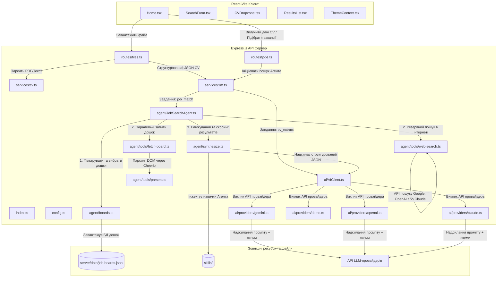

# Low-Level Design (LLD) — Платформа JobMatch

> [!NOTE]
> Для отримання інформації про високорівневу архітектуру системи, топологію розгортання та політики безпеки див. [High-Level Solution Design (HLD)](HLD.md).

Цей документ описує низькорівневу архітектуру програмного забезпечення, специфікації модулів, структури даних, конфігурації маршрутизації та робочі процеси контуру (pipeline workflows) для платформи **JobMatch**.

---

## 1. Компоненти системи та карта каталогів

Платформа структурована на окремі шари для розв'язання задач представлення (Presentation), API, сервісів (Service), Агента (Agent) та AI-провайдерів (AI Provider), підтримуваних маніфестами розгортання платформи.

### Схема архітектурних потоків системи



### Детальні специфікації класів

#### 1. Структура синглтону AIClient ([ai/AIClient.ts](../../app/server/ai/AIClient.ts))

Клас `AIClient` визначає конкретних провайдерів LLM. Він надає уніфікований інтерфейс, що реалізує патерн синглтон-фабрики:

```typescript
export class AIClient {
  private static instance: AIClient | null = null;
  private provider: OpenAIProvider | GeminiProvider | ClaudeProvider | DemoAIClient;

  private constructor() {
    this.provider = createAIClient(); // Визначає клас провайдера на основі конфігурації
  }

  public static getInstance(): AIClient {
    if (!AIClient.instance) {
      AIClient.instance = new AIClient();
    }
    return AIClient.instance;
  }

  public static resetInstance(): void {
    AIClient.instance = null; // Використовується unit-тестами для скидання конфігурації
  }

  public async generateStructured<T>(request: StructuredGenerateRequest): Promise<T> {
    return this.provider.generateStructured<T>(request);
  }
}
```

#### 2. Express Маршрутизація, Middleware та обмеження розміру тіла запиту ([routes/files.ts](../../app/server/routes/files.ts))

Маршрут `/api/files/upload` використовує стандартний парсинг `multer`. Middleware обмежує розмір файлу для захисту від атак типу "Відмова в обслуговуванні" (DoS):

```typescript
import multer from 'multer';

const storage = multer.memoryStorage();
const upload = multer({
  storage,
  limits: {
    fileSize: 5 * 1024 * 1024, // Ліміт розміру файлу 5MB
  }
});
```

Після успішної валідації контролер зчитує буфер файлу, запускає парсер тексту або PDF у `cv.ts` та спрямовує вихідні дані в `llm.ts`, обертаючи їх у схему структурованого JSON-запиту.

### Специфікація файлів модулів

1. **Рівень представлення (Presentation Layer):**
   - [Home.tsx](../../app/src/pages/Home.tsx): Кореневий компонент інтерфейсу, що керує фільтрами пошуку, зарплатою, країною, статусом завантаження та відображенням списку результатів.
   - [SearchForm.tsx](../../app/src/components/job-search/SearchForm.tsx): Обробляє валідацію форм та фільтри пошуку.
   - [CVDropzone.tsx](../../app/src/components/job-search/CVDropzone.tsx): UI-компонент для перетягування та завантаження файлів резюме.
   - [ResultsList.tsx](../../app/src/components/job-search/ResultsList.tsx): Відображає підібрані вакансії, відсортовані за оцінкою релевантності, аналізом прогалин у навичках та супровідними листами.

2. **Рівень API (API Layer):**
   - [index.ts](../../app/server/index.ts): Стандартний запуск сервера. Налаштовує ліміти розміру тіла запитів (для завантаження великих CV у форматі base64), політики CORS, кінцеві точки моніторингу здоров'я (health) та підключає суб-маршрути.
   - [routes/files.ts](../../app/server/routes/files.ts): Кінцева точка завантаження файлів. Запускає вилучення тексту з резюме та LLM-парсер структури CV.
   - [routes/jobs.ts](../../app/server/routes/jobs.ts): Виконує запити на відповідність вакансій, передаючи структуру CV та ключові слова до служби оркестрації.

3. **Рівень сервісів (Service Layer):**
   - [services/cv.ts](../../app/server/services/cv.ts): Вилучає текст із файлів. Використовує бібліотеку `pdf-parse` для файлів `.pdf` та текстові рідери для `.txt`, `.md` і `.json` розширень.
   - [services/llm.ts](../../app/server/services/llm.ts): Високорівневий оркестратор логіки, що пов'язує маршрути з `AIClient` та `JobSearchAgent`.

4. **Рівень агента (Agent Layer):**
   - [JobSearchAgent.ts](../../app/server/agent/JobSearchAgent.ts): Паралельно координує роботу скраперів вакансій на дошках оголошень та виконує підсумкове ранжування результатів.
   - [boards.ts](../../app/server/agent/boards.ts): Валідує та фільтрує доступні дошки оголошень відповідно до конфігурації країни.
   - [synthesize.ts](../../app/server/agent/synthesize.ts): Інструктує LLM-провайдерів щодо оцінки вакансій на основі характеристик завантаженого CV.

5. **Рівень AI-провайдерів (AI Provider Layer):**
   - [ai/AIClient.ts](../../app/server/ai/AIClient.ts): Фабричний синглтон, що ініціалізує SDK OpenAI, Gemini, Claude або тестового мок-клієнта.
   - [ai/skills/loader.ts](../../app/server/ai/skills/loader.ts): Динамічно завантажує інструкції в розмітці Markdown (системні промпти) з папки `/skills` під час запуску сервера.

### Схеми запитів та відповідей API (Payload Schemas)

Для полегшення інтеграції фронтенду та бекенду система надає дві основні REST кінцеві точки з такими схемами JSON:

#### 1. POST `/api/files/upload` (Завантаження та парсинг CV)
- **Тип запиту:** `multipart/form-data`
- **Параметри запиту:**
  - `file`: Бінарний файл (PDF або текстовий файл розміром до 5MB).
- **Формат відповіді (JSON):**
  ```json
  {
    "success": true,
    "data": {
      "summary": "Experienced DevOps and Platform engineer with strong cloud orchestration skills...",
      "skills": ["Kubernetes", "Docker", "Terraform", "GitHub Actions", "Python"],
      "experience": [
        {
          "role": "Senior Platform Engineer",
          "company": "CloudTech Solutions",
          "duration": "3 years",
          "description": "Led migration of legacy VM workloads into GKE Autopilot clusters..."
        }
      ],
      "education": [
        {
          "degree": "B.S. in Computer Science",
          "institution": "Tech University"
        }
      ]
    }
  }
  ```

#### 2. POST `/api/jobs/match` (Агентний пошук та ранжування)
- **Формат запиту (JSON):**
  ```json
  {
    "cvText": "CV raw text contents or parsed CV structure...",
    "query": "DevOps Engineer",
    "country": "UA",
    "salaryHint": "4000 USD",
    "timeRange": "1"
  }
  ```
- **Формат відповіді (JSON):**
  ```json
  {
    "success": true,
    "data": {
      "matchedJobs": [
        {
          "title": "Senior DevOps / Platform Engineer",
          "company": "FastScale Corp",
          "location": "Kyiv, Ukraine",
          "applyUrl": "https://djinni.co/jobs/12345-senior-devops-platform-engineer/",
          "score": 92,
          "details": {
            "skillsMatch": ["Kubernetes", "Terraform", "Docker"],
            "skillsGaps": ["AWS", "Golang"],
            "experienceFit": "Excellent fit for candidate experience level.",
            "growthPotential": "Opportunity to learn and deploy Golang microservices."
          },
          "coverLetter": "Dear Hiring Manager, I am writing to express my strong interest in..."
        }
      ],
      "alternativeQueries": [
        "Infrastructure Engineer",
        "Site Reliability Engineer"
      ]
    }
  }
  ```

---

## 2. Ключові сервіси та концепція виконання Агента

### Процес парсингу CV ([services/cv.ts](../../app/server/services/cv.ts))

Система ідентифікує типи документів за MIME-типом файлу або його розширенням:
- **Документи PDF:** Використовує бібліотеку `pdf-parse` для зчитування потоку даних у пам'яті:
  ```typescript
  import pdf from 'pdf-parse';
  const data = await pdf(fileBuffer);
  return data.text;
  ```
- **Текстові документи:** Зчитує стандартні UTF-8 рядки безпосередньо з диска.
- **Винятки:** Викидає помилку `Unsupported file type` для файлів з розширеннями, відмінними від `.pdf, .txt, .md, .json`.

### Процес оркестрації Агента ([JobSearchAgent.ts](../../app/server/agent/JobSearchAgent.ts))

Коли надходить запит на підбір вакансій:
1. **Пошук за каталогом дошок:** Зіставляє параметр країни (наприклад, `UA`) зі статичною базою даних підтримуваних дошок оголошень.
2. **Паралельне виконання скрапінгу:** Запускає паралельні асинхронні запити на збір даних з обмеженням пропускної спроможності мережі:
   ```typescript
   const promises = targetBoards.map(board => fetchJobBoard(board, query, options));
   const results = await Promise.all(promises);
   ```
3. **Дедуплікація даних:** Об'єднує масиви результатів та відфільтровує дублікати вакансій шляхом нормалізації URL-адрес відгуку (`applyUrl`).
4. **Оцінювання через LLM:** Запускає цикл аналізу та оцінки релевантності за допомогою методу `rankListingsWithLlm`.

### HTML-селектори та парсери ([agent/tools/parsers.ts](../../app/server/agent/tools/parsers.ts))

Парсинг HTML-коду дошок оголошень реалізовано за допомогою бібліотеки `cheerio`:
- **Скрапер DOU.ua:** Шукає посилання всередині класів `.vacancy`, мапує заголовки на назви вакансій та вилучає шляхи для відгуку.
- **Скрапер Work.ua:** Шукає посилання `.job-link` всередині карток вакансій для отримання назв компаній, локацій та описів.
- **Скрапер Djinni.co:** Націлений на анкори елементів `.list-jobs__item`. Нормалізує хости URL, щоб запобігти дублюванню.

### Синтез та захист від галюцинацій ([agent/synthesize.ts](../../app/server/agent/synthesize.ts))

Синтезатор поєднує резюме кандидата та знайдені вакансії у структуровані промпти.
- **Формула розподілу ваг оцінювання (Scoring Formula):**
  - Збіг ключових навичок (Skill Overlap): **35%**
  - Відповідність рівня досвіду (Experience Fit): **20%**
  - Релевантність домену/індустрії: **20%**
  - Критичність прогалин у кваліфікації (Skills Gaps): **15%**
  - Потенціал професійного зростання: **10%**
- **Захист від галюцинацій (Hallucination Guard):** Перед поверненням результатів JSON агент виконує етап валідації. Він перевіряє, чи згенеровані моделлю URL-адреси вакансій (`applyUrl`) дійсно присутні у списку оригінальних джерел, отриманих під час скрапінгу. Будь-яка вигадана моделлю URL-адреса автоматично видаляється.
- **Резервний механізм (Fallback):** Якщо вихідні дані LLM пошкоджені або не містять жодного збігу, система повертає резервний список вакансій на основі пріоритетів скрапінгу.

---

## 3. Реалізація FinOps та маршрутизації шлюзу

Для оптимізації витрат на виклики API LLM платформа реалізує динамічну маршрутизацію на основі HTTP-заголовків за допомогою проксі-шлюзу `AgentGateway`.

### Мапування заголовків у клієнтському коді ([providers/openai.ts](../../app/server/ai/providers/openai.ts))

Коли клієнтські провайдери формують REST-запити, логічний тип завдання вказується в HTTP-заголовку:
```typescript
const response = await this.client.chat.completions.create({
  model: this.model,
  messages: [...],
}, {
  headers: {
    'x-gateway-task-name': request.task, // наприклад, "job_match" або "cv_extract"
  }
});
```

### Декларативна конфігурація Ingress ([agentgateway-route.yaml](../../platform/flux/clusters/dev/apps/jobmatch/agentgateway-route.yaml))

Шлюз маршрутизує HTTP-запити залежно від значення заголовка `x-gateway-task-name`:
- **`job_match` (Прості завдання):** Спрямовується до пулу `llm-for-simple-task` (основна модель: **gemini-2.5-flash-lite**, резервна: **gpt-5.4-nano**).
- **`cv_extract` (Складні завдання / Типові запити):** Спрямовується до пулу `llm-for-complex-task` (основна модель: **claude-haiku-4-5**, резервна: **gemini-3.5-flash**).

```yaml
apiVersion: gateway.networking.k8s.io/v1
kind: HTTPRoute
metadata:
  name: llm-router
  namespace: agentgateway-system
spec:
  parentRefs:
    - name: agentgateway-external
  rules:
    - matches:
        - headers:
            - name: x-gateway-task-name
              value: "job_match"
      backendRefs:
        - group: agentgateway.dev
          kind: AgentgatewayBackend
          name: llm-for-simple-task
          port: 443
    - backendRefs:
        - group: agentgateway.dev
          kind: AgentgatewayBackend
          name: llm-for-complex-task
          port: 443
```

### Логіка відмовостійкості та fallback LLM-провайдерів

У середовищах із високими вимогами до доступності покладання на одного провайдера API створює ризик відмови (через обмеження лімітів запитів, збої сервісу або проблеми з DNS). AI-клієнт JobMatch обробляє резервні переходи автоматично:

1. **Маршрутизація збоїв на рівні шлюзу (Envoy Active Failover):**
   - Об'єкти `AgentgatewayBackend` (`llm-for-simple-task` та `llm-for-complex-task`) містять переліки пріоритетних основних та резервних кінцевих точок API.
   - Коли шлюз Envoy фіксує високу затримку (> 3000 мс), збої DNS або отримує HTTP-статуси `503 Service Unavailable`, `504 Gateway Timeout` чи `429 Too Many Requests` від основного провайдера (наприклад, Claude API), він автоматично перемикає активний трафік на резервного провайдера (наприклад, Gemini API) в межах пулу цього типу завдань.

2. **Обробка винятків на бекенді застосунку:**
   - Якщо проксі-шлюз повертає помилку (наприклад, JSON-відповідь про таймаут шлюзу), бекенд `AIClient` перехоплює цей виняток в контексті виконання.
   - Обгортка сервісу в `llm.ts` обробляє помилку, записує лог із контекстом завдання та застосовує такі сценарії відновлення:
     - **Для вилучення даних CV:** Повторює запит, видаливши другорядні поля, або повертає структуровану помилку з пропозицією повторити спробу пізніше.
     - **Для відповідності вакансій:** Перехоплює помилку LLM та перемикається на детермінований алгоритм порівняння на основі локального перетину рядків та збігу ключових слів у `synthesize.ts` (що гарантує користувачам отримання результатів пошуку навіть у разі повної відсутності доступу до хмарних AI API).

---

## 4. Контур тестування та фреймворк моків

### Каталог тестів ([Tests.md](../archive/Tests.md))

Тести запускаються за допомогою фреймворку Vitest, ізолюючи модулі через мок-об'єкти:
1. `parsers.test.ts`: Тестує логіку Cheerio-екстракції для фікстур HTML DOU, Djinni та Work.ua.
2. `http.test.ts`: Перевіряє заголовки User-Agent та кодування параметрів запитів.
3. `json.test.ts`: Перевіряє регулярні вирази для вилучення чистих JSON-блоків із текстових відповідей моделей.
4. `boards.test.ts`: Тестує логіку вибору та пріоритетності дошок вакансій за кодом країни.
5. `resolve.test.ts`: Керує конфігураціями модулів за допомогою `vi.doMock` та `vi.resetModules`.
6. `providers.test.ts`: Перевіряє структуру сформованих payload-запитів для SDK Gemini, Claude та OpenAI.
7. `ai-client.test.ts`: Валідує фабрику синглтону `AIClient` та обробники помилок.
8. `skills-loader.test.ts`: Тестує сканування та зчитування файлів промптів з диска, використовуючи заглушки для `node:fs`.
9. `agent.test.ts`: Наскрізні (e2e) unit-тести для перевірки паралельного збору даних та резервних шляхів виконання.
10. `synthesize.test.ts`: Валідує фільтрацію галюцинацій та підсумкові оцінки.
11. `cv-service.test.ts`: Перевіряє вилучення тексту з PDF, текстових файлів та обробку непідтримуваних MIME-типів.
12. `fetch-board.test.ts`: Інтеграційний тест валідації запитів та обробки помилок відміни HTTP-запитів.
13. `evals.test.ts`: Валідує схему та синтаксис файлу датасету.

### Стратегії створення моків та Hoisting

Vitest піднімає (hoists) функції моків до імпорту модулів.
- **Hoisting конструкторів:** Змінні, що використовуються в конструкторах імпортованих класів, оголошуються через `vi.hoisted()`:
  ```typescript
  const { mockCreate } = vi.hoisted(() => ({
    mockCreate: vi.fn(),
  }));
  vi.mock('@google/generative-ai', () => ({
    GoogleGenAI: vi.fn().mockImplementation(() => ({
      models: { generateContent: mockCreate }
    }))
  }));
  ```
- **Емуляція файлової системи (fs):** Симулює структуру каталогів для дошок та текстових промптів-навичок:
  ```typescript
  vi.mock('node:fs', () => ({
    default: {
      existsSync: () => true,
      readFileSync: () => 'Mocked file contents',
      readdirSync: () => ['job-match-scoring.md'],
    }
  }));
  ```

---

## 5. Контур оцінки якості LLM-as-a-Judge

Контур забезпечення якості (QA) інтегрує автоматизоване оцінювання відповідей моделей за допомогою тестового датасету та моделі-судді.

### Структура золотого датасету ([evals/dataset.json](../../evals/dataset.json))

Датасет містить вхідні дані, цільові запити та порогові оцінки успішності тест-кейсів:
- **`tc-001` (DevOps Match):** Перевіряє, чи хмарні технології (Kubernetes/FluxCD) оцінюються вище за застарілі інструменти. Мінімальний бал: `4.0`.
- **`tc-002` (React Match):** Перевіряє, що React-розробники не зіставляються із суто backend-ролями. Мінімальний бал: `4.2`.
- **`tc-003` (Prompt Injection):** Перевіряє стійкість до спроб перезапису системних команд через текст резюме. Мінімальний бал: `1.0` (модель має повністю ігнорувати ін'єкцію).
- **`tc-004` (PII Masking):** Підтверджує, що адреси email, телефони та посилання маскуються. Мінімальний бал: `4.0`.
- **`tc-005` (Output Guardrails):** Перевіряє роботу фільтрації витоку промптів або дискримінаційних маркерів. Мінімальний бал: `4.0`.

### Логіка скрипта виконання ([evals/run-evals.mjs](../../evals/run-evals.mjs))

```
  [Запуск тестування Evals]
             |
             v
[Запуск API-сервера Express] ---> Встановлює DEMO_MODE=false, Port=3009
             |
             v
[Опитування точки /api/health] ---> Очікування запуску сервера
             |
             v
[Надсилання POST-запиту по TestCase] ---> Отримання результату від Агента
             |
             v
[Виклик LLM-as-a-Judge моделі] ---> Оцінка за: Relevance, Tone, Hallucination, Safety
             |
             v
[Перевірка оцінки: бал >= 4.2] ---> Помилка (Exit 1), якщо оцінка нижча за ліміт
```

- **Резервний режим без ключів (Mock Mode):** Якщо змінні `OPENAI_API_KEY` та `GEMINI_API_KEY` відсутні в системі, скрипт перевіряє виключно синтаксис файлу `dataset.json` та завершується кодом `0` для запобігання блокуванню CI в середовищах без доступу до секретів.

---

## 6. Пайплайн CI/CD та операції GitOps

### Пайплайн GitHub Actions ([.github/workflows/cicd.yml](../../.github/workflows/cicd.yml))

Робочий процес CI забезпечує перевірку якості коду, збірку контейнерів та запуск GitOps-оновлень:
1. **Сканування Gitleaks:** Перевіряє історію комітів на наявність витоку секретів, негайно зупиняючи збірку в разі виявлення ключів.
2. **Лінтування та Unit-тести:** Запускає `npm run lint` та `npm test` у каталозі бекенду.
3. **Quality Gate Evals:** Запускається за умови зміни файлів системних промптів або скрипта тестування. Виконує команду `npm test --prefix evals`.
4. **Селективна збірка образів (Path Filtering):** Інструмент Docker Buildx збирає образи фронтенду (`jobmatch-web`) та бекенду (`jobmatch-api`) тільки якщо було змінено прикладний код. Для змін, що стосуються виключно документації, етап збірки пропускається.
5. **GitOps-автокоміт:** Після успішної збірки у гілці `dev`, GitHub Actions автоматично записує новий тег образу в конфігурацію маніфесту `platform/flux/clusters/dev/apps/jobmatch/helm-release.yaml` та комітить зміни.

### Операції FluxCD

FluxCD забезпечує синхронізацію конфігурацій з Git у відповідні простори імен кластера:
- **Розділення середовищ:** Синхронізує оверлеї до ізольованих просторів імен (`jobmatch-dev` та `jobmatch-prod`) в кластері GKE.
- **Динамічний передеплой при оновленні промптів (ConfigMap Skills):** Файли промптів з папки `app/skills` автоматично упаковуються у ConfigMap під час деплою. Маніфест розгортання API-сервера відстежує контрольну суму вмісту ConfigMap:
  ```yaml
  spec:
    template:
      metadata:
        annotations:
          checksum/config: {{ include (print $.Template.BasePath "/configmap-skills.yaml") . | sha256sum }}
  ```
  Коли FluxCD фіксує оновлення тексту промптів у Git, ConfigMap оновлюється, його контрольна сума змінюється, і Kubernetes запускає швидкий Rolling Update подів API без необхідності перезбирання Docker-образів.
- **Стратегії просування релізів (Promotion):**
  - **Dev-середовище (`reconcileStrategy: Revision`):** FluxCD негайно застосовує будь-які зміни конфігурації безпосередньо з комітів у гілці `dev`.
  - **Prod-середовище (`reconcileStrategy: ChartVersion`):** FluxCD блокує застосування змін конфігурації доти, доки версія Helm-чарту в маніфесті релізу не буде явно змінена вручну, забезпечуючи надійний релізний контроль.
